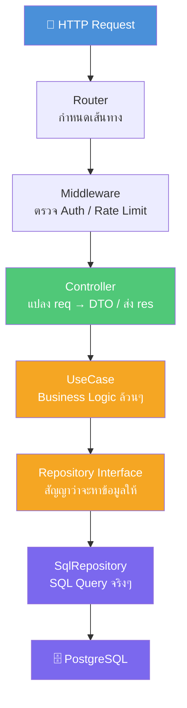
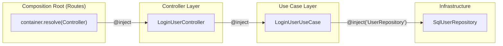
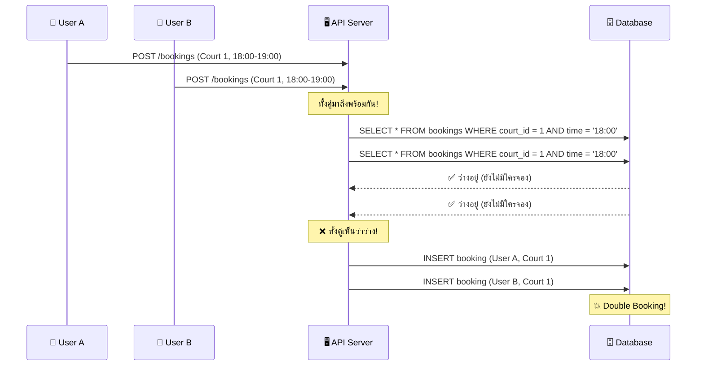
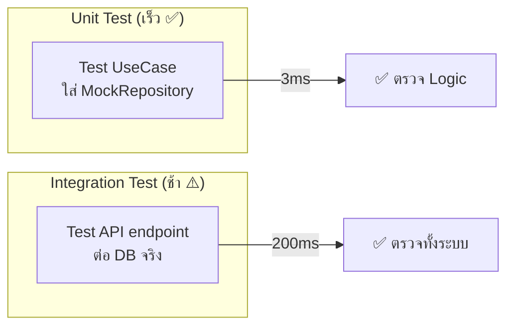
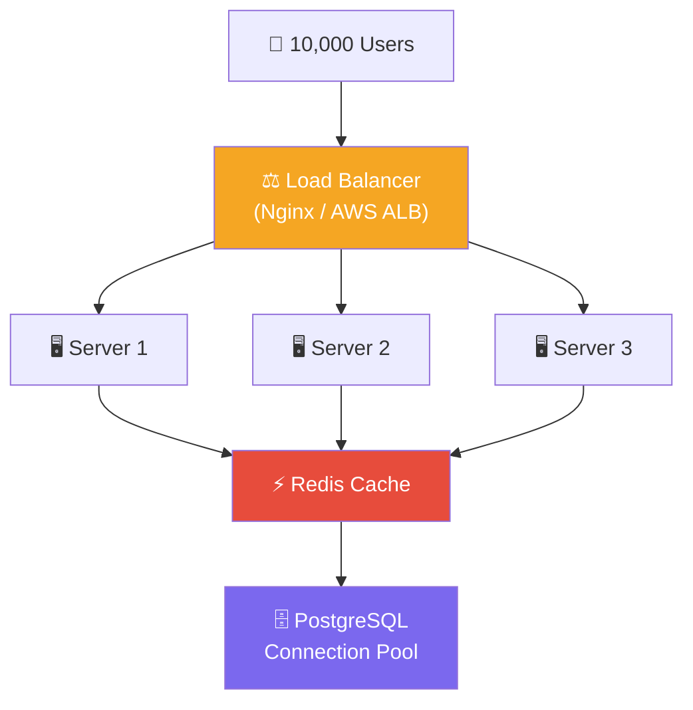

# 🎓 The Senior Developer Deep Dive

> เขียนโดย Senior Engineer สำหรับ Junior ที่อยากก้าวข้าม "รู้ว่าทำยังไง" ไปเป็น **"รู้ว่าทำไม"** — ทุกบรรทัดในเอกสารนี้มาจากประสบการณ์จริง ไม่ใช่ทฤษฎีในหนังสือ

---

## 1. 🏛️ The Architecture Philosophy — ทำไมต้อง Clean Architecture?

### ปัญหาที่ Clean Architecture แก้

Junior ส่วนใหญ่เขียนโค้ดแบบ "ทำให้มันทำงานได้ก่อน" ซึ่งจบลงด้วยโค้ดแบบนี้:

```typescript
// ❌ "ทำไปก่อน" — ทุกอย่างยัดอยู่ใน Route Handler เดียว
app.post("/register", async (req, res) => {
  if (!req.body.username)
    return res.status(400).json({ error: "Missing username" });
  if (!req.body.email) return res.status(400).json({ error: "Missing email" });

  const existing = await pool.query("SELECT * FROM users WHERE email = $1", [
    req.body.email,
  ]);
  if (existing.rows.length > 0)
    return res.status(409).json({ error: "Email taken" });

  const hash = await bcrypt.hash(req.body.password, 10);
  const result = await pool.query(
    "INSERT INTO users (username, email, password) VALUES ($1, $2, $3) RETURNING *",
    [req.body.username, req.body.email, hash],
  );
  res.json(result.rows[0]); // ⚠️ password hash ส่งกลับไปด้วย!
});
```

**ปัญหา:** Validation, Business Logic, Database Query, Response Formatting — ทุกอย่างอยู่ในฟังก์ชันเดียว แก้ตรงไหนก็พังที่อื่น ทดสอบไม่ได้ถ้าไม่ต่อ Database จริง

### การแบ่ง Layer

Clean Architecture แก้ปัญหานี้ด้วยการ **แบ่งความรับผิดชอบ** ออกเป็นชั้นๆ:



| Layer          | หน้าที่เดียว                                           | อะไรที่ **ห้ามทำ**                                  |
| -------------- | ------------------------------------------------------ | --------------------------------------------------- |
| **Router**     | ต่อ URL กับ Controller                                 | ❌ ห้ามมี Logic                                     |
| **Controller** | แปลง HTTP → DTO, เรียก UseCase, แปลงกลับเป็น Response  | ❌ ห้ามเขียน SQL / ❌ ห้ามเช็ค Business Rule        |
| **UseCase**    | Business Logic (เช่น "email ซ้ำไหม?", "hash password") | ❌ ห้ามรู้จัก Express / ❌ ห้ามรู้ว่าใช้ PostgreSQL |
| **Repository** | อ่าน/เขียน Database                                    | ❌ ห้ามมี Business Logic                            |

### ⚖️ Trade-offs — ราคาที่ต้องจ่าย

> **ข้อสำคัญ:** Clean Architecture ไม่ใช่คำตอบสำหรับทุกโปรเจกต์

| ข้อดี                                                 | ข้อเสีย                                |
| ----------------------------------------------------- | -------------------------------------- |
| เปลี่ยน DB จาก PostgreSQL → MongoDB แก้แค่ Repository | สร้าง feature ง่ายๆ ต้องสร้าง 4-5 ไฟล์ |
| Unit Test ง่ายมาก — Mock Repository ได้               | Junior อาจงงกับโครงสร้างตอนแรก         |
| แก้ Bug ง่าย — รู้ว่าต้องดูที่ Layer ไหน              | โปรเจกต์เล็กๆ อาจ Over-engineering     |

**เมื่อไหร่ที่ไม่ควรใช้:**

- โปรเจกต์ที่มีแค่ 2-3 endpoints และไม่มีแผนจะโต
- Prototype / MVP ที่ต้องส่งงานภายใน 1 สัปดาห์
- Script ที่รันครั้งเดียวแล้วทิ้ง

**กฎง่ายๆ:** ถ้าทีมมีมากกว่า 1 คน หรือโปรเจกต์จะอยู่นานกว่า 3 เดือน → **ใช้ Clean Architecture**

---

## 2. ⚔️ Senior's Arsenal — อาวุธของซีเนียร์ในโปรเจกต์นี้

### 2.1 Dependency Injection (IoC) — ทำไมห้ามใช้ `new`

**ปัญหาของ `new`:**

```typescript
// ❌ Tight Coupling — UseCase สร้าง Service เอง
class RegisterUserUseCase {
  execute(data: RegisterUserDTO) {
    const service = new CreateUserService(); // ← ผูกตาย!
    return service.execute(data);
  }
}

// ถ้าจะ Unit Test → ต้อง Mock CreateUserService ยังไง?
// คำตอบ: ทำไม่ได้! เพราะ new อยู่ข้างใน → ควบคุมไม่ได้
```

**วิธีที่ถูกต้อง — Constructor Injection:**

```typescript
// ✅ Loose Coupling — รับ dependency ผ่าน constructor
@injectable()
class RegisterUserUseCase {
  constructor(
    @inject(CreateUserService)
    private createUserService: CreateUserService, // ← "ของถูกส่งมาให้"
  ) {}

  execute(data: RegisterUserDTO) {
    return this.createUserService.execute(data); // ← ใช้ผ่าน this
  }
}

// Unit Test ง่ายมาก:
const mockService = { execute: vi.fn().mockResolvedValue(fakeUser) };
const useCase = new RegisterUserUseCase(mockService as any);
```

**Dependency Graph ของโปรเจกต์นี้:**



> **กฎเหล็ก:** `container.resolve()` อยู่ได้แค่ที่เดียว — **ไฟล์ Routes** (Composition Root) เท่านั้น ห้ามอยู่ใน Controller หรือ UseCase เด็ดขาด

---

### 2.2 Zod & Error Boundary — Never Trust User Input

**หลักการ:** ข้อมูลที่มาจาก Client คือ **ศัตรู** จนกว่าจะพิสูจน์ว่าปลอดภัย

```typescript
// Controller — Validate แล้ว throw ให้ ErrorHandler จัดการ
async handle(req: Request, res: Response, next: NextFunction) {
  try {
    const data = loginUserSchema.parse(req.body);   // ← ถ้าไม่ผ่าน → throw ZodError
    const result = await this.loginUserUseCase.execute(data);
    return res.json(ApiResponse.success("Login successful", result));
  } catch (error) {
    next(error);  // ← ZodError, AppError, หรืออะไรก็ตาม → ส่งไป ErrorHandler
  }
}
```

```typescript
// ErrorHandler.ts — "ผู้พิพากษา" ตัวเดียวที่ตัดสินว่าส่งอะไรกลับไปหา Client
if (err instanceof ZodError) {
  const errors = err.issues.map((issue) => ({
    field: issue.path.join("."), // เช่น "email", "password"
    message: issue.message, // เช่น "Invalid email format"
  }));
  return response
    .status(400)
    .json(ApiResponse.error("Validation failed", errors));
}
```

**ทำไมต้อง "รวมศูนย์ Error"?**

| แบบกระจาย (❌)                                                                   | แบบรวมศูนย์ (✅)                                             |
| -------------------------------------------------------------------------------- | ------------------------------------------------------------ |
| แต่ละ Controller จัดการ Error เอง                                                | `ErrorHandler` จัดการที่เดียว                                |
| Error format ไม่เหมือนกัน (บาง endpoint ส่ง `{ error }` บางอันส่ง `{ message }`) | ทุก endpoint ส่ง `{ status, message, errors? }` เหมือนกันหมด |
| ลืม `try/catch` 1 ที่ → Server hang                                              | Controller ทุกตัวถูกบังคับใช้ pattern เดียวกัน               |
| Frontend ต้องเขียน error handling ต่างกันทุก endpoint                            | Frontend เขียน error handler เดียว ใช้ได้ทุก endpoint        |

---

### 2.3 TypeScript `unknown` vs `any` — ทำไม `any` ถึงเป็นบาปหนา

```typescript
// ❌ any — "ฉันยอมแพ้ ไม่ตรวจอะไรทั้งนั้น"
function process(data: any) {
  data.name.toUpperCase(); // ❌ ถ้า data ไม่มี name → Runtime Error → Server Crash!
  // TypeScript ไม่เตือนเลย เพราะ any = "อะไรก็ได้"
}

// ✅ unknown — "ฉันยังไม่รู้ว่าเป็นอะไร ต้องตรวจก่อนใช้"
function process(data: unknown) {
  data.name.toUpperCase(); // ❌ Compile Error! TypeScript บังคับให้ตรวจก่อน

  // ต้องทำแบบนี้:
  if (typeof data === "object" && data !== null && "name" in data) {
    const name = (data as { name: string }).name;
    name.toUpperCase(); // ✅ ปลอดภัย!
  }
}
```

**ในโปรเจกต์นี้:**

```typescript
// ApiResponse — ใช้ unknown แทน any
export interface IApiResponse<T = unknown> {  // ← unknown ไม่ใช่ any
  status: "success" | "error";
  message: string;
  data?: T;
  errors?: IValidationError[];  // ← typed interface ไม่ใช่ any[]
}

// DbProvider — query parameters
public static async query(text: string, params?: unknown[]) {  // ← unknown[] ไม่ใช่ any[]
```

> **กฎง่ายๆ:** ถ้าอยากพิมพ์ `any` → หยุด → คิดว่า Type จริงๆ คืออะไร → ถ้าจริงๆ ไม่รู้ → ใช้ `unknown`

---

## 3. 🚨 Anti-Patterns — โค้ดพังๆ ที่ Junior ชอบเขียน

### 3.1 God Controller vs Single Responsibility

```typescript
// ❌ GOD CONTROLLER — ยัดทุกอย่างไว้ที่เดียว (500+ บรรทัด)
class UserController {
  async register(req, res) {
    // Validation (50 บรรทัด)
    // Business Logic (100 บรรทัด)
    // SQL Query (30 บรรทัด)
    // Response Formatting (20 บรรทัด)
    // Error Handling (20 บรรทัด)
  }
  async login(req, res) {
    /* อีก 200 บรรทัด */
  }
  async getProfile(req, res) {
    /* อีก 100 บรรทัด */
  }
  async updateProfile(req, res) {
    /* อีก 150 บรรทัด */
  }
  // → แก้ตรงไหนก็อาจพังอีกที่ → ทดสอบไม่ได้ → ไม่มีใครกล้าแก้
}
```

```typescript
// ✅ SINGLE RESPONSIBILITY — แต่ละไฟล์ทำแค่อย่างเดียว
// LoginUserController.ts   → แปลง HTTP req → DTO → เรียก UseCase → ส่ง res
// LoginUserUseCase.ts      → ตรวจรหัสผ่าน + สร้าง JWT Token
// LoginUserDTO.ts          → Zod schema สำหรับ validate input
// IUserRepository.ts       → Interface (สัญญา) ว่า Repository ทำอะไรได้บ้าง
// SqlUserRepository.ts     → SQL queries จริงๆ
```

### 3.2 Unhandled Promise Rejection — "ระเบิดเวลา" ของ Express

```typescript
// ❌ BOOM — ลืม try/catch ใน async handler
app.get("/users/:id", async (req, res) => {
  const user = await db.query("SELECT * FROM users WHERE id = $1", [req.params.id]);
  // ถ้า db.query throw error → Promise rejected
  // Express 4 ไม่จัดการ rejected Promise → Request แขวนค้างไปเลย
  // Client รอไปเรื่อยๆ จนกว่า timeout → ประสบการณ์แย่มาก
  res.json(user);
});

// ✅ ปลอดภัย — ทุก Controller ต้องมี try/catch + next(error)
async handle(req: Request, res: Response, next: NextFunction) {
  try {
    const user = await this.getUserByIdUseCase.execute(req.params.id);
    return res.json(ApiResponse.success("User found", user));
  } catch (error) {
    next(error);  // → ErrorHandler จัดการ → Client ได้ Response ที่มีความหมายกลับ
  }
}
```

### 3.3 Service Locator vs Constructor Injection

```typescript
// ❌ SERVICE LOCATOR — Controller รู้จัก Container (Anti-Pattern)
class LoginUserController {
  async handle(req, res) {
    const useCase = container.resolve(LoginUserUseCase); // ← ดึงเองจาก "ตู้กับข้าว"
    // ปัญหา: ถ้าจะ Unit Test → ต้อง Mock container ซึ่งยุ่งยากมาก
  }
}

// ✅ CONSTRUCTOR INJECTION — Controller ไม่รู้จัก Container เลย
@injectable()
class LoginUserController {
  constructor(
    @inject(LoginUserUseCase)
    private loginUserUseCase: LoginUserUseCase, // ← "ของถูกส่งมาถึงหน้าประตู"
  ) {}

  async handle(req, res, next) {
    const result = await this.loginUserUseCase.execute(data); // ← ใช้ผ่าน this
  }
}
// Unit Test: new LoginUserController(mockUseCase) → ง่ายมาก!
```

### สรุป Anti-patterns

| Anti-Pattern (❌)                   | Good Practice (✅)                                | ทำไม                                     |
| ----------------------------------- | ------------------------------------------------- | ---------------------------------------- |
| God Controller                      | 1 Controller = 1 UseCase                          | แก้ง่าย ทดสอบง่าย                        |
| `async` ไม่มี `try/catch`           | ทุก Controller ต้องมี `try/catch` + `next(error)` | ป้องกัน Request ค้าง                     |
| `container.resolve()` ใน Controller | `@inject()` ใน Constructor                        | ทดสอบง่าย ไม่ผูกกับ DI library           |
| `new Service()` ใน UseCase          | `@inject(Service)` ใน Constructor                 | เปลี่ยน implementation ได้               |
| `any`                               | `unknown` หรือ Type ที่เจาะจง                     | จับ Bug ตอน compile ไม่ใช่ตอน production |

---

## 4. 🔥 Real-World Chaos — รับมือกับ Race Condition

### สถานการณ์: จองคอร์ตแบดมินตัน

User A กับ User B กดจอง **คอร์ตเดียวกัน เวลาเดียวกัน** ในเสี้ยววินาทีเดียวกัน:



### วิธีแก้ที่ Senior ต้องรู้

#### วิธี 1: Database Transaction + Row Lock (Pessimistic Locking)

```sql
-- "ล็อกแถวไว้ก่อน ไม่ให้คนอื่นอ่าน/เขียนจนกว่าจะเสร็จ"
BEGIN;
  SELECT * FROM bookings
  WHERE court_id = $1 AND start_time = $2
  FOR UPDATE;  -- ← ล็อกแถวนี้! ใครมาอ่านทีหลังต้องรอ

  -- ถ้าไม่เจอ → ยังว่าง → จองได้
  INSERT INTO bookings (user_id, court_id, start_time) VALUES ($1, $2, $3);
COMMIT;
-- ← ปล่อยล็อก → คนที่รอจะเห็นว่า "มีคนจองแล้ว"
```

#### วิธี 2: Unique Constraint (ง่ายแต่ทรงพลัง)

```sql
-- เพิ่ม constraint ที่ DB level → ถึง code จะพลาด DB ก็ไม่ยอม
ALTER TABLE bookings
ADD CONSTRAINT unique_court_time UNIQUE (court_id, start_time);

-- ถ้า User B INSERT เข้ามาทีหลัง → DB throw error → API ส่ง 409 Conflict กลับ
```

#### วิธี 3: Optimistic Concurrency Control (OCC)

```typescript
// เพิ่ม version column → เช็คตอน UPDATE
const booking = await repo.findById(id); // version = 1

await repo.update({
  ...booking,
  status: "confirmed",
  version: booking.version + 1, // ← ต้อง match กับ DB
});

// SQL: UPDATE bookings SET status = 'confirmed', version = 2
//      WHERE id = $1 AND version = 1  ← ถ้าใครเปลี่ยนก่อน → affected rows = 0 → retry!
```

> **กฎของ Senior:** อย่าเชื่อ Application Code อย่างเดียว — **ใส่ constraint ที่ Database ด้วยเสมอ** เพราะ Database คือด่านสุดท้ายที่ไว้ใจได้

---

## 5. 🧪 The Art of Testing — ทำไมเขียนโค้ดเสร็จแล้วยังไม่จบ?

### ทำไม Architecture แบบนี้ถึงทำให้ Test ง่าย



### Unit Test — ทดสอบ Logic อย่างเดียว

```typescript
import "reflect-metadata"; // ← ต้องมี! เพราะ @injectable() ต้องการ polyfill นี้

describe("CreateUserService", () => {
  it("should hash password before saving", async () => {
    // ARRANGE — สร้างตัวแทนปลอม
    const mockRepo: IUserRepository = {
      create: vi.fn().mockResolvedValue(fakeUser),
      findByEmail: vi.fn().mockResolvedValue(undefined), // ← จำลอง: "email ยังไม่ถูกใช้"
      findByUsername: vi.fn().mockResolvedValue(undefined), // ← จำลอง: "username ยังไม่ถูกใช้"
      findByUsernameWithPassword: vi.fn(),
      findById: vi.fn(),
    };
    const service = new CreateUserService(mockRepo); // ← ใส่ Mock เข้าไปตรงๆ

    // ACT — ลงมือทำ
    const user = await service.execute({
      username: "test",
      email: "a@b.c",
      password: "12345678",
      role: "USER",
    });

    // ASSERT — ตรวจผลลัพธ์
    expect(mockRepo.create).toHaveBeenCalledOnce(); // ✅ เรียก create จริงไหม
    expect(user.password).not.toBe("12345678"); // ✅ password ถูก hash ไหม
  });

  it("should throw if email already exists", async () => {
    const mockRepo = {
      ...baseMock,
      findByEmail: vi.fn().mockResolvedValue(existingUser),
    };
    const service = new CreateUserService(mockRepo);

    await expect(service.execute(data)).rejects.toThrow(AppError); // ✅ throw AppError ไหม
  });
});
```

**ข้อดีที่เห็นชัด:**

- ⚡ รันภายใน **3-4ms** (ไม่ต้องต่อ Database)
- 🔄 รันซ้ำกี่ครั้งก็ได้ผลเหมือนเดิม (Deterministic)
- 🎯 Test แค่ Logic ของ Service — ไม่ปนกับ SQL / Express / Network

### Integration Test — ทดสอบทั้งระบบ

```typescript
// ยิง HTTP Request จริง → ผ่าน Middleware → Controller → UseCase → DB จริง
describe("POST /api/v1/auth/register", () => {
  it("should return 400 if username is missing", async () => {
    const res = await request(app)
      .post("/api/v1/auth/register")
      .send({ email: "test@test.com", password: "12345678" });

    expect(res.status).toBe(400);
    expect(res.body.status).toBe("error");
    expect(res.body.errors[0].field).toBe("username"); // ← ZodError ถูก map เป็น { field, message }
  });
});
```

### Unit Test vs Integration Test

|                   | Unit Test                    | Integration Test                   |
| ----------------- | ---------------------------- | ---------------------------------- |
| **ทดสอบอะไร**     | Logic ของ 1 class            | ทั้งระบบ (HTTP → DB)               |
| **ความเร็ว**      | 3-4ms                        | 100-300ms                          |
| **ต้องการ DB**    | ❌ ไม่ต้อง                   | ✅ ต้อง                            |
| **จับ Bug ได้**   | Logic ผิด, Business Rule ผิด | SQL ผิด, Middleware ผิด, Route ผิด |
| **ควรมีกี่ test** | มากที่สุด (70-80%)           | พอประมาณ (20-30%)                  |

> **กฎของ Senior:** เขียน Unit Test ก่อนเสมอ ถ้า Unit Test ผ่านแต่ระบบพัง → เพิ่ม Integration Test สำหรับ edge case นั้น

---

## 6. 🚀 Beyond Code: System Design Basics

### ถ้ามีคนเข้าใช้พร้อมกัน 10,000 คน?

Clean Architecture อย่างเดียว **เอาไม่อยู่** เพราะ Architecture Pattern แก้ปัญหา "โค้ดดูแลง่าย" แต่ไม่ได้แก้ปัญหา "รับ Load ไหว"



| ปัญหา                       | เครื่องมือ          | ทำอะไร                                            |
| --------------------------- | ------------------- | ------------------------------------------------- |
| Server 1 ตัวรับไม่ไหว       | **Load Balancer**   | กระจาย Request ไปหลาย Server                      |
| DB ถูกถามคำถามซ้ำๆ          | **Redis Cache**     | จำคำตอบไว้ ไม่ต้องถาม DB ทุกครั้ง                 |
| DB Connection ล้น           | **Connection Pool** | จำกัดจำนวน connection + reuse connection เดิม     |
| ส่ง Email หลัง Register ช้า | **Message Queue**   | โยนงานไปทำ background ไม่ต้องให้ Client รอ        |
| Deploy แล้ว Server ดับ      | **Health Check**    | ตรวจว่า Server ยังตอบได้ → ถ้าไม่ตอบ → เปลี่ยนตัว |

### สิ่งที่โปรเจกต์นี้มีแล้ว vs สิ่งที่ต้องเพิ่ม

```
✅ มีแล้ว:
   - Connection Pool (DbProvider — pg Pool)
   - Rate Limiting (express-rate-limit — 100 req/15 min)
   - Graceful Shutdown (ปิด server + pool อย่างถูกต้อง)
   - Structured Logging (Pino)

🔲 ยังไม่มี (เพิ่มได้ถ้าระบบโต):
   - Redis Cache (cache user profile ที่ถูกดึงบ่อย)
   - Message Queue (ส่ง email notification แบบ async)
   - Database Migration System (จัดการ schema version)
   - Metrics & Tracing (Prometheus + OpenTelemetry)
```

> **คำเตือนจาก Senior:** อย่า optimize ก่อนมีปัญหา — ถ้ายังไม่มีคนใช้ 1,000 คน อย่าเพิ่งใส่ Redis ทำให้ "ใช้งานได้ถูกต้อง" ก่อน แล้วค่อย "ทำให้รับ Load ได้" ตอนที่จำเป็น

---

> 🎯 **สรุปทั้งหมด:** Senior ไม่ใช่คนที่รู้ทุกอย่าง แต่คือคนที่ **ถาม "ทำไม" ก่อน "ทำยังไง"** — ทุก pattern ในเอกสารนี้ไม่ได้มีเพราะ "มันเท่" แต่เพราะมันแก้ปัญหาจริงที่จะเจอเมื่อระบบโตขึ้น สู้ต่อไปครับ 🚀
