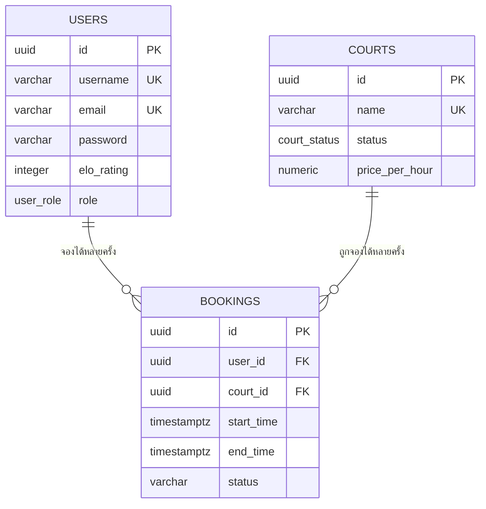
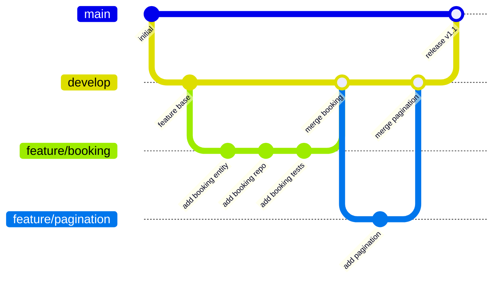
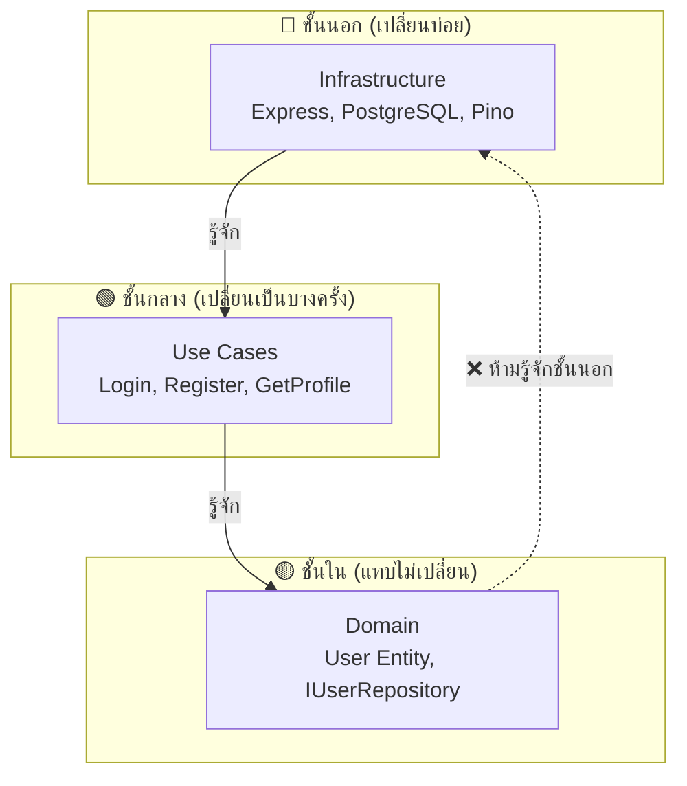
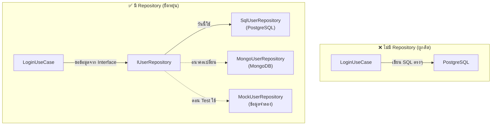
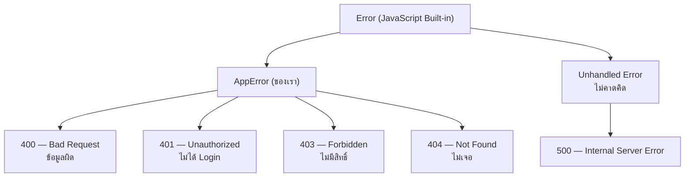
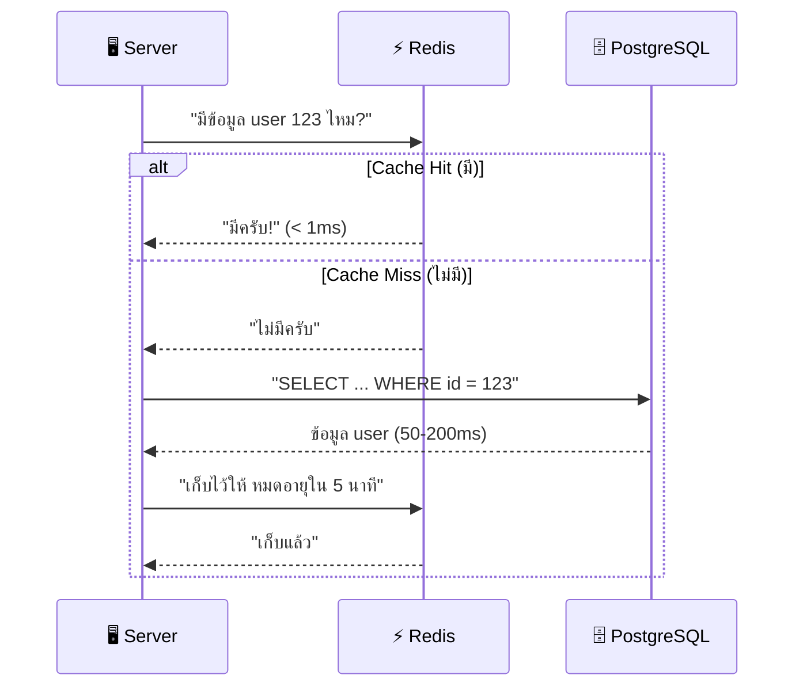
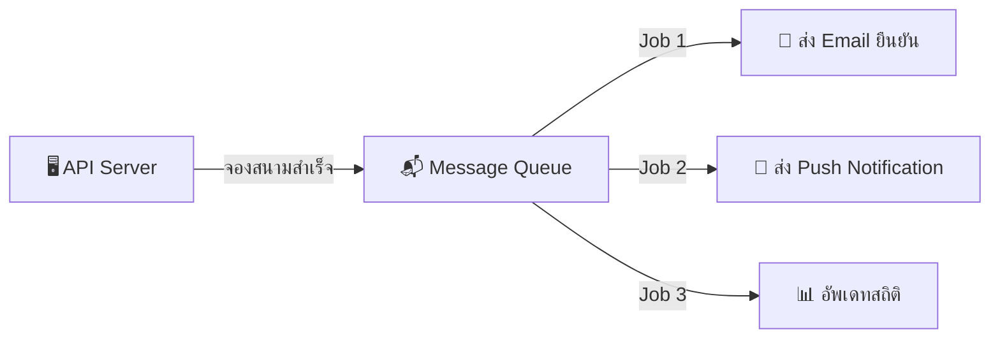
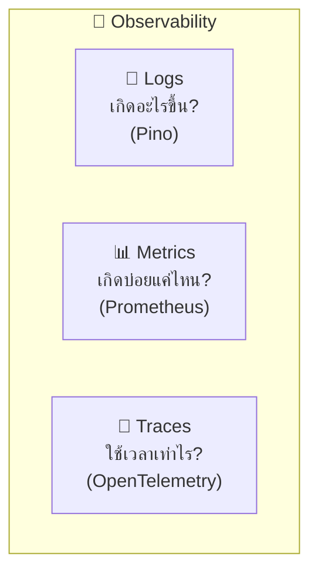

# 🎓 Badminton Nexus API — Deep Dive: จากมือใหม่สู่ Senior Engineer

> คู่มือนี้เป็นส่วนขยายจาก `LEARNING_GUIDE.md` — เจาะลึกทุกหัวข้อที่จำเป็นสำหรับการเติบโตจาก **"เพิ่งเริ่มเขียน Code"** ไปสู่ **"Senior Software Engineer"** ครับ

---

## 🟢 ระดับ 1: พื้นฐานที่ต้องมั่นคง

> 🧱 เปรียบเสมือน "รากฐานของบ้าน" — ถ้ารากไม่แข็ง ต่อให้สร้างบ้านสวยแค่ไหนก็พังภายหลัง

---

### 📘 1.1 TypeScript Fundamentals

TypeScript คือ JavaScript + ระบบ Type — ช่วยจับ Bug ก่อนที่ code จะรันจริง

#### Types & Interfaces — "พิมพ์เขียว" ของข้อมูล

เหมือนสั่งพิซซ่า ต้องระบุว่าต้องการอะไร:

```typescript
// ❌ ไม่มี Type — สั่งพิซซ่าแบบ "เอาอะไรก็ได้"
function createUser(data: any) { ... }

// ✅ มี Type — สั่งพิซซ่าแบบ "ขอ Hawaiian ขอบบาง ไม่ใส่หัวหอม"
interface CreateUserInput {
  username: string;     // ต้องเป็นข้อความ
  email: string;        // ต้องเป็นข้อความ
  password: string;     // ต้องเป็นข้อความ
  age?: number;         // ? = ไม่มีก็ได้ (optional)
}
function createUser(data: CreateUserInput) { ... }
```

**ในโปรเจคจริง:** ดูไฟล์ `src/modules/user/domain/User.ts`

#### Enum — "ตัวเลือกตายตัว"

เหมือนปุ่ม "สถานะ" บน Line ที่มีแค่ "ออนไลน์ / ออฟไลน์ / ไม่รบกวน":

```typescript
// ❌ ใช้ string ธรรมดา — พิมพ์ผิดไม่มีใครรู้
if (user.role === "ADMNI") { ... } // พิมพ์ผิด! แต่ TypeScript ไม่เตือน

// ✅ ใช้ Enum — TypeScript เตือนทันทีถ้าพิมพ์ผิด
enum UserRole {
  ADMIN = "ADMIN",
  USER = "USER",
}
if (user.role === UserRole.ADMIN) { ... } // พิมพ์ผิดไม่ได้!
```

**ในโปรเจคจริง:** ดูไฟล์ `src/modules/user/enum/user-role.enum.ts`

#### Generics — "แม่พิมพ์สารพัด"

เหมือน "กล่องใส่ของ" ที่ใส่อะไรก็ได้:

```typescript
// กล่องที่ใส่ได้ทุกชนิด แต่ระบุตอนใช้
type Box<T> = {
  content: T;
  label: string;
};

const userBox: Box<User> = { content: someUser, label: "ข้อมูลผู้ใช้" };
const numberBox: Box<number> = { content: 42, label: "คำตอบของจักรวาล" };
```

**ในโปรเจคจริง:** `Promise<User>` ใน Repository = "สัญญาว่าจะส่ง User กลับมา"

#### async/await — "สั่งอาหารแล้วรอ"

```typescript
// เหมือนสั่งกาแฟที่ร้าน:
async function morningRoutine() {
  const coffee = await orderCoffee(); // สั่ง → รอ → ได้กาแฟ
  const toast = await makeToast(); // ทำ → รอ → ได้ขนมปังปิ้ง
  eat(coffee, toast); // กินพร้อมกัน
}

// ถ้าไม่มี await — เหมือนสั่งกาแฟแล้วไม่รอ จะได้ถ้วยเปล่า!
```

**ในโปรเจคจริง:** `await this.userRepository.findById(id)` — รอจนกว่า DB จะส่งข้อมูลกลับมา

---

### 🌐 1.2 HTTP & REST API Deep Dive

#### Anatomy ของ HTTP Request

ทุกครั้งที่ browser ขอข้อมูล จะส่ง "จดหมาย" ที่มีโครงสร้างแบบนี้:

```
POST /auth/login HTTP/1.1          ← บรรทัดที่ 1: "ฉันต้องการ" + "ที่อยู่"
Host: localhost:3333               ← ส่งไปที่ server ไหน
Content-Type: application/json     ← ข้อมูลเป็นรูปแบบ JSON
Authorization: Bearer eyJhbG...    ← บัตรประชาชน (Token)

{                                  ← เนื้อหาจดหมาย (Body)
  "username": "duerf",
  "password": "MyP@ss123"
}
```

#### REST API Conventions — "มารยาทในการออกแบบ API"

| Verb + Route        | ความหมาย         | ตัวอย่าง          |
| ------------------- | ---------------- | ----------------- |
| `GET /users`        | ดูรายชื่อทั้งหมด | ดึงผู้ใช้ทุกคน    |
| `GET /users/123`    | ดูข้อมูลคนเดียว  | ดึงผู้ใช้ ID 123  |
| `POST /users`       | สร้างใหม่        | สมัครสมาชิก       |
| `PUT /users/123`    | แก้ไข (ทั้งหมด)  | อัพเดทโปรไฟล์     |
| `PATCH /users/123`  | แก้ไข (บางส่วน)  | เปลี่ยนชื่อเยี่ยน |
| `DELETE /users/123` | ลบ               | ลบบัญชี           |

**กฎทอง:**

- ✅ ใช้คำนาม (nouns): `/users`, `/courts`
- ❌ ไม่ใช้คำกริยา (verbs): `/getUsers`, `/createCourt`
- ✅ ใช้พหูพจน์: `/users` (ไม่ใช่ `/user`)
- ✅ Nested routes สำหรับความสัมพันธ์: `/users/123/bookings`

#### Response Format — "รูปแบบคำตอบ"

ในโปรเจคนี้เราใช้รูปแบบมาตรฐาน (`ApiResponse`):

```json
// ✅ สำเร็จ
{
  "status": "success",
  "message": "User profile retrieved successfully.",
  "data": {
    "id": "abc-123",
    "username": "duerf",
    "email": "duerf@example.com"
  }
}

// ❌ ผิดพลาด
{
  "status": "error",
  "message": "Username or password incorrect"
}

// ❌ Validation ไม่ผ่าน
{
  "status": "error",
  "message": "Validation failed",
  "errors": [
    { "field": "email", "message": "Invalid email" },
    { "field": "password", "message": "String must contain at least 8 character(s)" }
  ]
}
```

---

### 🗄️ 1.3 SQL & Database Design Deep Dive

#### ความสัมพันธ์ระหว่างตาราง



#### Index — "สารบัญของหนังสือ"

```sql
-- ❌ ไม่มี Index — เหมือนหาคำในหนังสือ 1,000 หน้า ทีละหน้า
SELECT * FROM users WHERE username = 'duerf';
-- Database ต้องอ่านทุกแถว (Full Table Scan) → ช้ามาก!

-- ✅ มี Index — เหมือนเปิดสารบัญแล้วเปิดตรงหน้าที่ต้องการ
CREATE INDEX idx_users_username ON users(username);
-- Database รู้ทันทีว่า 'duerf' อยู่แถวไหน → เร็ว!
```

**ในโปรเจคจริง:** ดูไฟล์ `schema.sql` — มี Index สำหรับ `users(is_active)` และ `courts(status)`

#### Transaction — "ทำหลายอย่างต้องสำเร็จทั้งหมดหรือล้มเหลวทั้งหมด"

```sql
-- สมมติโอนเงิน: ถ้าหักเงินสำเร็จ แต่เพิ่มเงินปลายทางไม่สำเร็จ
-- → ต้อง rollback ทั้งคู่! ไม่งั้นเงินหาย
BEGIN;
  UPDATE accounts SET balance = balance - 100 WHERE id = 'A';  -- หักเงิน
  UPDATE accounts SET balance = balance + 100 WHERE id = 'B';  -- เพิ่มเงิน
COMMIT;  -- สำเร็จทั้งคู่!

-- ถ้ามีอะไรผิดพลาด → ROLLBACK (คืนสถานะเดิม)
```

#### Normalization — "ไม่เก็บข้อมูลซ้ำ"

```
❌ ไม่ normalize — ข้อมูลซ้ำ:
| booking_id | user_name | user_email        | court_name |
|------------|-----------|-------------------|------------|
| 1          | duerf     | duerf@example.com | Court A    |
| 2          | duerf     | duerf@example.com | Court B    |  ← ชื่อ/อีเมล ซ้ำ!

✅ normalize — ใช้ ID อ้างอิง:
bookings: | id | user_id | court_id |
users:    | id | name    | email    |
courts:   | id | name    |          |
```

---

### 🌿 1.4 Git Workflow Deep Dive

#### Branching Strategy — "ถนนหลักกับถนนซอย"



| Branch      | เปรียบเสมือน                   | ใครใช้                     |
| ----------- | ------------------------------ | -------------------------- |
| `main`      | ถนนหลวง — ต้องปลอดภัย 100%     | Production (ลูกค้าใช้จริง) |
| `develop`   | ถนนทดสอบ — ทดลองก่อนเปิดให้ใช้ | ทีม Dev ทดสอบรวม           |
| `feature/*` | ถนนซอย — ทำ feature ใหม่       | Developer แต่ละคน          |
| `hotfix/*`  | รถพยาบาล — แก้ bug ด่วน        | แก้ไขฉุกเฉินบน production  |

#### Commit Message Convention

```
feat: add court booking system          ← เพิ่ม feature ใหม่
fix: correct password hashing rounds    ← แก้ bug
refactor: extract CreateUserService     ← ปรับโครงสร้าง (ไม่เปลี่ยนผลลัพธ์)
test: add LoginUserUseCase tests        ← เพิ่ม test
docs: update LEARNING_GUIDE.md          ← เพิ่มเอกสาร
chore: upgrade dependencies             ← งานบ้าน (update package)
```

---

### 🏗️ 1.5 Clean Architecture — ทำไมถึงแบ่งโฟลเดอร์แบบนี้

#### Dependency Rule — "กฎทิศทางเดียว"



**กฎเหล็ก:** ลูกศรชี้เข้าข้างในเท่านั้น!

- ✅ Controller (ชั้นนอก) รู้จัก UseCase (ชั้นกลาง)
- ✅ UseCase (ชั้นกลาง) รู้จัก Entity (ชั้นใน)
- ❌ Entity **ห้ามรู้จัก** Controller หรือ SQL — มันไม่รู้ด้วยซ้ำว่าอยู่ใน Express

```typescript
// ✅ ถูกต้อง — UseCase รู้จักแค่ Interface (ชั้นใน)
class LoginUserUseCase {
  constructor(private userRepo: IUserRepository) {} // ← Interface (Domain Layer)
}

// ❌ ผิด — UseCase รู้จัก Express (ชั้นนอก)
class LoginUserUseCase {
  constructor(private req: express.Request) {} // ← ผูกติดกับ Express!
}
```

**ข้อดีที่เห็นได้จริง:**

| สถานการณ์                    | ไม่มี Clean Architecture | มี Clean Architecture         |
| ---------------------------- | ------------------------ | ----------------------------- |
| เปลี่ยน Express → Fastify    | แก้ทุกไฟล์               | แก้แค่ `infra/http/`          |
| เปลี่ยน PostgreSQL → MongoDB | แก้ทุก Use Case          | แก้แค่ `SqlUserRepository`    |
| เพิ่ม Feature ใหม่           | ไม่แน่ใจว่าจะกระทบที่ไหน | สร้างไฟล์ใหม่ตาม pattern เดิม |
| เขียน Test                   | ยากมาก ต้องต่อ DB จริง   | ง่าย ใส่ Mock แทนได้          |

---

### 🔍 1.6 Validation ด้วย Zod — "ตำรวจตรวจสอบเอกสาร"

Zod เป็น library ที่ใช้ตรวจสอบข้อมูลก่อนเข้าระบบ — เหมือน "ตำรวจตรวจคนเข้าเมือง" ที่ดูว่าเอกสารครบหรือเปล่า:

```typescript
import { z } from "zod";

// สร้าง "แบบฟอร์ม" — ข้อมูลต้องเป็นไปตามนี้
const registerSchema = z.object({
  username: z
    .string()
    .min(3, "ชื่อผู้ใช้ต้องมีอย่างน้อย 3 ตัวอักษร")
    .max(30, "ชื่อผู้ใช้ต้องไม่เกิน 30 ตัวอักษร"),
  email: z.string().email("อีเมลไม่ถูกรูปแบบ"),
  password: z.string().min(8, "รหัสผ่านต้องมีอย่างน้อย 8 ตัวอักษร"),
});

// ใช้งานใน Controller:
// แปลง JSON body → validate → ปล่อยให้ ErrorHandler จัดการ ZodError เอง
try {
  const data = registerSchema.parse(req.body); // ถ้าไม่ผ่าน → throw ZodError
  // → Express รับ ZodError นี้ → ส่งต่อไป Global ErrorHandler
  // → ErrorHandler map ZodError → { field, message }[] แล้วส่งกลับ Client
  const { username, email, password } = data; // type-safe!
} catch (error) {
  next(error);
}
```

**ทำไมไม่ตรวจด้วย `if` ธรรมดา?**

```typescript
// ❌ ตรวจด้วย if — ยาวมาก, พลาดง่าย, ไม่มี type safety
if (!req.body.username)
  return res.status(400).json({ error: "Missing username" });
if (typeof req.body.username !== "string")
  return res.status(400).json({ error: "..." });
if (req.body.username.length < 3) return res.status(400).json({ error: "..." });
// ... ต้องเขียนอีก 10 บรรทัด

// ✅ Zod — สั้น, อ่านง่าย, ได้ TypeScript type มาฟรี
const data = registerSchema.parse(req.body); // 1 บรรทัดจบ!
```

---

### ⚙️ 1.7 Under the Hood — กลไกภายใน

#### 🛡️ Middleware Chain — "กำแพง 6 ชั้น"

ทุก Request ผ่านด่านตรวจในลำดับนี้ (ดูจริงได้ที่ `app.ts`):

```typescript
// ลำดับ middleware ใน app.ts (อ่านจากบนลงล่าง)
app.use(cors()); // ด่าน 1: ตรวจว่ามาจากเว็บที่อนุญาต
app.use(helmet()); // ด่าน 2: เพิ่ม Security Headers
app.use(limiter); // ด่าน 3: จำกัดจำนวน Request
app.use(httpLogger); // ด่าน 4: บันทึก Log
app.use(express.json()); // ด่าน 5: แปลง JSON body
app.use("/api/v1", routes); // ด่าน 6: ส่งไป Route ที่ตรง
app.use(errorHandler); // ท้ายสุด: จับ Error ที่หลุดมา
```

**Middleware ทำงานแบบ "สายโซ่"** — แต่ละตัวเรียก `next()` เพื่อส่งต่อ:

```
Request → [CORS] → next() → [Helmet] → next() → [Rate Limit] → next() → ...
                     ↑
            ถ้าด่านไหนไม่เรียก next() → สายโซ่หยุด → Response กลับทันที
```

**เจาะลึกแต่ละด่าน:**

| ด่าน              | ทำอะไร                                                                 | ตัวอย่าง Response ถ้าไม่ผ่าน    |
| ----------------- | ---------------------------------------------------------------------- | ------------------------------- |
| **CORS**          | ตรวจ `Origin` header ว่ามาจากเว็บที่อนุญาตไหม                          | `403` — "CORS blocked"          |
| **Helmet**        | เพิ่ม `X-Content-Type-Options`, `X-Frame-Options` ป้องกัน clickjacking | (ไม่ block — แค่เพิ่ม headers)  |
| **Rate Limit**    | นับ IP → เกิน 100 req/15 นาที → block                                  | `429` — "Too Many Requests"     |
| **Pino Logger**   | จดบันทึก method, url, status, เวลา                                     | (ไม่ block — แค่ log)           |
| **JSON Parser**   | แปลง `'{"name":"duerf"}'` → `{ name: "duerf" }`                        | `400` — "Invalid JSON"          |
| **Error Handler** | จับ throw ที่หลุดมา → แปลงเป็น response สวยๆ                           | `500` — "Internal server error" |

---

#### 🔐 JWT Token — "ทำงานจริงๆ ยังไง"

```typescript
// สร้าง Token (ใน LoginUserUseCase)
import jwt from "jsonwebtoken";

const token = jwt.sign(
  {
    sub: user.id, // subject — "ใครเป็นเจ้าของ Token นี้"
    role: user.role, // role — "มีสิทธิ์อะไร"
  },
  process.env.JWT_SECRET!, // กุญแจลับ — ใช้สร้างลายเซ็น
  { expiresIn: "1d" }, // หมดอายุ — ใช้ได้ 1 วัน
);
// ได้ Token: "eyJhbG...xxxPayload...xxxSignature"
```

```typescript
// ตรวจ Token (ใน AuthMiddleware.ts)
interface IPayload {
  sub: string;
  role: string;
}

try {
  const { sub, role } = jwt.verify(token, getJwtSecret()) as IPayload;
  // sub = user ID, role = "USER" หรือ "ADMIN"

  request.user = {
    id: sub, // ← ยัดข้อมูลเข้า Request (type-safe ผ่าน express.d.ts)
    role: role as UserRole,
  };
  return next(); // ← ผ่าน! ส่งต่อไป Controller
} catch {
  // Token ปลอม / หมดอายุ / ลายเซ็นไม่ตรง → 401
  throw new AppError("Invalid token", 401);
}
```

**Fail-Fast Pattern — "ถ้าไม่ตั้ง JWT_SECRET → Server ไม่ยอมเปิด"**

```typescript
// ใน AuthMiddleware — บรรทัดแรกสุด
if (!process.env.JWT_SECRET) {
  throw new Error("JWT_SECRET is required!");
  // → Server crash ตั้งแต่เริ่ม → Developer รู้ทันที
  // → ดีกว่า: Server เปิดได้ แต่ Token ทุกตัวไม่ปลอดภัย → ค่อยรู้ทีหลัง
}
```

---

#### 🔒 Bcrypt — "ขั้นตอนจริงๆ ในโค้ด"

```typescript
// ตอนสมัครสมาชิก (RegisterUserUseCase)
import bcrypt from "bcryptjs";

const saltRounds = 10; // จำนวนรอบสับ — ยิ่งเยอะยิ่งปลอดภัย (แต่ช้าขึ้น)
const hashedPassword = await bcrypt.hash("MyP@ssw0rd123", saltRounds);
// hashedPassword = "$2b$10$KIXeBz5vN3U7Q9s..."
// เก็บค่านี้ลง database — ไม่มีทางย้อนกลับเป็น "MyP@ssw0rd123"
```

```typescript
// ตอน Login (LoginUserUseCase)
const user = await this.userRepo.findByUsernameWithPassword(username);
const isMatch = await bcrypt.compare(inputPassword, user.password);
//                                    ↑ สิ่งที่พิมพ์     ↑ hash ที่เก็บใน DB

if (!isMatch) {
  throw new AppError("Username or password incorrect", 401);
  // ⚠️ ไม่บอกว่า "password ผิด" หรือ "username ไม่มี"
  // → ป้องกัน attacker เดาว่า username มีจริงหรือเปล่า
}
```

**Salt คืออะไร?**

```
ถ้าไม่มี Salt:
"password123" → hash → "abc123" (ค่าเดิมทุกครั้ง!)
→ Attacker มีตาราง hash → เทียบเจอทันที (Rainbow Table Attack)

ถ้ามี Salt (สุ่มค่าเพิ่มมา):
"password123" + "random_salt_1" → hash → "xyz789"
"password123" + "random_salt_2" → hash → "def456"
→ password เดียวกัน → hash ต่างกัน! → Rainbow Table ใช้ไม่ได้
```

---

#### 🧩 DI Container — "ขั้นตอนจริงในโค้ด"

```typescript
// ไฟล์ shared/container/index.ts — "ลงทะเบียนพนักงาน"
import { container } from "tsyringe";
import { IUserRepository } from "@modules/user/repositories/IUserRepository";
import { SqlUserRepository } from "@modules/user/repositories/SqlUserRepository";

// บอก Container ว่า: "ถ้าใครขอ IUserRepository → ให้ SqlUserRepository"
container.registerSingleton<IUserRepository>(
  "UserRepository",
  SqlUserRepository,
);
```

```typescript
// ไฟล์ Use Case — "รับ dependency ผ่าน Constructor (True Constructor Injection)"
import { inject, injectable } from "tsyringe";
import { IUserRepository } from "@modules/user/repositories/IUserRepository";

@injectable() // บอกว่า "class นี้ Container สร้างให้ได้"
class LoginUserUseCase {
  constructor(
    @inject("UserRepository") // บอกว่า "ขอ 'UserRepository' มาใส่ตรงนี้"
    private userRepository: IUserRepository,
  ) {}
  // → Container จะ new SqlUserRepository() แล้วใส่ให้อัตโนมัติ
}
```

```typescript
// ไฟล์ Controller — "รับ UseCase ผ่าน Constructor"
import { inject, injectable } from "tsyringe";
import { ApiResponse } from "@shared/utils/ApiResponse";

@injectable()
class LoginUserController {
  constructor(
    @inject(LoginUserUseCase) // ← UseCase ถูก Inject เข้ามาตรงนี้
    private loginUserUseCase: LoginUserUseCase,
  ) {}

  async handle(
    req: Request,
    res: Response,
    next: NextFunction,
  ): Promise<Response | void> {
    try {
      const result = await this.loginUserUseCase.execute(data); // ← ใช้ผ่าน this
      return res.json(ApiResponse.success("Login successful", result));
    } catch (error) {
      next(error); // ← ส่งต่อไป Global Error Handler ทุกกรณี
    }
  }
}
```

```typescript
// ไฟล์ Routes — "Composition Root" (ที่เดียวที่เรียก container.resolve)
import { container } from "tsyringe";

const loginController = container.resolve(LoginUserController);
// → Container สร้าง LoginUserUseCase + SqlUserRepository ให้อัตโนมัติ

authRouter.post("/login", loginController.handle.bind(loginController));
// ⚠️ ต้องใช้ .bind() เสมอ — ป้องกัน this เป็น undefined ใน Express callback
```

**flow ทั้งหมด:**

```
1. Server เริ่ม → import container/index.ts → ลงทะเบียน "UserRepository" = SqlUserRepository
2. Request เข้า → Route เรียก loginController.handle (ที่ bind ไว้)
3. handle เรียก this.loginUserUseCase.execute (ที่ inject เข้ามาใน constructor)
4. LoginUserUseCase เรียก this.userRepository (ที่ inject เข้ามาใน constructor)
5. ← ไม่มี container.resolve() อยู่ใน Controller หรือ UseCase เลย!
```

> [!IMPORTANT]
> **Service Locator vs Constructor Injection**
>
> | แบบเก่า (Service Locator ❌)            | แบบใหม่ (Constructor Injection ✅)        |
> | --------------------------------------- | ----------------------------------------- |
> | `container.resolve()` อยู่ใน Controller | `container.resolve()` อยู่แค่ใน Routes    |
> | Controller ผูกติดกับ `tsyringe`         | Controller ไม่รู้จัก Container เลย        |
> | ทดสอบยาก — ต้อง mock Container          | ทดสอบง่าย — `new Controller(mockUseCase)` |
> | "ขอของจาก pantry เอง"                   | "ของถูกส่งมาให้ที่หน้าประตู"              |

---

#### 🔌 Graceful Shutdown — "ปิดระบบอย่างปลอดภัย"

```typescript
// ไฟล์ server.ts — อ่าน flow จากบนลงล่าง
const server = app.listen(PORT, () => {
  logger.info(`Server running on port ${PORT}`);
});

// ฟังสัญญาณ "ปิดตัว" จาก OS (เช่น docker stop, Ctrl+C)
const shutdown = async (signal: string) => {
  logger.info(`${signal} received. Starting graceful shutdown...`);

  // ขั้นที่ 1: หยุดรับ Request ใหม่
  server.close(async () => {
    logger.info("HTTP server closed");

    // ขั้นที่ 2: ปิด Database Connection Pool
    await DbProvider.closePool();
    logger.info("Database pool closed");

    // ขั้นที่ 3: ออกจากโปรแกรม
    process.exit(0);
  });

  // Safety net: ถ้า 10 วินาทีแล้วยังไม่เสร็จ → บังคับปิด
  setTimeout(() => {
    logger.error("Forced shutdown after timeout");
    process.exit(1); // exit code 1 = ผิดปกติ
  }, 10_000);
};

process.on("SIGTERM", () => shutdown("SIGTERM")); // docker stop
process.on("SIGINT", () => shutdown("SIGINT")); // Ctrl+C
```

**ทำไมต้อง Graceful?**

| ปิดแบบ "ดึงปลั๊ก"                                             | ปิดแบบ "Graceful"              |
| ------------------------------------------------------------- | ------------------------------ |
| Request ที่กำลังทำค้างกลางทาง → ข้อมูลอาจเสียหาย              | รอ Request ที่ค้างให้เสร็จก่อน |
| DB Connection ค้าง → Pool เต็ม → การ restart ครั้งต่อไปอาจช้า | ปิด Connection อย่างถูกต้อง    |
| Log ท้ายสุดหาย → ไม่รู้ว่าเกิดอะไรก่อนปิด                     | Log ครบ → debug ได้            |

---

#### 📁 Path Aliases — "ที่อยู่สั้นๆ แทน relative path ยาวเหยียด"

แทนที่จะเขียน `../../../../shared/utils/ApiResponse` ซึ่งอ่านยากและเปราะบาง (ถ้าย้ายไฟล์ต้องแก้ทุกที่) เราตั้ง Path Alias ไว้ใน `tsconfig.json`:

```json
// tsconfig.json
{
  "compilerOptions": {
    "paths": {
      "@shared/*": ["./src/shared/*"],
      "@modules/*": ["./src/modules/*"],
      "@infra/*": ["./src/infra/*"]
    }
  }
}
```

```typescript
// ❌ BEFORE (Relative Path Hell)
import { ApiResponse } from "../../../../shared/utils/ApiResponse";
import { User } from "../../../user/domain/User";
import { AppError } from "../../../../shared/errors/AppError";

// ✅ AFTER (Clean Path Aliases)
import { ApiResponse } from "@shared/utils/ApiResponse";
import { User } from "@modules/user/domain/User";
import { AppError } from "@shared/errors/AppError";
```

**กฎง่ายๆ:**

- `@shared/` → โค้ดกลางที่ใช้ทุก module (errors, utils, middlewares)
- `@modules/` → import ข้ามโมดูล (auth module อ้างถึง user module)
- `@infra/` → infrastructure (database, HTTP)
- `./` หรือ `../` ยังใช้ได้ถ้าเป็น sibling ในโฟลเดอร์เดียวกัน เช่น `import { LoginUserDTO } from "./LoginUserDTO"`

---

## 🟡 ระดับ 2: เข้าใจ "ทำไม" ไม่ใช่แค่ "ทำอะไร"

> 🔬 ที่ระดับนี้จะเปลี่ยนจาก "ทำตามสูตร" เป็น "เข้าใจวิทยาศาสตร์เบื้องหลัง"

---

### 🧩 2.1 Design Patterns ที่ซ่อนอยู่ในโปรเจค

#### Repository Pattern — "แยกวิธีเก็บของออกจากวิธีใช้ของ"



**เกิดอะไรขึ้นจริงๆ?**

1. Use Case บอกว่า "ฉันต้องการหาผู้ใช้ด้วย username"
2. ไม่สนว่าข้อมูลมาจากไหน — PostgreSQL? MongoDB? ไฟล์ CSV? In-memory?
3. ตอน test → ใส่ Mock Repository (ข้อมูลจำลอง) ไม่ต้องต่อ DB จริง

**ในโปรเจค:** ดูไฟล์ `IUserRepository.ts` (สัญญา) vs `SqlUserRepository.ts` (ตัวจริง)

#### Singleton Pattern — "มีแค่ตัวเดียวในโลก"

```typescript
// DbProvider ใช้ Singleton — สร้าง Pool แค่ครั้งเดียว
class DbProvider {
  private static pool: Pool;  // ← มีแค่ตัวเดียว (static)

  public static async getConnection() {
    if (!this.pool) {          // ← ถ้ายังไม่มี → สร้างขึ้นมา
      this.pool = new Pool({...});
    }
    return this.pool;          // ← ถ้ามีแล้ว → ใช้ตัวเดิม
  }
}
```

**ทำไมถึงสำคัญ?** ถ้าสร้าง Pool ใหม่ทุก Request → Connection ล้นจนฐานข้อมูลล่ม

#### DTO Pattern — "ฟอร์มกรอกข้อมูล"

```typescript
// เหมือนแบบฟอร์มสมัครสมาชิก — ต้องกรอกครบก่อนส่ง
interface RegisterUserDTO {
  username: string; // ช่องที่ 1: ชื่อผู้ใช้ (ต้องกรอก)
  email: string; // ช่องที่ 2: อีเมล (ต้องกรอก)
  password: string; // ช่องที่ 3: รหัสผ่าน (ต้องกรอก)
}
// ไม่มี role → ระบบใส่ให้เอง (default: USER)
// ไม่มี id → ระบบสร้างให้เอง (UUID)
```

---

### 🏛️ 2.2 SOLID Principles — พร้อมตัวอย่างจริงจากโปรเจค

#### S — Single Responsibility: "คนหนึ่งทำหน้าที่เดียว"

```
✅ แต่ละ Use Case ทำแค่อย่างเดียว:
LoginUserUseCase      → ตรวจสอบรหัสผ่าน + ออก Token
RegisterUserUseCase   → สมัครสมาชิก
GetProfileUseCase     → ดึงข้อมูลโปรไฟล์
GetUserByIdUseCase    → ดึงข้อมูลผู้ใช้ตาม ID

❌ ถ้าทำหลายอย่างในที่เดียว:
UserUseCase → login + register + getProfile + updateProfile + deleteAccount
             → ไฟล์ยาว 500 บรรทัด → แก้ตรงไหนก็อาจพังอีกที่
```

#### O — Open/Closed: "เพิ่มได้ แต่ไม่ต้องแก้ของเดิม"

```typescript
// ✅ เพิ่ม BookingRepository ใหม่ได้ โดยไม่ต้องแก้ Use Case เลย
// แค่สร้างไฟล์ใหม่ + ลงทะเบียนใน DI Container
container.registerSingleton("BookingRepository", SqlBookingRepository);

// ❌ ถ้าต้องแก้ Use Case ทุกครั้งที่เพิ่ม feature → ผิดหลัก O
```

#### L — Liskov Substitution: "ปลั๊กไฟมาตรฐาน"

```typescript
// ✅ SqlUserRepository สามารถแทน IUserRepository ได้ทุกจุด
// เหมือนเครื่องใช้ไฟฟ้าที่เสียบปลั๊กมาตรฐานเดียวกัน
const repo: IUserRepository = new SqlUserRepository(); // ✅ ใช้ได้
const repo: IUserRepository = new MongoUserRepository(); // ✅ ใช้ได้เหมือนกัน
```

#### I — Interface Segregation: "ไม่ยัดเยียดของที่ไม่ต้องการ"

```typescript
// ✅ IUserRepository มีแค่ method ที่จำเป็น
interface IUserRepository {
  create(user: User): Promise<User>;
  findByEmail(email: string): Promise<User | undefined>;
  findByUsername(username: string): Promise<User | undefined>;
  findByUsernameWithPassword(username: string): Promise<User | undefined>;
  findById(id: string): Promise<User | undefined>;
}

// ❌ ถ้ายัดทุกอย่างไว้ใน Interface เดียว:
interface IEverythingRepository {
  createUser();
  findUser();
  deleteUser();
  createCourt();
  findCourt();
  deleteCourt();
  createBooking();
  findBooking();
  deleteBooking();
  // → Repository ที่ implement ต้องเขียนทุก method ถึงแม้ไม่ได้ใช้!
}
```

#### D — Dependency Inversion: "พึ่งสัญญา ไม่พึ่งคน"

```typescript
// ✅ Use Case พึ่ง Interface (สัญญา) → เปลี่ยนคนได้
class LoginUserUseCase {
  constructor(
    @inject("UserRepository")
    private userRepository: IUserRepository, // ← พึ่ง "สัญญา" ไม่ใช่ "คนจริง"
  ) {}
}

// ❌ ถ้าพึ่ง Class จริง → เปลี่ยนไม่ได้
class LoginUserUseCase {
  constructor(
    private userRepository: SqlUserRepository, // ← ผูกตายกับ SQL!
  ) {}
}
```

---

### 🧪 2.3 Testing Strategy Deep Dive

#### Anatomy ของ Unit Test

```typescript
// Unit Test รับต้องมี reflect-metadata เสมอ
// เพราะ @injectable() กระตุ้น tsyringe import ซึ่งต้องการ polyfill นี้
import "reflect-metadata";
import { describe, it, expect, vi } from "vitest";

describe("CreateUserService", () => {          // "เรื่อง" ที่จะทดสอบ

  it("should create a user with hashed password", async () => {  // "ฉาก" ที่ทดสอบ
    // 1. ARRANGE — เตรียมของ
    const mockRepo = createMockRepository();
    const service = new CreateUserService(mockRepo); // ← สร้างตรงๆ เพราะ Unit Test ไม่ใช้ Container

    // 2. ACT — ลงมือทำ
    const user = await service.execute({ username: "test", ... });

    // 3. ASSERT — ตรวจผลลัพธ์
    expect(user.password).toBe("hashed_password");
    expect(mockRepo.create).toHaveBeenCalledOnce();
  });

});
```

**กฎ AAA (Arrange → Act → Assert):**

| ขั้นตอน     | เปรียบเสมือน   | ทำอะไร                         |
| ----------- | -------------- | ------------------------------ |
| **Arrange** | เตรียมวัตถุดิบ | สร้าง Mock, ตั้งค่าข้อมูลจำลอง |
| **Act**     | ลงมือทำอาหาร   | เรียก function ที่ต้องการทดสอบ |
| **Assert**  | ชิมรสชาติ      | ตรวจว่าผลลัพธ์ตรงตามที่คาดหวัง |

#### Mock คืออะไร?

Mock = **"ตัวแสดงแทน"** — ไม่ต้องต่อ DB จริง ไม่ต้อง hash password จริง

```typescript
// สร้าง Repository ปลอม (MockRepository)
const mockRepo = {
  findByUsername: vi.fn().mockResolvedValue(undefined), // จำลอง: "ไม่เจอ user"
  create: vi.fn().mockResolvedValue(someUser), // จำลอง: "สร้างสำเร็จ"
};

// ข้อดี:
// ✅ Test รันเร็วมาก (ไม่ต้องรอ DB)
// ✅ Test ไม่พัง (ไม่ขึ้นกับ DB จริง)
// ✅ ทดสอบเฉพาะ "logic ของ Use Case" ไม่ปนกับ DB
```

---

### 🔍 2.4 Error Handling ขั้นสูง

#### Error Hierarchy — ลำดับชั้นของ Error



```typescript
// Error ที่ "คาดการณ์ได้" → AppError (ส่ง message กลับไปหาลูกค้า)
throw new AppError("Username or password incorrect", 401);

// Error ที่ "ไม่คาดคิด" → Error ธรรมดา (ซ่อนไว้ ไม่ส่งรายละเอียดไปหาลูกค้า)
// → ErrorHandler จับได้ → Log ไว้ → ส่ง "Internal server error" กลับไป
```

#### Error Handling Best Practices

```
1. ❌ อย่า catch แล้วเงียบ (swallow errors):
   try { ... } catch (err) { /* ไม่ทำอะไรเลย */ }

2. ✅ catch แล้ว log หรือ re-throw:
   try { ... } catch (err) { logger.error(err); throw err; }

3. ❌ อย่าส่ง stack trace ไปหาลูกค้า:
   res.json({ error: err.stack }); // เปิดเผยข้อมูลภายใน!

4. ✅ ส่งแค่ข้อความสั้นๆ:
   res.json({ error: "Internal server error" }); // ปลอดภัย
```

**`IValidationError` — Type มาตรฐานสำหรับข้อผิด Validation:**

```typescript
// ไฟล์ shared/utils/ApiResponse.ts
export interface IValidationError {
  field: string; // ชื่อ field ที่ผิด เช่น "email", "password"
  message: string; // คำอธิบาย เช่น "Invalid email format"
}

export interface IApiResponse<T = unknown> {
  status: "success" | "error";
  message: string;
  data?: T;
  errors?: IValidationError[]; // ← typed! ไม่ใช่ any[]
}
```

```typescript
// ใน ErrorHandler.ts — map ZodError → IValidationError[]
if (err instanceof ZodError) {
  const errors: IValidationError[] = err.issues.map((issue) => ({
    field: issue.path.join("."),
    message: issue.message,
  }));
  return response
    .status(400)
    .json(ApiResponse.error("Validation failed", errors));
}
```

---

## 🔴 ระดับ 3: คิดเป็นระบบ — Senior Mindset

> 🏗️ Senior ไม่ใช่คนที่รู้ทุกอย่าง แต่คือคนที่ **ถาม "ทำไม" เป็น** และ **ตัดสินใจได้ดีแม้ข้อมูลไม่ครบ**

---

### 🛡️ 3.1 Security — OWASP Top 10 ฉบับเข้าใจง่าย

#### Injection (อันดับ 1) — "ยัดคำสั่งปลอมเข้าระบบ"

```sql
-- ❌ ต่อ SQL ด้วย string concatenation → โดนโจมตีได้
const query = `SELECT * FROM users WHERE username = '${username}'`;
-- ถ้า username = "'; DROP TABLE users;--"
-- → SQL กลายเป็น: SELECT * FROM users WHERE username = ''; DROP TABLE users;--'
-- → ลบตาราง users ทิ้ง!!

-- ✅ ใช้ Parameterized Query → ปลอดภัย (โปรเจคเราทำถูกแล้ว!)
const query = `SELECT * FROM users WHERE username = $1`;
// $1 จะถูก escape อัตโนมัติ → ไม่มีทาง inject ได้
```

#### Broken Authentication (อันดับ 2) — "ปลอมตัวเข้าระบบ"

```
สิ่งที่โปรเจคเราป้องกันแล้ว:
✅ bcrypt hash รหัสผ่าน (ไม่เก็บ plaintext)
✅ JWT Token มี expiry (หมดอายุใน 1 วัน)
✅ JWT_SECRET fail-fast (ถ้าไม่ตั้งค่า → Server หยุดทำงาน)
✅ Rate Limiting (ป้องกัน brute-force)

สิ่งที่ยังเพิ่มได้:
🔲 Refresh Token (ต่ออายุ Token โดยไม่ต้อง login ใหม่)
🔲 Password Complexity Rules (บังคับรหัสผ่านซับซ้อน)
🔲 Account Lockout (ล็อกบัญชีหลังใส่รหัสผิดหลายครั้ง)
```

#### Data Exposure (อันดับ 3) — "เปิดเผยข้อมูลที่ไม่ควรเห็น"

```
สิ่งที่โปรเจคเราป้องกันแล้ว:
✅ ไม่ SELECT password ในคำสั่งทั่วไป (SAFE_COLUMNS)
✅ User.toPublic() ซ่อนรหัสผ่านก่อนส่งกลับ
✅ ErrorHandler ไม่ส่ง err.message ของ 500 ไปหาลูกค้า
✅ Helmet ตั้ง Security Headers
```

---

### 🏙️ 3.2 System Design Patterns

#### Caching Strategy — "จำคำตอบไว้ ไม่ต้องคิดใหม่ทุกครั้ง"



|                        | ไม่มี Cache      | มี Cache                        |
| ---------------------- | ---------------- | ------------------------------- |
| ดึงข้อมูลซ้ำ 100 ครั้ง | ถาม DB 100 ครั้ง | ถาม DB 1 ครั้ง + Cache 99 ครั้ง |
| เวลาเฉลี่ย             | 50-200ms         | < 1ms (หลังครั้งแรก)            |
| DB Load                | สูง              | ต่ำมาก                          |

#### Message Queue — "กล่องฝากข้อความ"



**ทำไมไม่ทำทุกอย่างใน API Server?**

```
❌ ทำทั้งหมดใน API:
POST /bookings → สร้าง booking → ส่ง email → ส่ง notification → อัพเดทสถิติ
→ ลูกค้ารอ 3 วินาที!

✅ ใช้ Message Queue:
POST /bookings → สร้าง booking → ส่ง job ไปคิว → ตอบลูกค้าทันที (200ms)
→ Worker ทำ email/notification/สถิติ ทีหลัง (ลูกค้าไม่ต้องรอ!)
```

---

### 🚀 3.3 DevOps & CI/CD Deep Dive

#### Docker — "กล่องบรรจุทุกอย่างไว้ด้วยกัน"

```dockerfile
# Dockerfile สำหรับ Production (Multi-stage Build)

# Stage 1: Build — เหมือนทำอาหารในครัว
FROM node:20-alpine AS builder
WORKDIR /app
COPY package.json pnpm-lock.yaml ./
RUN npm install -g pnpm && pnpm install --frozen-lockfile
COPY . .
RUN pnpm build

# Stage 2: Run — เหมือนเสิร์ฟให้ลูกค้า (เอาแค่ของที่จำเป็น)
FROM node:20-alpine AS runner
WORKDIR /app
COPY --from=builder /app/dist ./dist
COPY --from=builder /app/node_modules ./node_modules
COPY --from=builder /app/package.json ./
CMD ["node", "dist/infra/http/server.js"]
```

#### GitHub Actions CI/CD

```yaml
# .github/workflows/ci.yml
name: CI/CD Pipeline

on:
  push:
    branches: [main, develop]
  pull_request:
    branches: [main]

jobs:
  test:
    runs-on: ubuntu-latest
    steps:
      - uses: actions/checkout@v4
      - uses: pnpm/action-setup@v4
      - uses: actions/setup-node@v4
        with:
          node-version: 20
          cache: "pnpm"

      - run: pnpm install --frozen-lockfile # ติดตั้ง packages
      - run: pnpm tsc --noEmit # ตรวจ TypeScript
      - run: pnpm test # รัน Tests
```

---

### 📈 3.4 Performance & Scalability

#### N+1 Query Problem — "ถามซ้ำจนเหนื่อย"

```
❌ N+1 Problem:
1. SELECT * FROM bookings; → ได้ 100 bookings
2. SELECT * FROM users WHERE id = 1;   → หาชื่อผู้จองคนที่ 1
3. SELECT * FROM users WHERE id = 2;   → หาชื่อผู้จองคนที่ 2
...
101. SELECT * FROM users WHERE id = 100; → หาชื่อผู้จองคนที่ 100
→ รวม 101 queries! → ช้า!

✅ แก้ด้วย JOIN:
1. SELECT b.*, u.username FROM bookings b
   JOIN users u ON b.user_id = u.id;
→ แค่ 1 query → เร็ว!
```

#### Connection Pool Tuning

```
Pool Size เหมาะสมยังไง?

Rule of Thumb: pool_size = (CPU cores * 2) + disk spindles

สมมติ Server มี 4 cores:
→ pool_size = (4 * 2) + 1 = 9-10 connections

⚠️ เยอะเกินไป → ฐานข้อมูลรับไม่ไหว ช้าลง
⚠️ น้อยเกินไป → Request ต้องรอคิวนาน
```

---

### 🧭 3.5 Database Migration — "จัดการเวอร์ชันฐานข้อมูล"

#### ปัญหาของ Single `schema.sql`

```
❌ ตอนนี้ (schema.sql ไฟล์เดียว):
- ลบ table เดิมแล้วสร้างใหม่ → ข้อมูลหาย!
- ทำงานเป็นทีม → ใครควรแก้ไฟล์นี้?
- Production มี data จริงแล้ว → CREATE TABLE IF NOT EXISTS ไม่พอ

✅ Migration System:
migrations/
  001_create_users.sql       — สร้างตาราง users
  002_create_courts.sql      — สร้างตาราง courts
  003_add_bio_to_users.sql   — เพิ่มคอลัมน์ bio
  004_create_bookings.sql    — สร้างตาราง bookings

→ ระบบจำได้ว่า "รันถึง migration ไหนแล้ว"
→ Migration ใหม่จะรันเฉพาะอันที่ยังไม่เคยรัน
→ Rollback ได้ถ้ามีปัญหา
```

---

### 🔭 3.6 Observability — "มองเห็นสิ่งที่มองไม่เห็น"

#### 3 เสาหลักของ Observability



| เสาหลัก     | เปรียบเสมือน       | ตัวอย่าง                                                                   |
| ----------- | ------------------ | -------------------------------------------------------------------------- |
| **Logs**    | "สมุดบันทึกรายวัน" | "10:30 AM — User 123 login สำเร็จ"                                         |
| **Metrics** | "แดชบอร์ดสถิติ"    | "Request เฉลี่ย 500 ครั้ง/นาที, Error rate 0.1%"                           |
| **Traces**  | "GPS ติดตามคำขอ"   | "Request นี้ผ่าน middleware → controller → use case → DB ใช้เวลารวม 120ms" |

**ในโปรเจคตอนนี้:** มีแค่ Logs (Pino) → ระดับถัดไปคือเพิ่ม Metrics และ Traces

---

## 📚 แหล่งเรียนรู้แนะนำ (รวมไว้ที่เดียว)

### หนังสือ 📖

| หนังสือ                                                    | เหมาะกับระดับ   | เนื้อหา                               |
| ---------------------------------------------------------- | --------------- | ------------------------------------- |
| "Clean Code" — Robert C. Martin                            | 🟡 Intermediate | เขียน Code ที่คนอ่านเข้าใจ            |
| "Clean Architecture" — Robert C. Martin                    | 🟡 Intermediate | ออกแบบโครงสร้างระบบ (ใช้ในโปรเจคนี้!) |
| "Designing Data-Intensive Applications" — Martin Kleppmann | 🔴 Advanced     | คัมภีร์ Backend ระดับ Senior          |
| "The Pragmatic Programmer" — Hunt & Thomas                 | 🟢-🟡 All       | ปรัชญาการพัฒนาซอฟต์แวร์               |

### เว็บไซต์ 🌐

| เว็บไซต์             | เหมาะกับ           | ลิงก์                                       |
| -------------------- | ------------------ | ------------------------------------------- |
| TypeScript Handbook  | 🟢 พื้นฐาน         | typescriptlang.org/docs                     |
| SQLBolt              | 🟢 พื้นฐาน         | sqlbolt.com                                 |
| Refactoring Guru     | 🟡 Design Patterns | refactoring.guru                            |
| System Design Primer | 🔴 Advanced        | github.com/donnemartin/system-design-primer |
| OWASP Top 10         | 🔴 Security        | owasp.org/Top10                             |

### เครื่องมือ 🛠️

| เครื่องมือ         | ใช้ทำอะไร                     |
| ------------------ | ----------------------------- |
| **Postman**        | ทดสอบ API แบบ visual          |
| **DBeaver**        | ดูฐานข้อมูลแบบ GUI            |
| **Docker Desktop** | รัน container บนเครื่องตัวเอง |
| **GitHub**         | เก็บ Code + CI/CD             |

---

> 🎯 **สุดท้ายครับ:** การเป็น Senior Engineer ไม่ได้เกิดขึ้นข้ามคืน แต่ทุกบรรทัด Code ที่เขียน ทุก Bug ที่แก้ ทุก Test ที่เขียน ล้วนเป็นก้าวที่พาคุณไปข้างหน้า — สู้ๆ ครับ! 🚀
