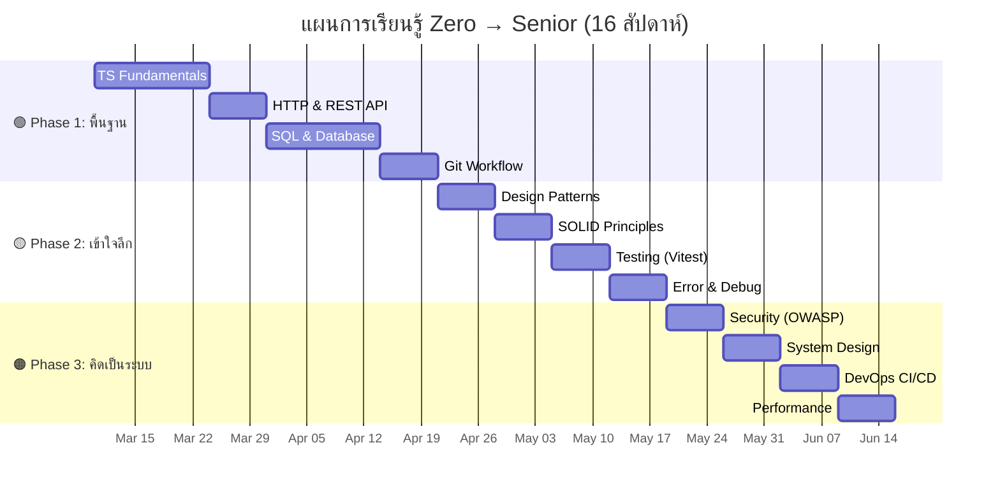

# 📅 Badminton Nexus API — แผนการเรียนรู้ 16 สัปดาห์

> แผนนี้ออกแบบมาสำหรับคนที่ **ไม่มีพื้นฐาน** เรียนวันละ **1-2 ชั่วโมง** ครับ
> ทุกสัปดาห์จะมี 📖 อ่าน + 🏋️ ทำ + ✅ Checkpoint เพื่อวัดผล

---

## 📊 ผลการ Review ความครบถ้วนของเอกสาร

### สิ่งที่ครอบคลุมแล้ว ✅

| หัวข้อ                                            | อยู่ในไฟล์ไหน         |
| ------------------------------------------------- | --------------------- |
| Architecture / Clean Architecture                 | LEARNING_GUIDE §1, §2 |
| Data Flow (Request Lifecycle)                     | LEARNING_GUIDE §3     |
| Tech Terms (DI, Validation, Error)                | LEARNING_GUIDE §4     |
| Code Walkthrough                                  | LEARNING_GUIDE §5     |
| Feature Extension Guide                           | LEARNING_GUIDE §6     |
| Middleware Chain, JWT, Bcrypt, Pool, DI, Shutdown | LEARNING_GUIDE §7     |
| Learning Roadmap + Exercises                      | LEARNING_GUIDE §8     |
| TypeScript Fundamentals                           | DEEP_DIVE §1.1        |
| HTTP & REST API                                   | DEEP_DIVE §1.2        |
| SQL & Database Design                             | DEEP_DIVE §1.3        |
| Git Workflow                                      | DEEP_DIVE §1.4        |
| Design Patterns (Repository, Singleton, DTO)      | DEEP_DIVE §2.1        |
| SOLID Principles                                  | DEEP_DIVE §2.2        |
| Testing Strategy (AAA, Mocking)                   | DEEP_DIVE §2.3        |
| Error Handling ขั้นสูง                            | DEEP_DIVE §2.4        |
| Security (OWASP Top 10)                           | DEEP_DIVE §3.1        |
| System Design (Cache, MQ, LB)                     | DEEP_DIVE §3.2        |
| DevOps & CI/CD (Docker, GH Actions)               | DEEP_DIVE §3.3        |
| Performance (N+1, Pool Tuning)                    | DEEP_DIVE §3.4        |
| Database Migration                                | DEEP_DIVE §3.5        |
| Observability (Logs, Metrics, Traces)             | DEEP_DIVE §3.6        |

### สิ่งที่ยังไม่ได้กล่าวถึง (เสริม)

| หัวข้อ                                        | ความสำคัญ  | หมายเหตุ                          |
| --------------------------------------------- | ---------- | --------------------------------- |
| **API Documentation (Swagger/OpenAPI)**       | 🟡 ปานกลาง | ทีมใหญ่ต้องใช้ แต่เรียนทีหลังได้  |
| **Environment Management** (dev/staging/prod) | 🟡 ปานกลาง | สำคัญตอน deploy จริง              |
| **WebSocket / Real-time**                     | 🟢 เสริม   | ใช้กรณี chat หรือ live scoreboard |
| **Clean Code Practices**                      | 🟡 ปานกลาง | อ่านหนังสือ Clean Code เสริมได้   |
| **Code Review Culture**                       | 🟡 ปานกลาง | เรียนจากประสบการณ์จริง            |
| **Agile/Scrum**                               | 🟢 เสริม   | process ทำงานเป็นทีม              |

> ✅ **สรุป:** เอกสารทั้ง 2 ไฟล์ **ครอบคลุมเนื้อหาหลักครบ** สำหรับ Backend Engineer ที่ใช้ Node.js + TypeScript + PostgreSQL แล้วครับ หัวข้อที่ขาดเป็นเรื่อง "เสริม" ที่เรียนระหว่างทางได้

---

## 🗓️ แผนเรียนรู้ 16 สัปดาห์



---

### 🟢 สัปดาห์ที่ 1-2: TypeScript Fundamentals

📖 **อ่าน:**

- DEEP_DIVE §1.1 (Types, Interfaces, Enum, Generics, async/await)
- [TypeScript Handbook — The Basics](https://www.typescriptlang.org/docs/handbook/2/basic-types.html)
- [TypeScript Handbook — Everyday Types](https://www.typescriptlang.org/docs/handbook/2/everyday-types.html)

🏋️ **ทำ:**

- [ ] เปิดไฟล์ `src/modules/user/domain/User.ts` → อ่านแล้วอธิบายให้ตัวเองฟังว่าแต่ละ field คืออะไร
- [ ] ลองเพิ่ม field `bio: string` ใน `User.ts` → ดูว่า TypeScript เตือน Error ตรงไหนบ้าง → แก้ให้ผ่าน
- [ ] เปิดไฟล์ `user-role.enum.ts` → ลองเพิ่ม role ใหม่ `MODERATOR`
- [ ] เขียน function ง่ายๆ ที่รับ `User` แล้ว return ชื่อเต็ม (firstName + lastName)

✅ **Checkpoint:** สามารถอ่าน Type definitions ในโปรเจคได้ เข้าใจ `interface`, `enum`, `?` (optional), `Promise<T>`

---

### 🟢 สัปดาห์ที่ 3: HTTP & REST API

📖 **อ่าน:**

- DEEP_DIVE §1.2 (HTTP anatomy, REST conventions, Response format)
- LEARNING_GUIDE §3 (Data Journey — Pizza Delivery)

🏋️ **ทำ:**

- [ ] รัน Server ด้วย `pnpm dev`
- [ ] ใช้ `curl http://localhost:3333/health` → อ่าน Response
- [ ] ลง Postman → ทดลอง POST `/auth/register` สร้าง user
- [ ] ทดลอง POST `/auth/login` → ได้ JWT Token
- [ ] ทดลอง GET `/profile` พร้อม Header `Authorization: Bearer <token>`
- [ ] ลองส่ง GET `/profile` โดยไม่ใส่ Token → สังเกต Error 401

✅ **Checkpoint:** เข้าใจ GET/POST, Status Codes (200/400/401/404/500), ส่ง Request ด้วย Postman ได้

---

### 🟢 สัปดาห์ที่ 4-5: SQL & Database Design

📖 **อ่าน:**

- DEEP_DIVE §1.3 (ER Diagram, Index, Transaction, Normalization)
- เปิด `src/infra/database/schema.sql` อ่านจริง → ลองเข้าใจทุกบรรทัด
- [SQLBolt](https://sqlbolt.com/) — ทำทุกบทจนจบ

🏋️ **ทำ:**

- [ ] ทำ SQLBolt ทุก Lesson (1-18)
- [ ] เชื่อมต่อ PostgreSQL ด้วย DBeaver หรือ `psql`
- [ ] เขียน query: `SELECT username, email, elo_rating FROM users ORDER BY elo_rating DESC`
- [ ] ลองเพิ่ม data ด้วย `INSERT INTO users (...) VALUES (...)`
- [ ] เปิดไฟล์ `SqlUserRepository.ts` → อ่าน SQL ที่ใช้จริง → อธิบายให้ตัวเองฟัง
- [ ] ลองเพิ่ม method `findByRole(role)` ใน Repository

✅ **Checkpoint:** เขียน SELECT, INSERT, UPDATE, DELETE ได้ เข้าใจ WHERE, ORDER BY, LIMIT อ่าน schema.sql เข้าใจ

---

### 🟢 สัปดาห์ที่ 6: Git Workflow

📖 **อ่าน:**

- DEEP_DIVE §1.4 (branching strategy, commit conventions)
- [Learn Git Branching](https://learngitbranching.js.org/) — ทำจนจบ Main section

🏋️ **ทำ:**

- [ ] เล่น Learn Git Branching จนผ่าน Main + Remote
- [ ] ลอง `git log --oneline -10` ในโปรเจค → อ่าน commit history
- [ ] สร้าง branch ใหม่: `git checkout -b feature/add-bio`
- [ ] แก้ไขไฟล์ → `git add .` → `git commit -m "feat: add bio field to User"`
- [ ] `git checkout main` → สังเกตว่าการแก้ไขหายไป (อยู่ใน branch อื่น)
- [ ] `git merge feature/add-bio` → สังเกตว่าการแก้ไขกลับมา

✅ **Checkpoint:** สร้าง branch, commit, merge ได้ เข้าใจ commit message convention

---

### 🟡 สัปดาห์ที่ 7: Design Patterns

📖 **อ่าน:**

- DEEP_DIVE §2.1 (Repository, Singleton, DTO)
- LEARNING_GUIDE §7.5 (DI Container)
- [Refactoring Guru — Repository](https://refactoring.guru/design-patterns)

🏋️ **ทำ:**

- [ ] เปิดไฟล์ `IUserRepository.ts` + `SqlUserRepository.ts` เทียบกัน → อธิบายว่าทำไมต้องมี 2 ไฟล์
- [ ] เปิด `DbProvider.ts` → ระบุว่า Singleton pattern อยู่ตรงไหน
- [ ] เปิด `CreateUserService.test.ts` → ดูว่า Mock Repository ถูกสร้างยังไง → นี่คือประโยชน์ของ Repository Pattern
- [ ] ลองสร้าง `InMemoryUserRepository` (เก็บ data ใน array แทน DB) → ลองใช้กับ test

✅ **Checkpoint:** อธิบายได้ว่า Repository / Singleton / DI แก้ปัญหาอะไร ชี้ได้ว่าอยู่ตรงไหนในโปรเจค

---

### 🟡 สัปดาห์ที่ 8: SOLID Principles

📖 **อ่าน:**

- DEEP_DIVE §2.2 (SOLID ทุกหลักการ + ตัวอย่างจากโปรเจค)
- LEARNING_GUIDE §7.5 (DI Container — ตัวอย่าง Dependency Inversion จริง)

🏋️ **ทำ:**

- [ ] เปิดทุก Use Case → ยืนยันว่าแต่ละตัวทำ "แค่อย่างเดียว" (S)
- [ ] ลองนึกว่าถ้าเปลี่ยน DB เป็น MongoDB → ต้องแก้ไฟล์อะไรบ้าง? (O, D)
- [ ] ดู `shared/container/index.ts` → อธิบายว่าทำไม Use Case ไม่ต้อง `import SqlUserRepository` โดยตรง
- [ ] เขียนคำอธิบาย SOLID ด้วยภาษาของตัวเอง (ไม่ลอก) ลงสมุดหรือ markdown

✅ **Checkpoint:** อธิบาย SOLID ได้ด้วยคำพูดตัวเอง ชี้ตัวอย่างจากโปรเจคได้ทุกหลักการ

---

### 🟡 สัปดาห์ที่ 9: Testing with Vitest

📖 **อ่าน:**

- DEEP_DIVE §2.3 (AAA Pattern, Mocking)
- LEARNING_GUIDE §8 แบบฝึกหัดข้อ 4
- [Vitest Getting Started](https://vitest.dev/guide/)

🏋️ **ทำ:**

- [ ] รัน `pnpm test` → อ่าน output ให้เข้าใจ
- [ ] เปิด `CreateUserService.test.ts` → อ่านทุก `it(...)` → อธิบายว่าแต่ละ test ทดสอบอะไร
- [ ] เขียน Test ใหม่ให้ `LoginUserUseCase`:
  - `should return token on correct credentials`
  - `should throw 401 on wrong password`
  - `should throw 401 on non-existent user`
- [ ] รัน `pnpm test` → ดูว่า test ใหม่ผ่านไหม

✅ **Checkpoint:** เขียน unit test ได้ เข้าใจ AAA, Mock, `expect().toThrow()`, `expect().rejects`

---

### 🟡 สัปดาห์ที่ 10: Error Handling & Debugging

📖 **อ่าน:**

- DEEP_DIVE §2.4 (Error Hierarchy, Best Practices)
- LEARNING_GUIDE §7.1 (Middleware Chain — ErrorHandler อยู่ท้ายสุด)
- เปิด `ErrorHandler.ts` → อ่านจริง

🏋️ **ทำ:**

- [ ] ลองส่ง Request ผิดๆ (email format ผิด, password สั้น) → สังเกต Validation Error
- [ ] ลองส่ง Token ปลอม → สังเกต 401 Error
- [ ] ใส่ `throw new Error("test crash")` ใน Use Case สักตัว → สังเกตว่า ErrorHandler จัดการยังไง
- [ ] ดู Terminal Log → อ่าน structured log (JSON) ของ Pino
- [ ] อ่าน stack trace ของ Error → ระบุไฟล์ + บรรทัดที่เกิด Error

✅ **Checkpoint:** อ่าน Error message / Stack trace ได้ เข้าใจ flow ว่า Error ไหลจากไหนถึงไหน

---

### 🟠 สัปดาห์ที่ 11: Security (OWASP)

📖 **อ่าน:**

- DEEP_DIVE §3.1 (SQL Injection, Broken Auth, Data Exposure)
- LEARNING_GUIDE §7.1 (Middleware Chain) + §7.2 (JWT) + §7.3 (Bcrypt)
- [OWASP Top 10](https://owasp.org/Top10/)

🏋️ **ทำ:**

- [ ] ส่ง Request ด้วย Postman → ดู Response Headers → หา Security Headers จาก Helmet
- [ ] ดูว่า `SqlUserRepository.ts` ใช้ `$1, $2` ป้องกัน SQL Injection ตรงไหน
- [ ] ลองส่ง `Authorization: Bearer invalid_token` → สังเกต Error
- [ ] ตรวจว่า `/health` ไม่ต้อง Login → `/profile` ต้อง Login → เข้าใจ route protection
- [ ] เปิด `.env.development.local` → ระบุว่ามี secret อะไรบ้าง → ทำไมห้ามใส่ใน Git

✅ **Checkpoint:** อธิบายได้ว่าโปรเจคป้องกัน Injection, Brute-force, Token ปลอม, Data exposure ยังไง

---

### 🟠 สัปดาห์ที่ 12: System Design

📖 **อ่าน:**

- DEEP_DIVE §3.2 (Caching, Message Queue)
- LEARNING_GUIDE §7.4 (Connection Pooling)
- [System Design Primer — GitHub](https://github.com/donnemartin/system-design-primer) (อ่าน "System design topics: start here")

🏋️ **ทำ:**

- [ ] วาดแผนผัง (บนกระดาษหรือ Mermaid) ว่าระบบตอนนี้มีอะไรบ้าง (Server → DB)
- [ ] วาดแผนผังว่าถ้ามี user 10,000 คน ต้องเพิ่มอะไร (Load Balancer? Cache? Replica?)
- [ ] เขียนอธิบายว่า "ถ้าจะเพิ่ม Redis Cache ให้ GetUserById" ต้องทำอะไรบ้าง (ไม่ต้อง code จริง แค่วางแผน)
- [ ] อ่าน `DbProvider.ts` อีกครั้ง → อธิบาย Connection Pooling ในมุม performance

✅ **Checkpoint:** วาด System Architecture diagram ได้ อธิบาย trade-off ระหว่าง Cache hit vs data staleness ได้

---

### 🟠 สัปดาห์ที่ 13: DevOps & CI/CD

📖 **อ่าน:**

- DEEP_DIVE §3.3 (Docker, GitHub Actions)
- `docker-compose.yml` ในโปรเจค (ถ้ามี)

🏋️ **ทำ:**

- [ ] ลง Docker Desktop → รัน `docker compose up` สำหรับ PostgreSQL
- [ ] เขียน `.github/workflows/ci.yml` ตาม template ใน DEEP_DIVE
- [ ] Push ไป GitHub → ดูว่า CI รันผ่านไหม
- [ ] ลองทำให้ CI fail (เช่น ใส่ TypeScript error) → สังเกตว่า GitHub แจ้ง Error ยังไง
- [ ] แก้ให้ผ่านแล้ว push อีกครั้ง → เห็น ✅ สีเขียว

✅ **Checkpoint:** เข้าใจ Docker basics, สร้าง CI pipeline ที่รัน lint + test อัตโนมัติได้

---

### 🟠 สัปดาห์ที่ 14: Performance & Database Migration

📖 **อ่าน:**

- DEEP_DIVE §3.4 (N+1 Problem, Pool Tuning)
- DEEP_DIVE §3.5 (Migration System)

🏋️ **ทำ:**

- [ ] เปิด `SqlUserRepository.ts` → ดูว่ามี N+1 problem ไหม (ตอนนี้ไม่มี เพราะ query ทีละตัว)
- [ ] ลองนึกว่า ถ้ามีระบบ booking + ต้องดึงชื่อ user ด้วย → เขียน SQL แบบ JOIN
- [ ] สร้างโฟลเดอร์ `migrations/` → ย้าย `schema.sql` เป็น `001_create_users.sql` + `002_create_courts.sql`
- [ ] เขียน `003_add_bio_to_users.sql`: `ALTER TABLE users ADD COLUMN bio TEXT`

✅ **Checkpoint:** ระบุ N+1 problem ได้ เขียน migration file ได้ เข้าใจว่า ALTER TABLE ทำอะไร

---

### 🟠 สัปดาห์ที่ 15-16: 🏆 Final Project — สร้างระบบจองสนาม

📖 **อ่าน:**

- LEARNING_GUIDE §6 (วิธีเพิ่มฟีเจอร์ใหม่)
- ทบทวนทุกหัวข้อที่เรียนมา

🏋️ **ทำ (สร้างระบบจองสนามครบทั้ง stack):**

- [ ] สร้าง `Booking` entity ใน `domain/`
- [ ] สร้าง `IBookingRepository` interface
- [ ] สร้าง `SqlBookingRepository` + migration file
- [ ] สร้าง `CreateBookingUseCase` + `GetBookingsByUserUseCase`
- [ ] สร้าง `CreateBookingController` + `GetBookingsController`
- [ ] สร้าง `booking.routes.ts` + เชื่อมกับ routes หลัก
- [ ] ลงทะเบียนใน DI Container
- [ ] เขียน Unit Tests (อย่างน้อย 3 test cases)
- [ ] รัน `tsc --noEmit` ✅ + `pnpm test` ✅
- [ ] ทดสอบด้วย Postman จริง

✅ **Final Checkpoint:** สร้าง feature ได้ครบ stack ตั้งแต่ Domain → DB → API → Test **ด้วยตัวเอง**

---

## 📐 วิธีวัดความก้าวหน้า

### Self-Assessment Checklist

ลองประเมินตัวเองทุก 4 สัปดาห์:

```
🟢 Phase 1 (สัปดาห์ที่ 6):
□ อ่าน TypeScript ในโปรเจคเข้าใจ 80%+
□ ส่ง HTTP Request ด้วย Postman ได้คล่อง
□ เขียน SQL เบื้องต้นได้ (SELECT, INSERT, WHERE)
□ ใช้ Git สร้าง branch + commit + merge ได้

🟡 Phase 2 (สัปดาห์ที่ 10):
□ อธิบาย SOLID ด้วยคำพูดตัวเองได้
□ เขียน Unit Test ได้ + รัน pass
□ อ่าน Error / Stack Trace แล้วหาจุดผิดได้
□ รู้ว่า Design Pattern อะไรอยู่ตรงไหนในโปรเจค

🟠 Phase 3 (สัปดาห์ที่ 16):
□ วาด System Architecture diagram ได้
□ รู้ว่าโปรเจคป้องกัน attack อะไรบ้าง
□ สร้าง CI pipeline ได้
□ สร้าง feature ใหม่ครบ stack ด้วยตัวเอง ← 🏆 เป้าหมายสุดท้าย
```

---

## 📚 แนวทาง "เรียนอย่างไรให้ได้ผล"

### 1. 🔁 ทำซ้ำ ดีกว่าอ่านเยอะ

```
❌ อ่านหนังสือ 10 เล่มแต่ไม่เคยเขียน code
✅ อ่าน 1 บท → ลองเขียนทันที → พังก็ไม่เป็นไร → แก้ → เข้าใจ
```

### 2. 🗣️ อธิบายให้คนอื่นฟัง (Rubber Duck)

```
ถ้าอธิบายให้ตุ๊กตาเป็ด (หรือคนที่ไม่รู้ code) ฟังได้ แสดงว่าเข้าใจจริง
ลองอธิบาย: "ทำไมเราต้องใช้ Repository Pattern?"
ถ้าตอบไม่ได้ → กลับไปอ่านอีกรอบ
```

### 3. 📝 จดบันทึก TIL (Today I Learned)

```
วันนี้ฉันเรียนรู้: "Index ช่วยให้ SQL ค้นหาเร็วขึ้น เหมือนสารบัญหนังสือ"
วันนี้ฉันติด: "ยังไม่เข้าใจว่า async/await ต่างจาก .then() ยังไง"
พรุ่งนี้ฉันจะ: "ลองเขียน async function ด้วยตัวเอง"
```

### 4. 💪 ยอมรับว่า "ไม่เข้าใจ" เป็นเรื่องปกติ

```
Senior Engineer ทุกคนเคยเป็น Junior มาก่อน
สิ่งที่แตกต่างคือ: Senior ไม่กลัวที่จะพูดว่า "ผมยังไม่เข้าใจ ช่วยอธิบายอีกทีได้ไหม?"
```

---

> 🎯 **เมื่อทำครบ 16 สัปดาห์:** คุณจะสามารถ **สร้าง feature ใหม่ได้ครบ stack ด้วยตัวเอง** ซึ่งคือทักษะของ **Junior-to-Mid Level Engineer** ส่วนการก้าวไป Senior ต้องอาศัย **ประสบการณ์ + การตัดสินใจ + การสอนคนอื่น** ซึ่งจะค่อยๆ สะสมระหว่างทำงานจริงครับ 🚀
