# 🏸 Badminton Nexus API — Developer Playbook

> สุดยอดคัมภีร์ฉบับเดียวจบ — ตั้งแต่ "ไม่เคยเขียน Code" จนถึง "คิดแบบ Senior Engineer" ทุกอย่างที่ต้องรู้เพื่อทำงานกับ Repository นี้รวมอยู่ที่นี่ครับ 🎯

---

## 📋 Table of Contents

- [🟢 Part 1: The Big Picture — เข้าใจระบบใน 5 นาที](#-part-1-the-big-picture--เข้าใจระบบใน-5-นาที)
  - [ปรัชญาสถาปัตยกรรม: ร้านอาหารจำลอง](#-ปรัชญาสถาปัตยกรรม-ร้านอาหารจำลอง)
  - [การเดินทางของข้อมูล: สั่งพิซซ่า](#-การเดินทางของข้อมูล-สั่งพิซซ่า)
  - [ศัพท์เทคนิคแบบชาวบ้าน](#-ศัพท์เทคนิคแบบชาวบ้าน)
  - [โครงสร้างโฟลเดอร์](#-โครงสร้างโฟลเดอร์)
  - [วิธีเพิ่มฟีเจอร์ใหม่](#-วิธีเพิ่มฟีเจอร์ใหม่)
- [🧱 Part 1.5: The Building Blocks — ชิ้นส่วนพื้นฐานที่ต้องรู้](#-part-15-the-building-blocks--ชิ้นส่วนพื้นฐานที่ต้องรู้)
  - [OOP Basics — สถาปัตยกรรมระดับย่อย](#️-oop-basics--สถาปัตยกรรมระดับย่อย)
  - [Access Modifiers — ป้ายอนุญาตการเข้าถึง](#-access-modifiers--ป้ายอนุญาตการเข้าถึง)
  - [Design Patterns — รูปแบบการทำงาน](#-design-patterns--รูปแบบการทำงาน)
- [⚡ Part 1.6: The Backend Essentials — หัวใจของการทำ Backend](#-part-16-the-backend-essentials--หัวใจของการทำ-backend)
  - [Asynchronous Programming — พนักงานรับออเดอร์คนเดียว](#-asynchronous-programming--พนักงานรับออเดอร์คนเดียว)
  - [DTO vs Domain Entity — ใบออเดอร์ vs จานอาหาร](#-dto-vs-domain-entity--ใบออเดอร์-vs-จานอาหาร)
  - [REST API & HTTP Status Codes — ภาษาที่คุยกับลูกค้า](#-rest-api--http-status-codes--ภาษาที่คุยกับลูกค้า)
  - [Environment Variables — ตู้เซฟของผู้จัดการ](#-environment-variables--ตู้เซฟของผู้จัดการ)
- [🛡️ Part 1.7: The Advanced Arsenal — อาวุธขั้นสูงของ Backend](#️-part-17-the-advanced-arsenal--อาวุธขั้นสูงของ-backend)
  - [Middleware — รปภ. คัดกรองคนหน้าประตู](#-middleware--รปภ-คัดกรองคนหน้าประตู)
  - [Authentication vs Authorization — บัตรประชาชน vs ป้ายห้อยคอ VIP](#-authentication-vs-authorization--บัตรประชาชน-vs-ป้ายห้อยคอ-vip)
  - [Password Hashing — เครื่องบดที่ย้อนกลับไม่ได้](#-password-hashing--เครื่องบดที่ย้อนกลับไม่ได้)
  - [Database Seeding — เสกผู้จัดการคนแรก](#-database-seeding--เสกผู้จัดการคนแรก)
  - [CORS — กฎการคุยข้ามเขต](#-cors--กฎการคุยข้ามเขต)
- [🗄️ Part 1.8: Database & Reliability — ศาสตร์แห่งการควบคุมข้อมูล](#️-part-18-database--reliability--ศาสตร์แห่งการควบคุมข้อมูล)
  - [Connection Pooling — ฝูงแท็กซี่จอดรอ](#-connection-pooling--ฝูงแท็กซี่จอดรอ)
  - [Transactions — สำเร็จทั้งหมด หรือ ล้มเหลวทั้งหมด](#-transactions--สำเร็จทั้งหมด-หรือ-ล้มเหลวทั้งหมด)
  - [Race Conditions — สองคนแย่งเค้กชิ้นสุดท้าย](#️-race-conditions--สองคนแย่งเค้กชิ้นสุดท้าย)
  - [Soft Delete — ย้ายแฟ้มลงใต้ดิน](#️-soft-delete--ย้ายแฟ้มลงใต้ดิน-ไม่ใช่เผาทิ้ง)
- [🏛️ Part 1.9: The Architect's Vision — วิสัยทัศน์ระดับสถาปนิก](#️-part-19-the-architects-vision--วิสัยทัศน์ระดับสถาปนิก)
  - [Docker — รถเข็นขายอาหารครบชุด](#-docker--รถเข็นขายอาหารครบชุด)
  - [Observability / Logging — กล้องวงจรปิดของร้าน](#-observability--logging--กล้องวงจรปิดของร้าน)
  - [Automated Testing — ผู้ตรวจสอบอาหารผู้เข้มงวด](#️-automated-testing--ผู้ตรวจสอบอาหารผู้เข้มงวด)
- [🏢 Part 1.10: The Engineering Culture — วัฒนธรรมวิศวกรรม](#-part-110-the-engineering-culture--วัฒนธรรมวิศวกรรม)
  - [Git Workflow (Pull Request)](#-git-workflow-pull-request--เสนอสูตรใหม่ให้หัวหน้าเชฟ)
  - [API Documentation](#-api-documentation--เมนูอาหารสำหรับ-frontend)
  - [Linter & Formatter](#-linter--formatter--กฎยูนิฟอร์มและการจัดจาน)
  - [CI/CD — สายพานอัตโนมัติ](#-cicd--สายพานอัตโนมัติ)
- [⚡ Part 1.11: Elite Performance & Security — การรีดประสิทธิภาพขั้นสุด](#-part-111-elite-performance--security--การรีดประสิทธิภาพขั้นสุด)
  - [Node.js Event Loop](#-nodejs-event-loop--the-flash-รับออเดอร์)
  - [Rate Limiting](#-rate-limiting--รปภ-ไล่คนก่อกวน)
  - [Pagination](#-pagination--ไม่โยนหนังสือ-10000-หน้าให้ลูกค้า)
  - [Caching (Redis)](#-caching-redis--เฟร้นช์ฟรายใต้หลอดไฟอุ่น)
- [🌌 Part 1.12: The Grand Scale — สถาปัตยกรรมไร้ขีดจำกัด](#-part-112-the-grand-scale--สถาปัตยกรรมไร้ขีดจำกัด)
  - [WebSockets — เพจเจอร์สั่นแทนที่จะถามซ้ำ](#-websockets--เพจเจอร์สั่นแทนที่จะถามซ้ำ)
  - [Message Queues — ตะกร้างาน "ทำทีหลัง"](#-message-queues--ตะกร้างาน-ทำทีหลัง)
  - [Cron Jobs — ภารโรงกะดึก](#-cron-jobs--ภารโรงกะดึก)
  - [Microservices — แยกบาร์เครื่องดื่มออกจากครัว](#️-microservices--แยกบาร์เครื่องดื่มออกจากครัว)
- [🟡 Part 2: Under the Hood — เจาะลึกระดับโค้ด](#-part-2-under-the-hood--เจาะลึกระดับโค้ด)
  - [TypeScript Fundamentals](#-21-typescript-fundamentals)
  - [HTTP & REST API](#-22-http--rest-api-deep-dive)
  - [SQL & Database Design](#-23-sql--database-design)
  - [Middleware Chain](#-24-middleware-chain--กำแพง-6-ชั้น)
  - [JWT Token](#-25-jwt-token--สายรัดข้อมือในงานคอนเสิร์ต)
  - [Bcrypt](#-26-bcrypt--ตู้เซฟที่เปิดไม่ได้)
  - [DI Container & Constructor Injection](#-27-di-container--constructor-injection)
  - [Zod & Error Boundary](#-28-zod--error-boundary--never-trust-user-input)
  - [Graceful Shutdown](#-29-graceful-shutdown--ปิดร้านอย่างมีมารยาท)
  - [Path Aliases](#-210-path-aliases)
- [🔴 Part 3: The Senior Mindset — วิถีแห่งวิศวกรซอฟต์แวร์](#-part-3-the-senior-mindset--วิถีแห่งวิศวกรซอฟต์แวร์)
  - [Trade-offs ของ Clean Architecture](#️-trade-offs--ราคาที่ต้องจ่าย)
  - [Anti-Patterns](#-anti-patterns--โค้ดพังๆ-ที่ junior-ชอบเขียน)
  - [Real-World Chaos: Race Condition](#-real-world-chaos--รับมือกับ-race-condition)
  - [The Art of Testing](#-the-art-of-testing)
  - [Design Patterns & SOLID](#-design-patterns--solid-principles)
  - [Security (OWASP)](#️-security--owasp-top-10)
  - [System Design Basics](#-system-design-basics)
  - [TypeScript unknown vs any](#-typescript-unknown-vs-any)
- [🚀 Part 4: Developer Roadmap — แผนอัปสกิล 16 สัปดาห์](#-part-4-developer-roadmap--แผนอัปสกิล-16-สัปดาห์)
- [📚 แหล่งเรียนรู้แนะนำ](#-แหล่งเรียนรู้แนะนำ)

---

## 🟢 Part 1: The Big Picture — เข้าใจระบบใน 5 นาที

> 🎯 ส่วนนี้เขียนสำหรับคนที่ไม่มีพื้นฐานเลย — ใช้การเปรียบเทียบเพื่อให้เข้าใจภาพรวมก่อนดำดิ่ง

---

### 🏪 ปรัชญาสถาปัตยกรรม: ร้านอาหารจำลอง

ลองจินตนาการว่าระบบของเราคือ **"ร้านอาหาร"** ที่มี 3 ส่วนหลัก:

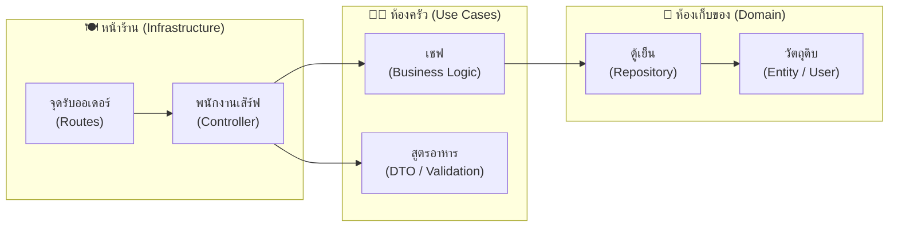

**ทำไมต้องแยกส่วน?** ถ้าเปลี่ยน **เตาในครัว** (ฐานข้อมูล) ไม่ควรกระทบ **วิธีที่พนักงานรับออเดอร์** ถ้าเปลี่ยน **พนักงานเสิร์ฟ** (Express → Fastify) เชฟก็ยังทำอาหารได้เหมือนเดิม

> 💡 **หลักการสำคัญ:** "ส่วนที่เปลี่ยนบ่อย" ต้องอยู่ข้างนอก, "ส่วนที่ไม่ค่อยเปลี่ยน" ต้องอยู่ข้างใน

---

### 🍕 การเดินทางของข้อมูล: สั่งพิซซ่า

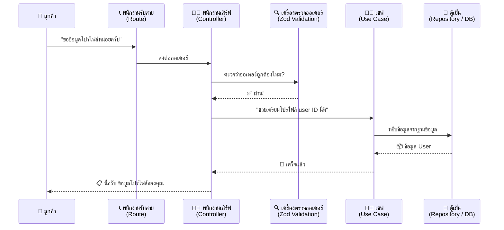

**ตัวอย่างจริงจากโปรเจกต์ — ดึงข้อมูลโปรไฟล์:**

1. **ลูกค้าโทรมา (HTTP Request)** → `GET /profile`
2. **พนักงานรับสาย** → [user.routes.ts](../src/infra/http/routes/user.routes.ts) กำหนดเส้นทาง
3. **พนักงานเสิร์ฟ** → [GetProfileController.ts](../src/modules/user/useCases/GetProfile/GetProfileController.ts) รับ Request
4. **เครื่องตรวจ (Zod)** → ตรวจสอบว่าข้อมูลถูกรูปแบบ
5. **เชฟ** → [GetProfileUseCase.ts](../src/modules/user/useCases/GetProfile/GetProfileUseCase.ts) ดึงข้อมูล
6. **ตู้เย็น** → [SqlUserRepository.ts](../src/modules/user/repositories/SqlUserRepository.ts) query จาก PostgreSQL
7. **ส่งกลับ** → ข้อมูลไหลกลับผ่าน [ApiResponse.ts](../src/shared/utils/ApiResponse.ts) จนถึงมือลูกค้า

---

### 🔤 ศัพท์เทคนิคแบบชาวบ้าน

| คำศัพท์                  | เปรียบเสมือน           | อธิบายสั้นๆ                                                     | 📂 ดูโค้ดจริง                                                             |
| ------------------------ | ---------------------- | --------------------------------------------------------------- | ------------------------------------------------------------------------- |
| **Dependency Injection** | เช่าอุปกรณ์            | เชฟไม่ต้องซื้อเตาเอง ระบบจัดให้ → เปลี่ยนเตาได้โดยเชฟไม่ต้องรู้ | [container/index.ts](../src/shared/container/index.ts)                    |
| **Validation (Zod)**     | เครื่องสแกนที่ประตู    | ตรวจข้อมูลก่อนเข้าระบบ ถ้าไม่ผ่านก็ส่งกลับ                      | [LoginUserDTO.ts](../src/modules/auth/useCases/LoginUser/LoginUserDTO.ts) |
| **Error Handling**       | แผนฉุกเฉินตอนไฟดับ     | บันทึกรายละเอียดไว้ใน Log แต่บอกลูกค้าแค่ "ขออภัย กำลังแก้ไข"   | [ErrorHandler.ts](../src/shared/middlewares/ErrorHandler.ts)              |
| **JWT Token**            | สายรัดข้อมือคอนเสิร์ต  | Login ครั้งเดียว ได้ Token → แสดงทุกครั้งที่จะเข้าถึงข้อมูล     | [AuthMiddleware.ts](../src/shared/middlewares/AuthMiddleware.ts)          |
| **Bcrypt**               | เครื่องทำไข่สุก        | แปลงรหัสผ่าน → Hash → เอากลับมาเป็นรหัสเดิมไม่ได้               | [CreateUserService.ts](../src/modules/user/services/CreateUserService.ts) |
| **Connection Pool**      | แท็กซี่จอดรอที่สนามบิน | สร้าง Connection ล่วงหน้า ไม่ต้องสร้างใหม่ทุก Request           | [DbProvider.ts](../src/infra/database/DbProvider.ts)                      |

---

### 📁 โครงสร้างโฟลเดอร์

```text
src/
├── @types/                          # Type declarations (Express augmentation)
│   └── express.d.ts
│
├── infra/                           # 🔌 Infrastructure — "อุปกรณ์ภายนอก"
│   ├── database/
│   │   └── DbProvider.ts               # Connection Pool (Singleton)
│   └── http/
│       ├── app.ts                       # Express app setup + middleware chain
│       ├── server.ts                    # Boot server + graceful shutdown
│       └── routes/
│           ├── index.ts                 # Route aggregator (/api/v1)
│           ├── auth.routes.ts           # POST /login, /register, /admin/create
│           └── user.routes.ts           # GET /profile, /users/:id
│
├── modules/                         # 📦 Business Domains — "แผนกต่างๆ"
│   ├── auth/
│   │   └── useCases/
│   │       ├── LoginUser/
│   │       │   ├── LoginUserController.ts
│   │       │   ├── LoginUserDTO.ts          # Zod validation schema
│   │       │   └── LoginUserUseCase.ts      # Business logic: verify + JWT
│   │       ├── RegisterUser/
│   │       │   ├── RegisterUserController.ts
│   │       │   ├── RegisterUserDTO.ts
│   │       │   └── RegisterUserUseCase.ts
│   │       └── CreateUserByAdmin/
│   │           ├── CreateUserByAdminController.ts
│   │           ├── CreateUserByAdminDTO.ts
│   │           └── CreateUserByAdminUseCase.ts
│   └── user/
│       ├── domain/
│       │   └── User.ts                  # 📜 Entity — "วัตถุดิบ"
│       ├── enum/
│       │   └── user-role.enum.ts         # ADMIN | USER
│       ├── repositories/
│       │   ├── IUserRepository.ts        # 📋 Interface (สัญญา)
│       │   └── SqlUserRepository.ts      # 🗄️ SQL implementation
│       ├── services/
│       │   ├── CreateUserService.ts      # Hash password + save
│       │   └── CreateUserService.test.ts # ✅ Unit Test
│       └── useCases/
│           ├── GetProfile/
│           │   ├── GetProfileController.ts
│           │   ├── GetProfileUseCase.ts
│           │   └── GetProfileUseCase.test.ts  # ✅ Unit Test
│           └── GetUserById/
│               ├── GetUserByIdController.ts
│               └── GetUserByIdUseCase.ts
│
├── shared/                          # 🔧 Cross-cutting — "ของใช้ร่วมกัน"
│   ├── container/
│   │   └── index.ts                     # DI Container registrations
│   ├── errors/
│   │   └── AppError.ts                  # Custom error class
│   ├── middlewares/
│   │   ├── AuthMiddleware.ts            # JWT verification
│   │   ├── RoleMiddleware.ts            # Role-based access (ADMIN only)
│   │   ├── ErrorHandler.ts              # Global error → ApiResponse
│   │   └── index.ts
│   └── utils/
│       ├── ApiResponse.ts               # { status, message, data?, errors? }
│       ├── Logger.ts                    # Pino structured logging
│       └── Validators.ts               # Shared validation helpers
│
└── scripts/                         # 🛠️ One-time setup scripts
    ├── init-db.ts                       # Create tables
    └── seed-admin.ts                    # Seed admin user
```

**ลิงก์ด่วนไปยังไฟล์สำคัญ:**

| ไฟล์                                                                          | หน้าที่                             |
| ----------------------------------------------------------------------------- | ----------------------------------- |
| [User.ts](../src/modules/user/domain/User.ts)                                 | Entity — กำหนดว่า "User" คืออะไร    |
| [IUserRepository.ts](../src/modules/user/repositories/IUserRepository.ts)     | Interface สำหรับ Repository         |
| [SqlUserRepository.ts](../src/modules/user/repositories/SqlUserRepository.ts) | SQL implementation                  |
| [container/index.ts](../src/shared/container/index.ts)                        | DI Container — ลงทะเบียน dependency |
| [ErrorHandler.ts](../src/shared/middlewares/ErrorHandler.ts)                  | Global Error Handler                |
| [app.ts](../src/infra/http/app.ts)                                            | Express app + middleware chain      |
| [server.ts](../src/infra/http/server.ts)                                      | Boot + Graceful Shutdown            |

| ตู้เอกสาร     | เปรียบเสมือน                 | เปลี่ยนบ่อยแค่ไหน?       |
| ------------- | ---------------------------- | ------------------------ |
| **Domain**    | ระเบียบบริษัท (หลักกฎหมาย)   | แทบไม่เคยเปลี่ยน         |
| **Use Cases** | คู่มือขั้นตอนปฏิบัติงาน      | เปลี่ยนเมื่อมีนโยบายใหม่ |
| **Infra**     | อุปกรณ์ / เครื่องมือสำนักงาน | เปลี่ยนบ่อยที่สุด        |

---

### 🆕 วิธีเพิ่มฟีเจอร์ใหม่

สมมติเพิ่มระบบ **"จองสนามแบดมินตัน"** — ทำตามขั้นตอนเดิมเสมอ (ดูตัวอย่างจาก User module ที่มีอยู่แล้ว):

1. **Domain** → สร้าง `Booking.ts` (ดูตัวอย่าง: [User.ts](../src/modules/user/domain/User.ts))
2. **Repository** → สร้าง `IBookingRepository.ts` + `SqlBookingRepository.ts` (ดูตัวอย่าง: [IUserRepository.ts](../src/modules/user/repositories/IUserRepository.ts) + [SqlUserRepository.ts](../src/modules/user/repositories/SqlUserRepository.ts))
3. **Use Case** → สร้าง `CreateBookingUseCase.ts` (ดูตัวอย่าง: [LoginUserUseCase.ts](../src/modules/auth/useCases/LoginUser/LoginUserUseCase.ts))
4. **Controller + Route** → `CreateBookingController.ts` + `POST /bookings` (ดูตัวอย่าง: [LoginUserController.ts](../src/modules/auth/useCases/LoginUser/LoginUserController.ts) + [auth.routes.ts](../src/infra/http/routes/auth.routes.ts))
5. **DI Container** → ลงทะเบียนใน [container/index.ts](../src/shared/container/index.ts)
6. **Test** → เขียน Unit Test อย่างน้อย 3 กรณี (ดูตัวอย่าง: [CreateUserService.test.ts](../src/modules/user/services/CreateUserService.test.ts))

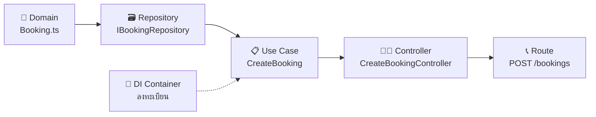

## 🧱 Part 1.5: The Building Blocks — ชิ้นส่วนพื้นฐานที่ต้องรู้

> 🧩 ก่อนจะดำดิ่งลงไปในรายละเอียดระดับโค้ด เรามาทำความเข้าใจ **"ชิ้นส่วนพื้นฐาน"** ของ TypeScript และ OOP กันก่อน — เพราะโค้ดทุกบรรทัดในโปรเจกต์นี้สร้างจากอิฐก้อนเหล่านี้

---

### 🏗️ OOP Basics — สถาปัตยกรรมระดับย่อย

#### Class & Object — "พิมพ์เขียว" vs "ของจริง"

| คำศัพท์ | เปรียบเสมือน | ตัวอย่าง |
| --- | --- | --- |
| **Class** | 📐 พิมพ์เขียวบ้าน | "บ้านจะมีห้องนอน ห้องครัว ห้องน้ำ" |
| **Object** | 🏡 บ้านที่สร้างจริง | "บ้านหลังนี้ — ห้องนอนสีฟ้า ครัวแบบเปิด" |

**Class** = แม่แบบ, **Object** = ของจริงที่สร้างจากแม่แบบ ดูตัวอย่างจริง ([User.ts](../src/modules/user/domain/User.ts)):

```typescript
// 📐 Class = พิมพ์เขียว
export class User {
  id?: string;
  username!: string;
  email!: string;
  password!: string;
  eloRating: number = 1200;
  role: UserRole = UserRole.USER;
}

// 🏡 Object = สร้างของจริง
const john = new User({
  username: "john_doe",
  email: "john@example.com",
  password: hashedPassword,
});
```

> 💡 Class เหมือนสูตรอาหาร — Object คืออาหารจานจริงที่ทำตามสูตรนั้น

---

#### Constructor — "ขั้นตอนเตรียมตัว"

เมื่อพนักงานใหม่เข้าทำงานวันแรก เขาจะได้รับกุญแจ 🔑 บัตร 🪪 อุปกรณ์ 🧰 — **Constructor** ทำหน้าที่เดียวกัน:

```typescript
// จาก User.ts — Constructor คือ "ขั้นตอนเตรียมตัว"
constructor(props: Partial<User>, id?: string) {
  Object.assign(this, props);
  this.id = id;
  if (props.eloRating === undefined) this.eloRating = 1200;
  if (props.role === undefined) this.role = UserRole.USER;
}
```

> 🎯 เวลาเรียก `new User({...})` → Constructor วิ่งอัตโนมัติ ไม่ต้องเรียกเอง

---

#### Interface — "สัญญาจ้างงาน" (Contract)

**Interface** กำหนดว่า Class ที่จะมาทำงานแทน **ต้องมี method อะไรบ้าง** แต่ไม่บอกว่าต้องทำ *ยังไง* ดูตัวอย่างจริง ([IUserRepository.ts](../src/modules/user/repositories/IUserRepository.ts)):

```typescript
// 📋 Interface = สัญญาจ้างงาน
export interface IUserRepository {
  create(user: User): Promise<User>;
  findByEmail(email: string): Promise<User | undefined>;
  findByUsername(username: string): Promise<User | undefined>;
  findById(id: string): Promise<User | undefined>;
}
```

แล้ว `SqlUserRepository` มา **"เซ็นสัญญา"** ([SqlUserRepository.ts](../src/modules/user/repositories/SqlUserRepository.ts)):

```typescript
export class SqlUserRepository implements IUserRepository {
  async create(user: User): Promise<User> { /* SQL INSERT */ }
  async findByEmail(email: string): Promise<User | undefined> { /* SQL SELECT */ }
  // ✅ ทำครบทุกข้อในสัญญา!
}
```

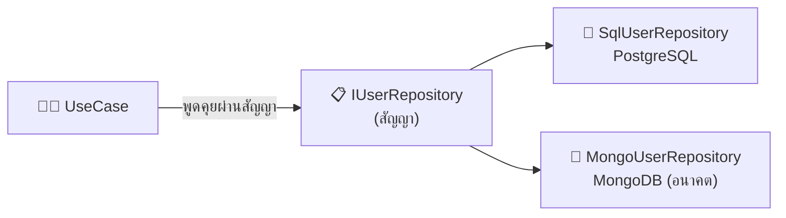

> 💡 ถ้าเปลี่ยน DB → สร้าง Class ใหม่ที่ implements Interface เดิม ระบบอื่นไม่ต้องแก้!

---

### 🔐 Access Modifiers — ป้ายอนุญาตการเข้าถึง

| Modifier | เปรียบเสมือน | ใครเข้าถึงได้ |
| --- | --- | --- |
| **`public`** | 🍽️ ห้องอาหาร | ใครก็ได้ |
| **`private`** | 🔒 สูตรลับเชฟ | เฉพาะ Class นี้ |
| **`protected`** | 👨‍👩‍👦 ความลับครอบครัว | Class นี้ + ลูก |
| **`readonly`** | 🪪 ป้ายชื่อที่ปั๊มแล้ว | อ่านได้ แก้ไม่ได้ |
| **`static`** | 🪧 ป้ายร้าน | เรียกได้โดยไม่ต้องสร้าง Object |
| **`abstract`** | 📖 กฎแฟรนไชส์ | บังคับให้ลูก implement |

```typescript
@injectable()
class LoginUserUseCase {
  constructor(
    @inject("UserRepository")
    private userRepository: IUserRepository,
    //  ↑ private = เฉพาะ Class นี้ใช้ได้ ข้างนอกเรียกไม่ได้
  ) {}

  // public (default) = ข้างนอกเรียกได้
  async execute(data: LoginUserInput) {
    const user = await this.userRepository.findByUsernameWithPassword(data.username);
  }
}
```

> 🎯 **หลักคิด:** เปิดเผยให้น้อยที่สุด (`private` ก่อน) → ค่อยขยายเมื่อจำเป็น

---

### 🧩 Design Patterns — รูปแบบการทำงาน

#### Repository Pattern — "ผู้จัดการคลังสินค้า"

UseCase (เชฟ) ไม่ต้องรู้ว่าวัตถุดิบมาจากไหน แค่บอก Repository "ขอข้อมูล User ID นี้" → Repository ไปจัดหามาให้:

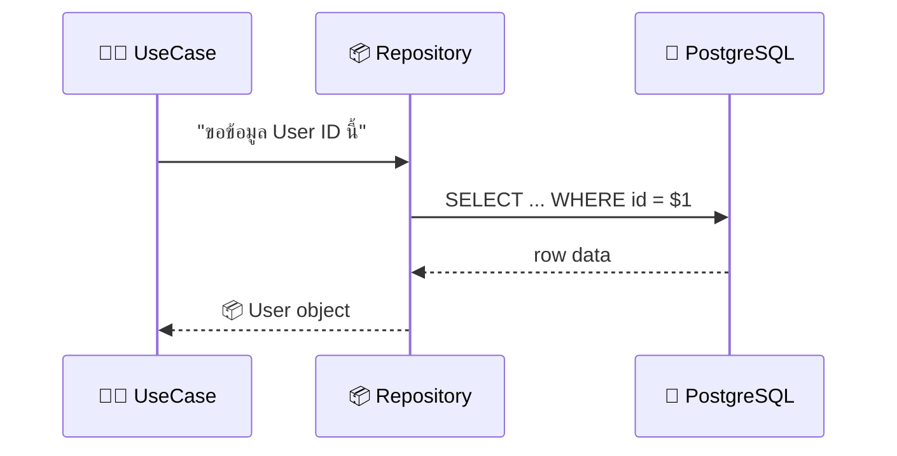

#### Dependency Injection (DI) — "ส่งเครื่องมือให้ ไม่ใช่ให้ไปซื้อเอง"

```typescript
// ❌ ซื้อเอง — ผูกมัดตายตัว
class GetProfileUseCase {
  private userRepository = new SqlUserRepository(); // 💀
}

// ✅ ร้านจัดให้ — Dependency Injection
@injectable()
class GetProfileUseCase {
  constructor(
    @inject("UserRepository")
    private userRepository: IUserRepository, // ← Interface!
  ) {}
}
```

DI Container เป็น "ฝ่ายบุคคล" จับคู่สัญญากับพนักงาน ([container/index.ts](../src/shared/container/index.ts)):

```typescript
container.registerSingleton<IUserRepository>(
  "UserRepository",      // ชื่อตำแหน่ง
  SqlUserRepository,     // พนักงานตัวจริง
);
```

> 💡 DI ทำให้โค้ดเหมือน LEGO — ถอดเปลี่ยนง่าย ทดสอบง่าย ไม่ผูกมัดกัน

---

## ⚡ Part 1.6: The Backend Essentials — หัวใจของการทำ Backend

> 🔌 ก่อนเจาะลึกโค้ดใน Part 2 มาเข้าใจ **กลไกพื้นฐานของ Backend** กันก่อน — Async ทำงานยังไง? ข้อมูลเข้า-ออกต่างกันยังไง? แล้วทำไมห้ามเขียนรหัสผ่านในโค้ด?

---

### ⏳ Asynchronous Programming — พนักงานรับออเดอร์คนเดียว

> 📂 ดูตัวอย่างจริง: [GetProfileUseCase.ts](../src/modules/user/useCases/GetProfile/GetProfileUseCase.ts) | [SqlUserRepository.ts](../src/modules/user/repositories/SqlUserRepository.ts)

Node.js มี **Main Thread เดียว** เหมือนร้านที่มี **พนักงานรับออเดอร์คนเดียว** ถ้ายืนรอที่ครัวจนอาหารเสร็จ → ลูกค้าโต๊ะอื่นไม่มีคนรับออเดอร์!

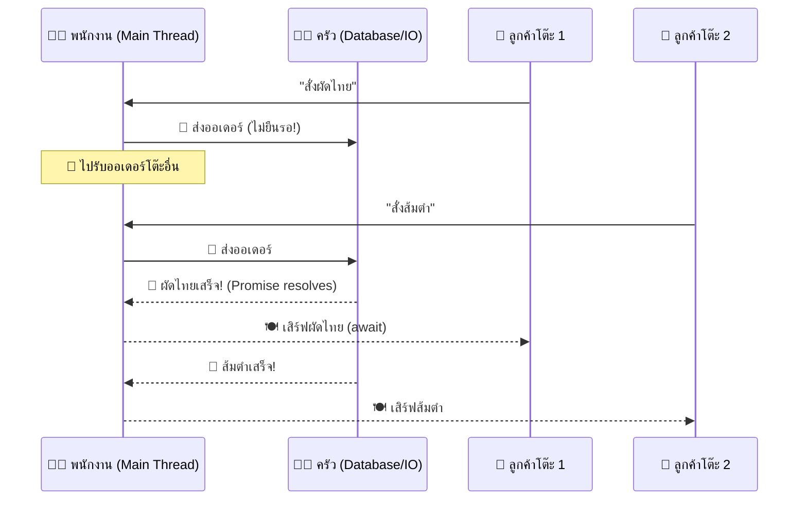

```typescript
// จาก SqlUserRepository.ts
async findById(id: string): Promise<User | undefined> {
  const result = await DbProvider.query(    // await = "รอครัว" แต่ไม่ block!
    `SELECT ... FROM users WHERE id = $1`, [id],
  );
  return result.rows.length === 0 ? undefined : this.mapRowToUser(result.rows[0]);
}
```

| คำ | เปรียบเสมือน | อธิบาย |
| --- | --- | --- |
| **`async`** | 🏷️ ร้านนี้ส่งเดลิเวอรี่ได้ | function จะ return `Promise` |
| **`await`** | ⏳ รอเดลิเวอรี่มาถึง | หยุดรอผลลัพธ์ (ไม่ block คนอื่น) |
| **`Promise`** | 📦 พัสดุกำลังจัดส่ง | กล่องที่จะมีผลลัพธ์ในอนาคต |

> 🎯 เห็น `Promise` → ต้อง `await` | เห็น `await` → function ต้อง `async` | Database/HTTP/File → เป็น async เสมอ

---

### 📋 DTO vs Domain Entity — ใบออเดอร์ vs จานอาหาร

> 📂 ดูจริง: [RegisterUserDTO.ts](../src/modules/auth/useCases/RegisterUser/RegisterUserDTO.ts) (DTO) | [User.ts](../src/modules/user/domain/User.ts) (Entity)

| | 📝 ใบออเดอร์ (DTO) | 🍽️ จานอาหาร (Entity) |
| --- | --- | --- |
| **คืออะไร** | ข้อมูลที่ลูกค้าส่งมา | ข้อมูลฉบับสมบูรณ์ภายในระบบ |
| **มีอะไร** | แค่ที่ลูกค้ากรอก | ทุกอย่าง: ID, hash, timestamps |
| **ตรวจสอบ** | Zod ตรวจก่อนเข้าครัว | Business logic ตรวจอีกที |

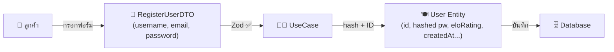

> ⚠️ ห้ามส่ง Entity กลับลูกค้าโดยตรง (มี hash!) → ใช้ `user.toPublic()`

---

### 🌐 REST API & HTTP Status Codes — ภาษาที่คุยกับลูกค้า

> 📂 ดู: [ApiResponse.ts](../src/shared/utils/ApiResponse.ts) | [ErrorHandler.ts](../src/shared/middlewares/ErrorHandler.ts)

| Status | เปรียบเสมือน | ความหมาย |
| --- | --- | --- |
| **200** ✅ | 🍽️ อาหารเสิร์ฟแล้ว | สำเร็จ |
| **201** ✅ | 📋 รับออเดอร์แล้ว | สร้างสำเร็จ |
| **400** ❌ | 🚫 เมนูนี้ไม่มี | ข้อมูลผิด (Validation) |
| **401** 🔒 | 🚪 แสดงบัตรก่อน | ยังไม่ Login |
| **403** ⛔ | 🚧 ห้อง VIP เท่านั้น | ไม่มีสิทธิ์ |
| **404** 🔍 | 🤷 ไม่เจอโต๊ะที่จอง | ไม่พบข้อมูล |
| **500** 💥 | 🔥 ครัวไฟไหม้ | Server พัง (ผิดฝั่งเรา) |

```typescript
// ทุก Response ใช้ format มาตรฐาน (ApiResponse.ts)
ApiResponse.success("Login successful", { token });  // ✅
ApiResponse.error("Validation failed", errors);       // ❌
```

> 💡 Format เดียวกัน → Frontend รู้เลยว่า `status === "success"` หรือ `"error"` ไม่ต้องเดา

---

### 🔐 Environment Variables — ตู้เซฟของผู้จัดการ

> 📂 ดูจริง: [.env.example](../.env.example) | [server.ts](../src/infra/http/server.ts)

**ห้ามเด็ดขาด** แปะรหัสไว้ที่ประตูหน้าร้าน (hardcode ใส่โค้ดแล้ว push GitHub)!

```typescript
// ❌ Hardcode 💀
const JWT_SECRET = "my_super_secret_key_123";

// ✅ อ่านจากตู้เซฟ
const JWT_SECRET = process.env.JWT_SECRET;
const PORT = process.env.PORT || 3333;
```

| ไฟล์ | คืออะไร | อยู่ใน Git? |
| --- | --- | --- |
| `.env.example` | 📋 template | ✅ share ได้ |
| `.env` | 🔐 ค่าจริง | ❌ อยู่ใน `.gitignore` |

> 🎯 **กฎเหล็ก:** ห้าม commit `.env` | ต้องมี `.env.example` | ห้าม hardcode ค่า sensitive

---

## 🛡️ Part 1.7: The Advanced Arsenal — อาวุธขั้นสูงของ Backend

> 🔰 เมื่อเข้าใจพื้นฐานแล้ว มาเรียนรู้ **"อาวุธขั้นสูง"** ที่ทำให้ระบบปลอดภัย จัดการสิทธิ์ได้ และพร้อมเปิดใช้งานจริง

---

### 🚪 Middleware — รปภ. คัดกรองคนหน้าประตู

> 📂 ดูจริง: [AuthMiddleware.ts](../src/shared/middlewares/AuthMiddleware.ts) | [app.ts](../src/infra/http/app.ts)

ก่อนถึงพนักงานเสิร์ฟ (Controller) ต้องผ่าน **รปภ. (Middleware)** ก่อน — ไม่ผ่านก็ถูกไล่กลับ!

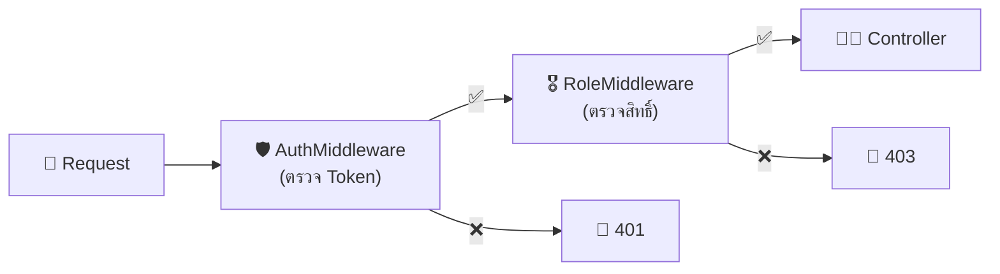

ตัวอย่างจริง ([auth.routes.ts](../src/infra/http/routes/auth.routes.ts)):

```typescript
authRouter.post(
  "/admin-create-user",
  ensureAuthenticated,  // ด่าน 1: Login แล้ว?
  ensureAdmin,          // ด่าน 2: เป็น Admin?
  createUserByAdminController.handle.bind(createUserByAdminController),
);
```

| Route | ด่าน Middleware | ใครเข้าถึงได้ |
| --- | --- | --- |
| `POST /register` | ไม่มี | ใครก็ได้ |
| `GET /profile` | `ensureAuthenticated` | คนที่ Login แล้ว |
| `POST /admin-create-user` | `ensureAuthenticated` + `ensureAdmin` | Admin เท่านั้น |

> 💡 Middleware = "ด่านตรวจ" ต่อเป็นโซ่ — ด่านไหนไม่ผ่าน สายโซ่หยุดทันที

---

### 🪪 Authentication vs Authorization — บัตรประชาชน vs ป้ายห้อยคอ VIP

> 📂 AuthN: [AuthMiddleware.ts](../src/shared/middlewares/AuthMiddleware.ts) | AuthZ: [RoleMiddleware.ts](../src/shared/middlewares/RoleMiddleware.ts)

| | 🪪 Authentication (AuthN) | 🎖️ Authorization (AuthZ) |
| --- | --- | --- |
| **คำถาม** | "คุณเป็นใคร?" | "คุณมีสิทธิ์ทำอะไร?" |
| **เปรียบเสมือน** | แสดงบัตรประชาชนที่ประตู | ป้ายห้อยคอบอกว่าเข้าห้อง VIP ได้ไหม |
| **ถ้าไม่ผ่าน** | `401 Unauthorized` | `403 Forbidden` |

```typescript
// 🪪 AuthN — "คุณเป็นใคร?" (AuthMiddleware.ts)
export function ensureAuthenticated(request, response, next) {
  const authHeader = request.headers.authorization;
  if (!authHeader) throw new AppError("Token missing", 401);
  const { sub, role } = jwt.verify(token, getJwtSecret()) as IPayload;
  request.user = { id: sub, role };
  return next();  // ✅ รู้แล้วว่าเป็นใคร
}

// 🎖️ AuthZ — "คุณมีสิทธิ์ไหม?" (RoleMiddleware.ts)
export function ensureAdmin(request, response, next) {
  if (request.user.role !== UserRole.ADMIN)
    throw new AppError("User is not an admin", 403);
  return next();  // ✅ เป็น Admin
}
```

> 🎯 AuthN = "ตรวจตั๋ว" (มีตั๋วไหม?) → AuthZ = "ตรวจโซน" (ตั๋วเข้า VIP ได้ไหม?)

---

### 🔐 Password Hashing — เครื่องบดที่ย้อนกลับไม่ได้

> 📂 Hash: [CreateUserService.ts](../src/modules/user/services/CreateUserService.ts) | Compare: [LoginUserUseCase.ts](../src/modules/auth/useCases/LoginUser/LoginUserUseCase.ts)

> 🥩 **เครื่องบดเนื้อ** — บดเนื้อหมูเป็นไส้กรอกได้ แต่ **ไม่มีทางเอาไส้กรอกกลับเป็นเนื้อหมูเดิม** แม้แฮกเกอร์ได้ DB ก็เห็นแค่ "ไส้กรอก" (hash)!

```typescript
// สมัคร → บดเนื้อ
const hashedPassword = await bcrypt.hash("MyP@ssw0rd123", 10);
// ผลลัพธ์: "$2a$10$N9qo8uLOickgx2ZM..." ← ย้อนกลับไม่ได้!

// Login → เทียบไส้กรอก
const isMatch = await bcrypt.compare(inputPassword, user.password);
if (!isMatch) throw new AppError("Username or password incorrect", 401);
```

| | ❌ เก็บ password ตรงๆ | ✅ เก็บ hash (bcrypt) |
| --- | --- | --- |
| แฮกเกอร์ได้ DB | 🔥 ได้ password ทั้งหมด | 🛡️ ได้แค่ hash (ย้อนไม่ได้) |
| password ซ้ำกัน | hash เหมือนกัน | hash ต่างกัน (เพราะ Salt) |

> 💡 **Salt** = ค่าสุ่มผสมก่อนบด → password เดียวกัน hash ต่างกันทุกครั้ง

---

### 🌱 Database Seeding — เสกผู้จัดการคนแรก

> 📂 ดูจริง: [seed-admin.ts](../src/scripts/seed-admin.ts)

**ปัญหาไก่กับไข่:** ถ้า *"เฉพาะ Admin สร้าง User ได้"* แล้วใครสร้าง Admin คนแรก? 🤔

> 🏪 ก่อนเปิดร้าน เจ้าของ **เดินเข้าประตูหลัง** ทิ้ง Master Key ในตู้เซฟ — นั่นคือ **Database Seeding**

```typescript
// seed-admin.ts — "เจ้าของเข้าประตูหลัง"
const hashedPassword = await bcrypt.hash(password, 10);
await DbProvider.query(
  `INSERT INTO users (...) VALUES ($1, ..., $7)
   ON CONFLICT (username) DO NOTHING`,  // รันซ้ำได้ปลอดภัย!
  ["System", "Admin", "Admin", username, email, hashedPassword, "ADMIN"],
);
```

```bash
# วิธีรัน
pnpm exec ts-node -r tsconfig-paths/register src/scripts/seed-admin.ts
```

> 🎯 Seed = สร้างข้อมูลเริ่มต้น *ก่อน* เปิดระบบ | ใช้ `ON CONFLICT DO NOTHING` เพื่อรันซ้ำได้

---

### 🌐 CORS — กฎการคุยข้ามเขต

> 📂 ดูจริง: [app.ts](../src/infra/http/app.ts)

> 🏪 ร้านอาหารในกรุงเทพ (Backend) **ปฏิเสธ** รับออเดอร์ทางโทรศัพท์จากเชียงใหม่ (Frontend) โดยอัตโนมัติ — ยกเว้นร้านจะ **ติดป้ายบอก** ว่ารับได้

```typescript
// จาก app.ts
app.use(cors());  // อนุญาตทุก origin (เหมาะตอน dev)
// Production: app.use(cors({ origin: "https://app.example.com" }));
```

| ตั้งค่า | ใช้ตอนไหน |
| --- | --- |
| `cors()` | Development |
| `cors({ origin: "https://..." })` | Production |

> ⚠️ CORS เป็นกฎของ **Browser** — Postman หรือ Server-to-Server ไม่มี CORS

---

## 🗄️ Part 1.8: Database & Reliability — ศาสตร์แห่งการควบคุมข้อมูล

> 🏦 ข้อมูลคือสิ่งมีค่าที่สุดของระบบ — ส่วนนี้สอนวิธีจัดการข้อมูลให้ปลอดภัย เร็ว และไม่พลาด

---

### 🚕 Connection Pooling — ฝูงแท็กซี่จอดรอ

> 📂 ดูจริง: [DbProvider.ts](../src/infra/database/DbProvider.ts)

ทุกครั้งที่ต้องคุยกับ Database ต้อง "เปิดสาย" (Connection) ถ้าสร้างใหม่ทุก Request → ช้ามาก เหมือนโทรเรียกแท็กซี่ทุกครั้ง

> 🚕 **Connection Pool** = ฝูงแท็กซี่จอดรอที่สนามบิน → ใครต้องการก็ขึ้นเลย ไม่ต้องรอ → ลงแล้วก็กลับมาจอดรอคนต่อไป

```typescript
// DbProvider.ts — สร้าง Pool แค่ครั้งเดียว (Singleton)
import { Pool } from "pg";

const pool = new Pool({
  host: process.env.DB_HOST,
  port: Number(process.env.DB_PORT),
  // ...
});

// ทุก Request ใช้ connection จาก Pool
static async query(text: string, params?: unknown[]) {
  return pool.query(text, params);  // ← ยืมแท็กซี่ → คืนเมื่อเสร็จ
}
```

| | ❌ ไม่มี Pool | ✅ มี Pool |
| --- | --- | --- |
| ทุก Request | สร้าง Connection ใหม่ (ช้า 50-100ms) | ยืมจาก Pool (เร็ว <1ms) |
| 100 Request พร้อมกัน | 100 Connection = DB ล่ม | 10-20 Connection หมุนเวียน |
| เปรียบเสมือน | โทรเรียกแท็กซี่ทุกเที่ยว | แท็กซี่จอดรอพร้อมใช้ |

---

### 🤝 Transactions — "สำเร็จทั้งหมด หรือ ล้มเหลวทั้งหมด"

สมมติลูกค้า **จองสนาม + ตัดเงิน** ถ้าจองสำเร็จแต่ตัดเงินไม่ได้ → ข้อมูลพัง!

> 🤝 **Transaction** = การแลกเปลี่ยนของ — ต้อง "จ่ายเงิน" กับ "ได้ของ" **พร้อมกัน** ถ้าฝั่งไหนไม่สำเร็จ → ยกเลิกทั้งหมด

```sql
-- Pseudocode
BEGIN TRANSACTION;
  INSERT INTO bookings (court_id, user_id, ...);  -- จองสนาม
  UPDATE wallets SET balance = balance - 500;      -- ตัดเงิน
COMMIT;  -- ✅ สำเร็จทั้งคู่!

-- ถ้ามี Error ตรงไหนก็ตาม:
ROLLBACK;  -- ❌ ย้อนกลับทั้งหมด เหมือนไม่เคยเกิดขึ้น
```

| คำ | เปรียบเสมือน |
| --- | --- |
| **BEGIN** | เริ่มข้อตกลง |
| **COMMIT** | ✅ จับมือ — ทั้ง 2 ฝ่ายพอใจ |
| **ROLLBACK** | ❌ ยกเลิก — คืนของให้เหมือนเดิม |

---

### ⚔️ Race Conditions — สองคนแย่งเค้กชิ้นสุดท้าย

User A กับ User B กดจองคอร์ตเดียวกันพร้อมกัน:

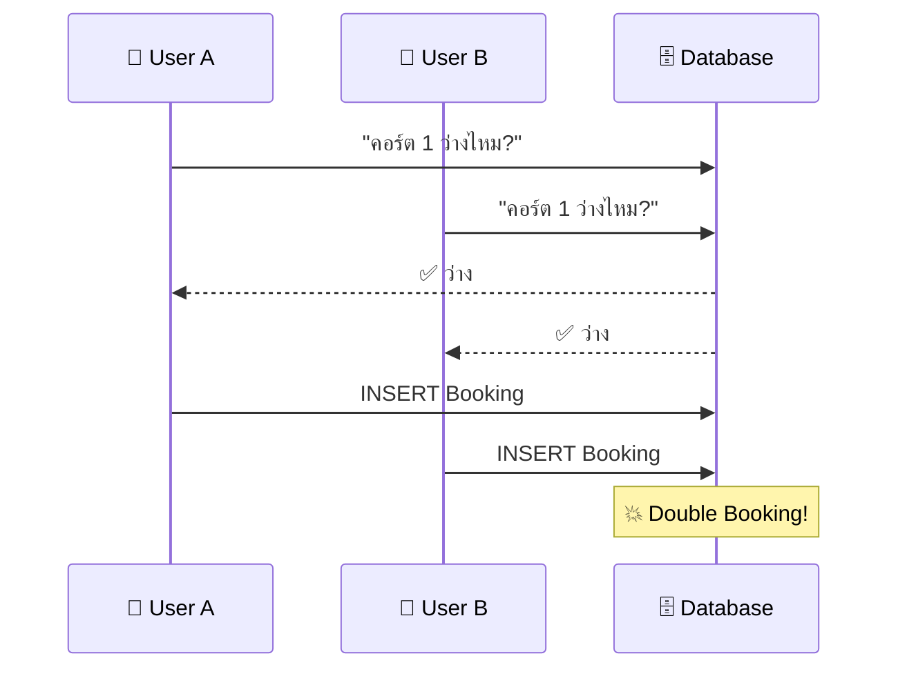

**วิธีแก้:**

| วิธี | อธิบาย |
| --- | --- |
| **Row Lock** (`SELECT ... FOR UPDATE`) | ล็อกแถวไว้จนจบ Transaction |
| **Unique Constraint** | `UNIQUE (court_id, start_time)` → DB ไม่ยอมให้ซ้ำ |
| **Optimistic Concurrency** | เพิ่ม `version` column → เช็คก่อน UPDATE |

> 🎯 **กฎของ Senior:** ใส่ constraint ที่ Database ด้วยเสมอ — DB คือด่านสุดท้ายที่ไว้ใจได้

---

### 🗑️ Soft Delete — ย้ายแฟ้มลงใต้ดิน ไม่ใช่เผาทิ้ง

| | ❌ Hard Delete | ✅ Soft Delete |
| --- | --- | --- |
| SQL | `DELETE FROM users WHERE id = $1` | `UPDATE users SET is_active = false WHERE id = $1` |
| ข้อมูล | หายถาวร กู้ไม่ได้ | ยังอยู่ แค่ซ่อน |
| เปรียบเสมือน | 🔥 เผาแฟ้มพนักงาน | 📦 ย้ายแฟ้มลงห้องเก็บเอกสาร |
| กู้คืน | ❌ ไม่ได้ | ✅ `SET is_active = true` |

```sql
-- Query ปกติจะเพิ่มเงื่อนไข:
SELECT * FROM users WHERE is_active = true;  -- ไม่เห็นคนที่ถูก "ลบ"
```

> 💡 Production ส่วนใหญ่ใช้ Soft Delete เพราะกฎหมายบางอย่างห้ามลบข้อมูลจริง (GDPR ยกเว้น)

---

## 🏛️ Part 1.9: The Architect's Vision — วิสัยทัศน์ระดับสถาปนิก

> 🔭 เมื่อเข้าใจโค้ดแล้ว มาดูภาพใหญ่ — เครื่องมือที่ทำให้ระบบพร้อม deploy, ตรวจจับปัญหาได้ และมั่นใจว่าไม่พัง

---

### 🚚 Docker — รถเข็นขายอาหารครบชุด

> 📂 ดูจริง: [docker-compose.yml](../docker-compose.yml)

ปัญหาคลาสสิก: *"ในเครื่องฉันรันได้นะ!"* 🤷 แต่เครื่องเพื่อนพัง — เพราะ version ต่างกัน, ขาด dependency

> 🚚 **Docker** = รถเข็นขายอาหารที่ **มาพร้อมเตา กระทะ วัตถุดิบ ทุกอย่าง** — ตั้งที่ไหนก็ขายได้เหมือนกันหมด

```yaml
# docker-compose.yml — สั่งเปิด "รถเข็น" ด้วยคำสั่งเดียว
services:
  db:
    image: postgres:16-alpine    # PostgreSQL พร้อมใช้
    container_name: badminton_db
    environment:
      POSTGRES_USER: admin
      POSTGRES_PASSWORD: password123
      POSTGRES_DB: badminton_db
    ports:
      - "5432:5432"              # เปิดช่องให้เข้าถึงจากเครื่องเรา
    volumes:
      - postgres_data:/var/lib/postgresql/data  # ข้อมูลไม่หายตอนปิด
```

```bash
# เปิดทุกอย่างด้วยคำสั่งเดียว:
docker compose up -d    # -d = รันเบื้องหลัง
docker compose down      # ปิดทุกอย่าง
```

| คำ | เปรียบเสมือน |
| --- | --- |
| **Image** | 📐 พิมพ์เขียวรถเข็น |
| **Container** | 🚚 รถเข็นจริงที่สร้างจากพิมพ์เขียว |
| **Volume** | 📦 กล่องเก็บวัตถุดิบถาวร (ข้อมูลไม่หายตอนปิด) |
| **Port Mapping** | 🚪 ช่องส่งอาหารออก |

---

### 📹 Observability / Logging — กล้องวงจรปิดของร้าน

> 📂 ดูจริง: [Logger.ts](../src/shared/utils/Logger.ts) | [app.ts](../src/infra/http/app.ts) (pino-http)

ถ้าร้านอาหารไม่มีกล้อง → เกิดเหตุแล้วไม่รู้ว่าเกิดอะไร ที่ไหน เมื่อไหร่

```typescript
// Logger.ts — ระบบ CCTV (Pino)
import pino from "pino";
export const logger = pino({
  level: process.env.LOG_LEVEL || "info",
});
```

| Level | เปรียบเสมือน | ใช้เมื่อไหร่ |
| --- | --- | --- |
| **DEBUG** | 🔬 กล้องซูม | ดูรายละเอียดขณะ develop |
| **INFO** | 📹 กล้องทั่วไป | บันทึกเหตุการณ์ปกติ (server started, request received) |
| **WARN** | ⚠️ กล้องตรวจจับ | มีบางอย่างผิดปกติแต่ยังทำงานได้ |
| **ERROR** | 🚨 สัญญาณเตือนภัย | เกิดข้อผิดพลาด ต้องแก้ไข! |

> 🎯 **กฎ:** Production ตั้ง `level: "info"` | Development ตั้ง `level: "debug"` | อย่า `console.log` ใน production

---

### 🕵️ Automated Testing — ผู้ตรวจสอบอาหารผู้เข้มงวด

> 📂 ดูจริง: [CreateUserService.test.ts](../src/modules/user/services/CreateUserService.test.ts) | [vitest.config.ts](../vitest.config.ts)

> 🕵️ ก่อนเสิร์ฟอาหาร ต้องมี **ผู้ตรวจสอบ** ชิมก่อนทุกจาน — ถ้าไม่ผ่าน ห้ามเสิร์ฟ!

```typescript
// CreateUserService.test.ts — ผู้ตรวจสอบ
describe("CreateUserService", () => {
  it("should hash password before saving", async () => {
    // ARRANGE — เตรียมของ
    const mockRepo = { create: vi.fn().mockResolvedValue(fakeUser), ... };
    const service = new CreateUserService(mockRepo);

    // ACT — ลงมือทำ
    const user = await service.execute({ username: "test", ... });

    // ASSERT — ตรวจผลลัพธ์
    expect(mockRepo.create).toHaveBeenCalledOnce();
    expect(user.password).not.toBe("12345678");  // ต้องถูก hash!
  });
});
```

| ประเภท | ทดสอบ | เร็วแค่ไหน | ต้องการ DB? |
| --- | --- | --- | --- |
| **Unit Test** | Logic 1 class | 3-4ms | ❌ (ใช้ Mock) |
| **Integration Test** | ทั้งระบบ HTTP → DB | 100-300ms | ✅ |

```bash
# รัน test ทั้งหมด
pnpm test
```

> 💡 **AAA Pattern:** Arrange (เตรียม) → Act (ทำ) → Assert (ตรวจ) — ทุก test ต้องมี 3 ขั้นตอนนี้

---

## 🏢 Part 1.10: The Engineering Culture — วัฒนธรรมวิศวกรรม

> 👔 เขียนโค้ดดีอย่างเดียวไม่พอ — ทีมต้องมี **กระบวนการ** ที่ทำให้ทุกคนทำงานร่วมกันได้อย่างราบรื่น

---

### 🔀 Git Workflow (Pull Request) — เสนอสูตรใหม่ให้หัวหน้าเชฟ

ไม่มีใครแก้สูตรอาหารได้ตามใจ — ต้อง **เสนอให้หัวหน้าเชฟอนุมัติ** ก่อน!

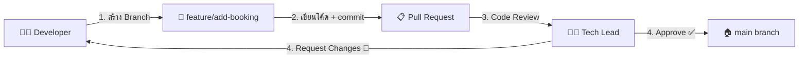

| ขั้นตอน | เปรียบเสมือน |
| --- | --- |
| **Branch** | 🧪 ห้องทดลองสูตรใหม่ (ไม่กระทบเมนูหลัก) |
| **Commit** | 📝 จดบันทึกการเปลี่ยนแปลง |
| **Pull Request** | 📋 ยื่นสูตรให้หัวหน้าตรวจ |
| **Code Review** | 🔍 หัวหน้าชิมและให้ feedback |
| **Merge** | ✅ อนุมัติ → เพิ่มเข้าเมนูจริง |

> 🎯 **กฎ:** ห้าม push ตรงไป `main` — ต้องผ่าน PR เสมอ

---

### 📖 API Documentation — เมนูอาหารสำหรับ Frontend

Frontend (พนักงานเสิร์ฟ) ต้องรู้ว่ามีเมนูอะไรบ้าง สั่งยังไง ได้อะไรกลับมา

| ต้องบอก | ตัวอย่าง |
| --- | --- |
| **Endpoint** | `POST /api/v1/auth/login` |
| **Method** | POST |
| **Request Body** | `{ "username": "john", "password": "..." }` |
| **Response 200** | `{ "status": "success", "data": { "token": "..." } }` |
| **Response 401** | `{ "status": "error", "message": "Username or password incorrect" }` |

> 💡 เครื่องมือแนะนำ: **Swagger/OpenAPI** สร้างเอกสารจากโค้ดอัตโนมัติ | **Postman Collection** แชร์ให้ Frontend ทดลองเรียก API ได้เลย

---

### 📏 Linter & Formatter — กฎยูนิฟอร์มและการจัดจาน

| เครื่องมือ | ทำอะไร | เปรียบเสมือน |
| --- | --- | --- |
| **ESLint** | ตรวจหา Bug, Anti-pattern | 🕵️ ผู้ตรวจสอบสุขอนามัย |
| **Prettier** | จัด format ให้สวยเหมือนกัน | 🎨 กฎการจัดจาน (plating) |

```bash
pnpm lint        # ตรวจ code quality
pnpm format      # จัดรูปแบบอัตโนมัติ
```

> 🎯 ทุกคนในทีมเขียนยูนิฟอร์มเดียวกัน → อ่านโค้ดของคนอื่นได้ง่าย

---

### 🏭 CI/CD — สายพานอัตโนมัติ

> 🏭 เปรียบเสมือน **สายพานโรงงาน** ที่ตรวจสอบ (CI) และจัดส่ง (CD) อาหารอัตโนมัติ

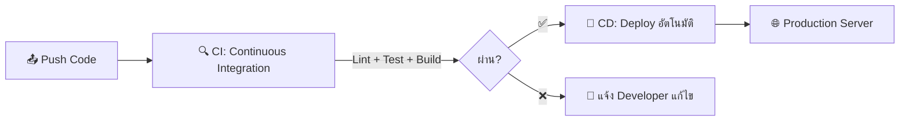

| ขั้นตอน | ทำอะไร | ถ้าไม่ผ่าน |
| --- | --- | --- |
| **Lint** | ตรวจ code style | ❌ ส่ง deploy ไม่ได้ |
| **Test** | รัน test ทั้งหมด | ❌ ส่ง deploy ไม่ได้ |
| **Build** | compile TypeScript | ❌ ส่ง deploy ไม่ได้ |
| **Deploy** | ส่งขึ้น server จริง | ✅ อัตโนมัติ |

> 💡 CI/CD ทำให้ **ไม่มีทาง** deploy code ที่ test ไม่ผ่าน — เหมือนสายพานที่โยนอาหารไม่ผ่านมาตรฐานทิ้งอัตโนมัติ

---

## ⚡ Part 1.11: Elite Performance & Security — การรีดประสิทธิภาพขั้นสุด

> 🏎️ ระบบที่ดีต้องเร็ว ปลอดภัย และรองรับคนจำนวนมาก — ส่วนนี้สอนเทคนิคที่ทำให้ระบบพร้อมรบ

---

### ⚡ Node.js Event Loop — The Flash รับออเดอร์

Node.js มี **thread เดียว** ที่ทำงานเร็วมาก (Event Loop) เหมือน The Flash — แต่ถ้าให้เขาไปยกของหนัก (CPU-intensive) ทุกอย่างจะหยุดชะงัก!

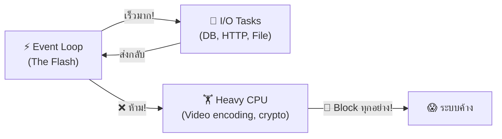

| ✅ ทำได้เร็ว (Non-blocking) | ❌ ห้ามทำใน Main Thread |
| --- | --- |
| Database query | คำนวณหนักๆ (crypto, image processing) |
| HTTP request | Loop ล้านรอบ |
| File read/write | Synchronous อะไรก็ตาม |

> 🎯 **กฎ:** อย่า block Event Loop — ถ้าต้องทำงานหนัก ส่งไปทำใน Worker Thread หรือ Background Job

---

### 🚦 Rate Limiting — รปภ. ไล่คนก่อกวน

> 📂 ดูจริง: [app.ts](../src/infra/http/app.ts)

ถ้าลูกค้าคนเดียวกดกริ่ง 1,000 ครั้งใน 1 นาที → ต้องมีคนห้าม!

```typescript
// จาก app.ts — Rate Limiting
app.use(rateLimit({
  windowMs: 15 * 60 * 1000,  // 15 นาที
  limit: 100,                 // สูงสุด 100 requests ต่อ IP
  message: {
    status: "error",
    message: "Too many requests, please try again later.",
  },
}));
```

| | ไม่มี Rate Limit | มี Rate Limit |
| --- | --- | --- |
| DDoS Attack | 🔥 Server ล่ม | 🛡️ Block IP อัตโนมัติ |
| Brute Force Login | 💀 ลองรหัสได้ไม่จำกัด | ⏳ ต้องรอ 15 นาที |
| Normal User | ปกติ | ปกติ (100 req เกินพอ) |

---

### 📄 Pagination — ไม่โยนหนังสือ 10,000 หน้าให้ลูกค้า

ถ้ามี User 10,000 คน → ส่งทีเดียวทั้งหมด? ❌ Server ช้า, Client ค้าง!

```typescript
// แบบ Pagination
GET /users?page=1&limit=20    // → ส่งแค่ 20 คนแรก
GET /users?page=2&limit=20    // → ส่ง 20 คนถัดไป
```

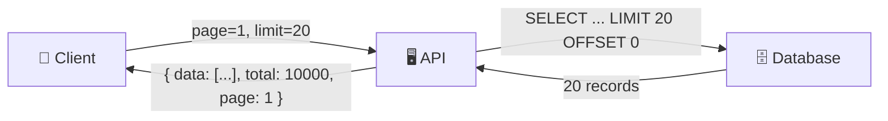

> 💡 บอก Frontend ด้วยว่ามีทั้งหมดกี่รายการ (`total`) เพื่อแสดงปุ่ม pagination

---

### ⚡ Caching (Redis) — เฟร้นช์ฟรายใต้หลอดไฟอุ่น

ข้อมูลบางอย่างถูกเรียกบ่อยมาก → ทำไมต้อง query DB ทุกครั้ง?

> 🍟 เหมือน **เฟร้นช์ฟรายใต้หลอดไฟอุ่น** — ทำเตรียมไว้เลย ลูกค้าสั่งก็เสิร์ฟได้ทันที ไม่ต้องรอทอดใหม่

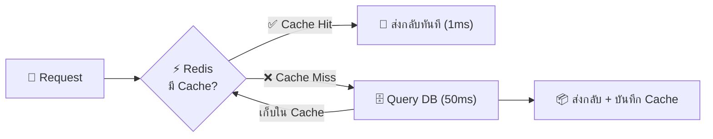

| | ❌ ไม่มี Cache | ✅ มี Redis Cache |
| --- | --- | --- |
| ทุก Request | Query DB (50-100ms) | อ่านจาก Redis (1ms) |
| DB Load | สูงมาก | ลดลง 80-90% |
| เหมาะกับ | — | ข้อมูลที่เปลี่ยนไม่บ่อย (profile, settings) |

> ⚠️ Cache ต้องมี **TTL (Time-To-Live)** เหมือนเฟร้นช์ฟรายที่ต้องทิ้งหลังผ่านไป 30 นาที

---

## 🌌 Part 1.12: The Grand Scale — สถาปัตยกรรมไร้ขีดจำกัด

> 🚀 เมื่อระบบโตจนเครื่อง 1 ตัวรับไม่ไหว — ต้องคิดแบบ "ระบบกระจาย" นี่คือแนวคิดที่ Senior ต้องรู้

---

### 📟 WebSockets — เพจเจอร์สั่นแทนที่จะถามซ้ำ

HTTP ปกติ = ลูกค้าต้อง **ถามซ้ำ** ทุก 5 วินาที ว่าอาหารเสร็จหรือยัง (Polling) → สิ้นเปลือง!

> 📟 **WebSocket** = ให้ **เพจเจอร์** แก่ลูกค้า — เมื่ออาหารเสร็จ เพจเจอร์สั่น ลูกค้าไม่ต้องมาถาม!

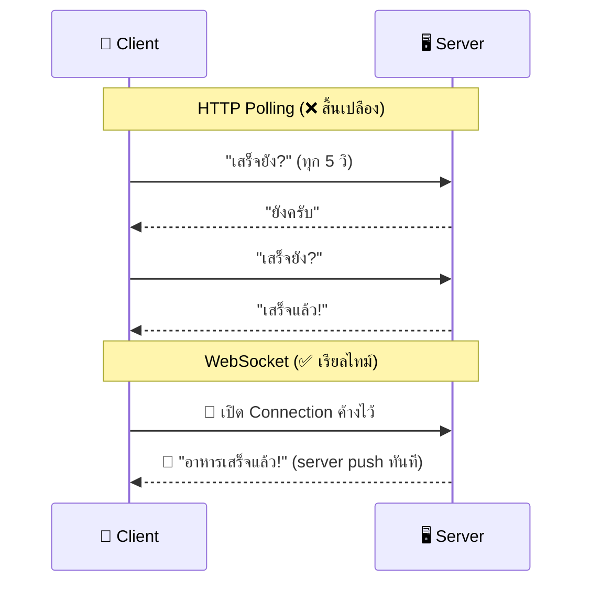

| ใช้ WebSocket เมื่อ | ตัวอย่าง |
| --- | --- |
| **แจ้งเตือนเรียลไทม์** | "มีคนจองสนามของคุณแล้ว!" |
| **แชท** | ข้อความมาถึงทันที |
| **Live scoreboard** | คะแนนอัพเดทสด |

---

### 📮 Message Queues — ตะกร้างาน "ทำทีหลัง"

บางงานไม่ต้องทำทันที เช่น ส่ง Email ยืนยัน — ถ้าทำตอน Request ลูกค้าต้องรอนาน!

> 📮 **Message Queue** = ตะกร้าที่โยนงาน "ส่ง Email" เข้าไป แล้วพนักงาน backroom มาหยิบไปทำทีหลัง ลูกค้าไม่ต้องรอ

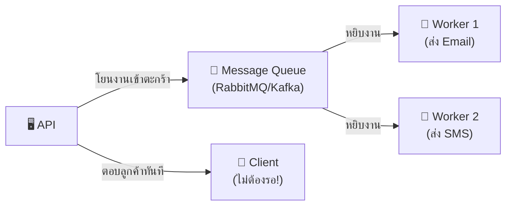

| ❌ ไม่มี Queue | ✅ มี Queue |
| --- | --- |
| API ส่ง Email ก่อนตอบ Client (ช้า 2-3 วินาที) | API โยนงานแล้วตอบทันที (<100ms) |
| ส่ง Email ล้มเหลว = Request ล้มเหลว | ส่งล้มเหลว = Queue ลองใหม่อัตโนมัติ (retry) |

---

### ⏰ Cron Jobs — ภารโรงกะดึก

บางงานต้องทำ **ตามเวลา** เช่น ลบ booking ที่หมดอายุทุกเที่ยงคืน

> ⏰ เหมือน **ภารโรงกะดึก** ที่มาทำความสะอาดทุกคืน — ไม่ต้องมีใครสั่ง

```
# ตัวอย่าง Cron Schedule
┌───────────── minute (0-59)
│ ┌─────────── hour (0-23)
│ │ ┌───────── day of month (1-31)
│ │ │ ┌─────── month (1-12)
│ │ │ │ ┌───── day of week (0-6)
│ │ │ │ │
0 0 * * *     ← ทุกเที่ยงคืน
*/5 * * * *   ← ทุก 5 นาที
0 9 * * 1     ← ทุกวันจันทร์ 9 โมง
```

| ใช้ Cron เมื่อ | ตัวอย่าง |
| --- | --- |
| **ลบข้อมูลหมดอายุ** | ลบ booking เก่าทุกเที่ยงคืน |
| **สร้างรายงาน** | สรุปยอดทุกวันจันทร์ |
| **ล้าง temp files** | ลบไฟล์ชั่วคราวทุก 6 ชั่วโมง |

---

### 🏘️ Microservices — แยกบาร์เครื่องดื่มออกจากครัว

ถ้าร้านอาหารใหญ่มาก — ครัว ล้มก็ลากเครื่องดื่มล้มด้วย!

> 🏘️ **Microservices** = แยกบาร์เครื่องดื่มไปอยู่ **อาคารแยก** → ถ้าครัวไฟไหม้ คนยังซื้อเครื่องดื่มได้!

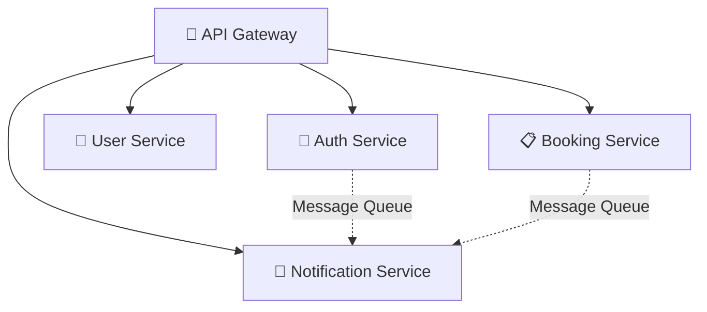

| | Monolith (ร้านเดียว) | Microservices (หลายอาคาร) |
| --- | --- | --- |
| **ข้อดี** | ง่าย, deploy ทีเดียว | แยกส่วน, scale ได้อิสระ |
| **ข้อเสีย** | อย่างหนึ่งพัง = ทุกอย่างพัง | ซับซ้อน, ต้องจัดการ network |
| **เหมาะกับ** | ทีมเล็ก, โปรเจกต์เริ่มต้น | ทีมใหญ่, ระบบที่โตมากแล้ว |

> 🎯 **กฎของ Senior:** เริ่มต้นด้วย Monolith → แยกเป็น Microservices เมื่อจำเป็นจริงๆ เท่านั้น (อย่า over-engineer!)

---

---

## 🟡 Part 2: Under the Hood — เจาะลึกระดับโค้ด

> 🔬 ส่วนนี้เจาะลึกทุกกลไกภายใน — จาก TypeScript พื้นฐานถึง DI Container

---

### 📘 2.1 TypeScript Fundamentals

> 📂 ดูของจริง: [User.ts](../src/modules/user/domain/User.ts) (Entity), [user-role.enum.ts](../src/modules/user/enum/user-role.enum.ts) (Enum)

```typescript
// Types & Interfaces — "พิมพ์เขียว" ของข้อมูล
interface CreateUserInput {
  username: string;
  email: string;
  password: string;
  age?: number; // ? = optional
}

// Enum — "ตัวเลือกตายตัว"
enum UserRole {
  ADMIN = "ADMIN",
  USER = "USER",
}

// Generics — "แม่พิมพ์สารพัด"
const userBox: Box<User> = { content: someUser, label: "ข้อมูลผู้ใช้" };

// async/await — "สั่งอาหารแล้วรอ"
const user = await this.userRepository.findById(id);
```

---

### 🌐 2.2 HTTP & REST API Deep Dive

| Verb + Route        | ความหมาย         | ตัวอย่าง        |
| ------------------- | ---------------- | --------------- |
| `GET /users`        | ดูรายชื่อทั้งหมด | ดึงผู้ใช้ทุกคน  |
| `GET /users/123`    | ดูข้อมูลคนเดียว  | ดึง user ID 123 |
| `POST /users`       | สร้างใหม่        | สมัครสมาชิก     |
| `PUT /users/123`    | แก้ไขทั้งหมด     | อัพเดทโปรไฟล์   |
| `DELETE /users/123` | ลบ               | ลบบัญชี         |

**Response Format มาตรฐาน** (ดูของจริง: [ApiResponse.ts](../src/shared/utils/ApiResponse.ts))**:**

```json
// ✅ สำเร็จ
{ "status": "success", "message": "Login successful", "data": { ... } }

// ❌ Error
{ "status": "error", "message": "Username or password incorrect" }

// ❌ Validation ไม่ผ่าน
{ "status": "error", "message": "Validation failed",
  "errors": [{ "field": "email", "message": "Invalid email" }] }
```

**Status Codes ที่ต้องรู้:** `200` สำเร็จ / `400` ข้อมูลผิด / `401` ไม่ได้ Login / `403` ไม่มีสิทธิ์ / `404` ไม่เจอ / `500` Server พัง

---

### 🗄️ 2.3 SQL & Database Design

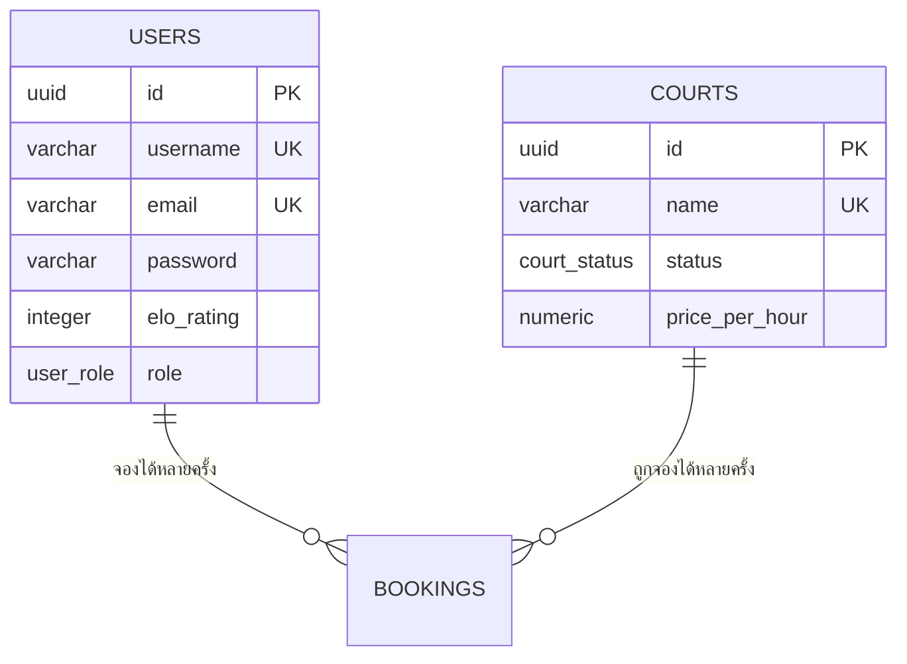

**Index** = สารบัญหนังสือ → ค้นหาเร็วขึ้นมหาศาล
**Transaction** = ทำหลายอย่างต้องสำเร็จทั้งหมดหรือล้มเหลวทั้งหมด
**Normalization** = เก็บข้อมูลไม่ซ้ำ ใช้ ID อ้างอิงแทน

---

### 🛡️ 2.4 Middleware Chain — "กำแพง 6 ชั้น"

> 📂 ดูลำดับการต่อ middleware จริง: [app.ts](../src/infra/http/app.ts) | ดูระบบ error: [ErrorHandler.ts](../src/shared/middlewares/ErrorHandler.ts)

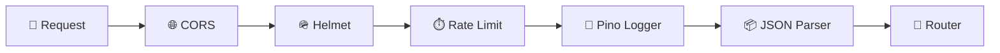

| ด่าน              | ทำอะไร                            | ถ้าไม่ผ่าน  |
| ----------------- | --------------------------------- | ----------- |
| **CORS**          | ตรวจ Origin ว่ามาจากเว็บที่อนุญาต | `403`       |
| **Helmet**        | เพิ่ม Security Headers            | (ไม่ block) |
| **Rate Limit**    | เกิน 100 req/15 นาที → block      | `429`       |
| **Pino Logger**   | จดบันทึกทุก Request               | (ไม่ block) |
| **JSON Parser**   | แปลง body เป็น object             | `400`       |
| **Error Handler** | จับ Error ที่หลุดมาทั้งหมด        | `500`       |

> ถ้าด่านไหนไม่ผ่าน สายโซ่หยุดทันที — เหมือนสนามบินจริงๆ

---

### 🔐 2.5 JWT Token — "สายรัดข้อมือในงานคอนเสิร์ต"

> 📂 สร้าง Token: [LoginUserUseCase.ts](../src/modules/auth/useCases/LoginUser/LoginUserUseCase.ts) | ตรวจ Token: [AuthMiddleware.ts](../src/shared/middlewares/AuthMiddleware.ts)

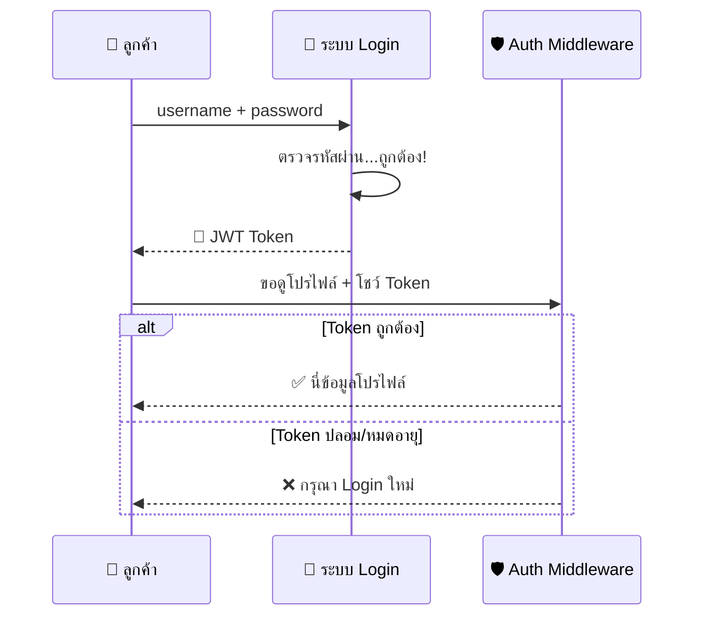

```typescript
// สร้าง Token (LoginUserUseCase)
const token = jwt.sign(
  { sub: user.id, role: user.role },
  process.env.JWT_SECRET!,
  { expiresIn: "1d" },
);

// ตรวจ Token (AuthMiddleware)
const { sub, role } = jwt.verify(token, getJwtSecret()) as IPayload;
request.user = { id: sub, role: role as UserRole };
```

> ⚠️ `JWT_SECRET` คือ "แม่กุญแจ" — ถ้าไม่ได้ตั้งค่า Server หยุดทำงานทันที (Fail-Fast)

---

### 🔒 2.6 Bcrypt — "ตู้เซฟที่เปิดไม่ได้"

> 📂 ดูการ hash password จริง: [CreateUserService.ts](../src/modules/user/services/CreateUserService.ts) | ดูการ compare: [LoginUserUseCase.ts](../src/modules/auth/useCases/LoginUser/LoginUserUseCase.ts)

```typescript
// สมัคร → Hash password (ย้อนกลับไม่ได้!)
const hashed = await bcrypt.hash("MyP@ssw0rd123", 10); // 10 = salt rounds

// Login → เทียบ hash
const isMatch = await bcrypt.compare(inputPassword, user.password);
if (!isMatch) throw new AppError("Username or password incorrect", 401);
// ⚠️ ไม่บอกว่า "password ผิด" หรือ "username ไม่มี" → ป้องกัน enumeration attack
```

**Salt** = ค่าสุ่มเพิ่มมา → password เดียวกัน hash ได้ต่างกัน → Rainbow Table ใช้ไม่ได้

---

### 🧩 2.7 DI Container & Constructor Injection

> 📂 ลงทะเบียน: [container/index.ts](../src/shared/container/index.ts) | Composition Root: [auth.routes.ts](../src/infra/http/routes/auth.routes.ts) + [user.routes.ts](../src/infra/http/routes/user.routes.ts)

```typescript
// 1. ลงทะเบียน (shared/container/index.ts)
container.registerSingleton<IUserRepository>(
  "UserRepository",
  SqlUserRepository,
);

// 2. UseCase รับ dependency ผ่าน Constructor
@injectable()
class LoginUserUseCase {
  constructor(
    @inject("UserRepository")
    private userRepository: IUserRepository, // ← "ของถูกส่งมาให้"
  ) {}
}

// 3. Controller รับ UseCase ผ่าน Constructor
@injectable()
class LoginUserController {
  constructor(
    @inject(LoginUserUseCase)
    private loginUserUseCase: LoginUserUseCase,
  ) {}

  async handle(req: Request, res: Response, next: NextFunction) {
    try {
      const data = loginUserSchema.parse(req.body);
      const result = await this.loginUserUseCase.execute(data);
      return res.json(ApiResponse.success("Login successful", result));
    } catch (error) {
      next(error);
    }
  }
}

// 4. Routes — Composition Root (ที่เดียวที่เรียก container.resolve)
const loginController = container.resolve(LoginUserController);
authRouter.post("/login", loginController.handle.bind(loginController));
// ⚠️ .bind() จำเป็นเพื่อรักษา this context
```

> [!IMPORTANT]
> `container.resolve()` อยู่ได้แค่ใน **Routes** (Composition Root) เท่านั้น — ห้ามอยู่ใน Controller หรือ UseCase

---

### 🔍 2.8 Zod & Error Boundary — Never Trust User Input

> 📂 Zod schema ตัวอย่าง: [RegisterUserDTO.ts](../src/modules/auth/useCases/RegisterUser/RegisterUserDTO.ts) | Error handler: [ErrorHandler.ts](../src/shared/middlewares/ErrorHandler.ts) | Custom error: [AppError.ts](../src/shared/errors/AppError.ts)

```typescript
// Zod schema — ตรวจสอบข้อมูลก่อนเข้าระบบ
const registerSchema = z.object({
  username: z.string().min(3).max(30),
  email: z.string().email(),
  password: z.string().min(8),
});

// Controller → parse() → ถ้าไม่ผ่าน throw ZodError → next(error) ส่งไป ErrorHandler

// ErrorHandler — รวมศูนย์ Error ทั้งหมดไว้ที่เดียว
if (err instanceof ZodError) {
  const errors = err.issues.map((issue) => ({
    field: issue.path.join("."),
    message: issue.message,
  }));
  return response
    .status(400)
    .json(ApiResponse.error("Validation failed", errors));
}
```

| แบบกระจาย (❌)                      | แบบรวมศูนย์ (✅)                                          |
| ----------------------------------- | --------------------------------------------------------- |
| แต่ละ Controller จัดการ Error เอง   | `ErrorHandler` จัดการที่เดียว                             |
| Format ไม่เหมือนกัน                 | ทุก endpoint ส่ง `{ status, message, errors? }` เหมือนกัน |
| ลืม `try/catch` 1 ที่ → Server hang | ถูกบังคับใช้ pattern เดียวกัน                             |

---

### 🔌 2.9 Graceful Shutdown — "ปิดร้านอย่างมีมารยาท"

> 📂 ดู shutdown handler จริง: [server.ts](../src/infra/http/server.ts) | DB Pool: [DbProvider.ts](../src/infra/database/DbProvider.ts)

```mermaid
sequenceDiagram
    participant OS as 💻 OS
    participant Server as 🖥️ Server
    participant Pool as 🏊 DB Pool

    OS->>Server: 🛑 SIGTERM
    Server->>Server: หยุดรับ Request ใหม่
    Note over Server: ⏳ รอ Request ที่ค้างให้เสร็จ
    Server->>Pool: ปิด Connection ทั้งหมด
    Pool-->>Server: ✅ ปิดแล้ว
    Server->>OS: 👋 exit 0

    Note over Server: ⏰ Safety net: 10 วิเบังคับปิด
```

ถ้าปิดแบบ "ดึงปลั๊ก" → ข้อมูลค้าง, Connection ล้น, Log หาย

---

### 📁 2.10 Path Aliases

```json
// tsconfig.json
{
  "paths": {
    "@shared/*": ["./src/shared/*"],
    "@modules/*": ["./src/modules/*"],
    "@infra/*": ["./src/infra/*"]
  }
}
```

```typescript
// ❌ import { ApiResponse } from "../../../../shared/utils/ApiResponse";
// ✅ import { ApiResponse } from "@shared/utils/ApiResponse";
```

`@shared/` = โค้ดกลาง, `@modules/` = import ข้ามโมดูล, `@infra/` = infrastructure, `./` = sibling ในโฟลเดอร์เดียวกัน

---

## 🔴 Part 3: The Senior Mindset — วิถีแห่งวิศวกรซอฟต์แวร์

> 🏗️ Senior ไม่ใช่คนที่รู้ทุกอย่าง แต่คือคนที่ **ถาม "ทำไม" ก่อน "ทำยังไง"**

---

### ⚖️ Trade-offs — ราคาที่ต้องจ่าย

> Clean Architecture ไม่ใช่คำตอบสำหรับทุกโปรเจกต์

| ข้อดี                                                 | ข้อเสีย                                |
| ----------------------------------------------------- | -------------------------------------- |
| เปลี่ยน DB จาก PostgreSQL → MongoDB แก้แค่ Repository | สร้าง feature ง่ายๆ ต้องสร้าง 4-5 ไฟล์ |
| Unit Test ง่ายมาก — Mock Repository ได้               | Junior อาจงงกับโครงสร้างตอนแรก         |
| แก้ Bug ง่าย — รู้ว่าต้องดูที่ Layer ไหน              | โปรเจกต์เล็กๆ อาจ Over-engineering     |

**เมื่อไหร่ที่ไม่ควรใช้:**

- โปรเจกต์ 2-3 endpoints ไม่มีแผนจะโต
- Prototype / MVP ส่งงานใน 1 สัปดาห์
- Script รันครั้งเดียวแล้วทิ้ง

**กฎง่ายๆ:** ทีม > 1 คน หรือ โปรเจกต์ > 3 เดือน → **ใช้ Clean Architecture**

---

### 🚨 Anti-Patterns — โค้ดพังๆ ที่ Junior ชอบเขียน

#### God Controller vs Single Responsibility

```typescript
// ❌ GOD CONTROLLER — 500+ บรรทัด: Validation + Logic + SQL + Response + Error
class UserController {
  async register(req, res) {
    /* 200 บรรทัด */
  }
  async login(req, res) {
    /* 200 บรรทัด */
  }
  // → แก้ตรงไหนก็พังอีกที่ → ทดสอบไม่ได้ → ไม่มีใครกล้าแก้
}

// ✅ SINGLE RESPONSIBILITY — แต่ละไฟล์ทำแค่อย่างเดียว
// LoginUserController.ts → แปลง HTTP → DTO → UseCase → Response
// LoginUserUseCase.ts    → ตรวจรหัสผ่าน + สร้าง JWT
// LoginUserDTO.ts        → Zod schema

// 📂 ดูของจริง:
// → Controller: ../src/modules/auth/useCases/LoginUser/LoginUserController.ts
// → UseCase:    ../src/modules/auth/useCases/LoginUser/LoginUserUseCase.ts
// → DTO:        ../src/modules/auth/useCases/LoginUser/LoginUserDTO.ts
```

#### Unhandled Promise Rejection

```typescript
// ❌ ลืม try/catch → Express 4 ไม่จัดการ rejected Promise → Request ค้าง!
app.get("/users/:id", async (req, res) => {
  const user = await db.query("...");  // throw → hang forever
  res.json(user);
});

// ✅ ทุก Controller ต้องมี try/catch + next(error)
async handle(req, res, next) {
  try { ... } catch (error) { next(error); }
}
```

#### Service Locator vs Constructor Injection

```typescript
// ❌ Service Locator — Controller ผูกกับ Container
const useCase = container.resolve(LoginUserUseCase);  // ทดสอบยาก!

// ✅ Constructor Injection — Controller ไม่รู้จัก Container เลย
constructor(@inject(LoginUserUseCase) private useCase: LoginUserUseCase) {}
// ทดสอบง่าย: new Controller(mockUseCase)
```

| Anti-Pattern (❌)                   | Good Practice (✅)          | ทำไม                       |
| ----------------------------------- | --------------------------- | -------------------------- |
| God Controller                      | 1 Controller = 1 UseCase    | แก้ง่าย ทดสอบง่าย          |
| `async` ไม่มี `try/catch`           | `try/catch` + `next(error)` | ป้องกัน Request ค้าง       |
| `container.resolve()` ใน Controller | `@inject()` ใน Constructor  | ทดสอบง่าย                  |
| `new Service()` ใน UseCase          | `@inject(Service)`          | เปลี่ยน implementation ได้ |
| `any`                               | `unknown` หรือ Type เจาะจง  | จับ Bug ตอน compile        |

---

### 🔥 Real-World Chaos — รับมือกับ Race Condition

User A กับ User B กดจอง **คอร์ตเดียวกัน เวลาเดียวกัน** พร้อมกัน:

```mermaid
sequenceDiagram
    participant A as 👤 User A
    participant B as 👤 User B
    participant API as 🖥️ API Server
    participant DB as 🗄️ Database

    A->>API: POST /bookings (Court 1, 18:00)
    B->>API: POST /bookings (Court 1, 18:00)
    API->>DB: SELECT ... (ว่างไหม?)
    API->>DB: SELECT ... (ว่างไหม?)
    DB-->>API: ✅ ว่าง
    DB-->>API: ✅ ว่าง
    Note over DB: ❌ ทั้งคู่เห็นว่าว่าง!
    API->>DB: INSERT (User A)
    API->>DB: INSERT (User B)
    Note over DB: 💥 Double Booking!
```

**วิธีแก้:**

1. **Row Lock** — `SELECT ... FOR UPDATE` ล็อกแถวไว้จนกว่า Transaction จะเสร็จ
2. **Unique Constraint** — `UNIQUE (court_id, start_time)` → DB ไม่ยอมให้ซ้ำ
3. **Optimistic Concurrency** — เพิ่ม `version` column → เช็คก่อน UPDATE

> **กฎของ Senior:** ใส่ constraint ที่ Database ด้วยเสมอ — เพราะ Database คือด่านสุดท้ายที่ไว้ใจได้

---

### 🧪 The Art of Testing

> 📂 ดู test จริง: [CreateUserService.test.ts](../src/modules/user/services/CreateUserService.test.ts) | [GetProfileUseCase.test.ts](../src/modules/user/useCases/GetProfile/GetProfileUseCase.test.ts)

```mermaid
graph LR
    subgraph "Unit Test (เร็ว ✅)"
        UT["Test UseCase<br/>ใส่ MockRepository"]
    end
    subgraph "Integration Test (ช้า ⚠️)"
        IT["Test API endpoint<br/>ต่อ DB จริง"]
    end
    UT -->|"3ms"| R1["✅ ตรวจ Logic"]
    IT -->|"200ms"| R2["✅ ตรวจทั้งระบบ"]
```

```typescript
import "reflect-metadata";  // ← ต้องมี! เพราะ @injectable() ต้องการ polyfill นี้

describe("CreateUserService", () => {
  it("should hash password before saving", async () => {
    // ARRANGE — สร้าง Mock
    const mockRepo = { create: vi.fn().mockResolvedValue(fakeUser), ... };
    const service = new CreateUserService(mockRepo);

    // ACT — ลงมือทำ
    const user = await service.execute({ username: "test", ... });

    // ASSERT — ตรวจผลลัพธ์
    expect(mockRepo.create).toHaveBeenCalledOnce();
    expect(user.password).not.toBe("12345678");
  });
});
```

|                | Unit Test     | Integration Test   |
| -------------- | ------------- | ------------------ |
| **ทดสอบ**      | Logic 1 class | ทั้งระบบ HTTP → DB |
| **ความเร็ว**   | 3-4ms         | 100-300ms          |
| **ต้องการ DB** | ❌            | ✅                 |
| **สัดส่วน**    | 70-80%        | 20-30%             |

---

### 🧩 Design Patterns & SOLID Principles

**Patterns ในโปรเจกต์:**

| Pattern        | อยู่ตรงไหน                              | แก้ปัญหา                   | 📂 ดูโค้ด                                                                                                                                                      |
| -------------- | --------------------------------------- | -------------------------- | -------------------------------------------------------------------------------------------------------------------------------------------------------------- |
| **Repository** | `IUserRepository` + `SqlUserRepository` | แยกวิธีเก็บข้อมูลจาก Logic | [Interface](../src/modules/user/repositories/IUserRepository.ts) / [SQL](../src/modules/user/repositories/SqlUserRepository.ts)                                |
| **Singleton**  | `DbProvider` สร้าง Pool แค่ครั้งเดียว   | Connection ไม่ล้น          | [DbProvider.ts](../src/infra/database/DbProvider.ts)                                                                                                           |
| **DI**         | `@inject("UserRepository")` ใน UseCase  | เปลี่ยน/Mock ได้ง่าย       | [container/index.ts](../src/shared/container/index.ts)                                                                                                         |
| **DTO**        | `LoginUserDTO`, `RegisterUserDTO`       | กำหนดรูปแบบ input          | [LoginUserDTO.ts](../src/modules/auth/useCases/LoginUser/LoginUserDTO.ts) / [RegisterUserDTO.ts](../src/modules/auth/useCases/RegisterUser/RegisterUserDTO.ts) |

**SOLID:**

| หลักการ                       | ตัวอย่าง                                            |
| ----------------------------- | --------------------------------------------------- |
| **S** — Single Responsibility | แต่ละ UseCase ทำแค่อย่างเดียว                       |
| **O** — Open/Closed           | เพิ่ม Repository ใหม่ได้โดยไม่แก้ UseCase           |
| **L** — Liskov Substitution   | `SqlUserRepository` แทน `IUserRepository` ได้ทุกจุด |
| **I** — Interface Segregation | `IUserRepository` มีแค่ method ที่จำเป็น            |
| **D** — Dependency Inversion  | UseCase พึ่ง Interface ไม่ใช่ Class จริง            |

---

### 🛡️ Security — OWASP Top 10

| ช่องโหว่          | ป้องกันแล้ว? | วิธี                              | 📂 ดูโค้ด                                                                     |
| ----------------- | ------------ | --------------------------------- | ----------------------------------------------------------------------------- |
| **SQL Injection** | ✅           | Parameterized Queries (`$1, $2`)  | [SqlUserRepository.ts](../src/modules/user/repositories/SqlUserRepository.ts) |
| **XSS**           | ✅           | Helmet `Content-Security-Policy`  | [app.ts](../src/infra/http/app.ts)                                            |
| **Brute Force**   | ✅           | Rate Limiting (100 req/15 min)    | [app.ts](../src/infra/http/app.ts)                                            |
| **Broken Auth**   | ✅           | JWT + bcrypt + fail-fast          | [AuthMiddleware.ts](../src/shared/middlewares/AuthMiddleware.ts)              |
| **Data Exposure** | ✅           | ไม่ SELECT password, `toPublic()` | [User.ts](../src/modules/user/domain/User.ts)                                 |

---

### 🚀 System Design Basics

**ถ้ามี 10,000 คนพร้อมกัน?**

```mermaid
graph TB
    USERS["👥 10,000 Users"] --> LB["⚖️ Load Balancer"]
    LB --> S1["🖥️ Server 1"]
    LB --> S2["🖥️ Server 2"]
    LB --> S3["🖥️ Server 3"]
    S1 --> CACHE["⚡ Redis Cache"]
    S2 --> CACHE
    S3 --> CACHE
    CACHE --> DB["🗄️ PostgreSQL"]
```

| มีแล้ว ✅                      | 📂 ดูตรงไหน                                          | ยังไม่มี 🔲               |
| ------------------------------ | ---------------------------------------------------- | ------------------------- |
| Connection Pool (pg Pool)      | [DbProvider.ts](../src/infra/database/DbProvider.ts) | Redis Cache               |
| Rate Limiting (100 req/15 min) | [app.ts](../src/infra/http/app.ts)                   | Message Queue             |
| Graceful Shutdown              | [server.ts](../src/infra/http/server.ts)             | Database Migration System |
| Structured Logging (Pino)      | [Logger.ts](../src/shared/utils/Logger.ts)           | Metrics & Tracing         |

> **คำเตือน:** อย่า optimize ก่อนมีปัญหา — ทำให้ "ถูกต้อง" ก่อน แล้วค่อย "เร็ว"

---

### 🔐 TypeScript `unknown` vs `any`

```typescript
// ❌ any — TypeScript ไม่เตือนเลย → Runtime crash
function process(data: any) {
  data.name.toUpperCase();
}

// ✅ unknown — ต้องตรวจก่อนใช้
function process(data: unknown) {
  if (typeof data === "object" && data !== null && "name" in data) {
    (data as { name: string }).name.toUpperCase(); // ปลอดภัย!
  }
}

// ในโปรเจกต์:
// → IApiResponse<T = unknown>          ดูใน ApiResponse.ts
// → DbProvider.query(params?: unknown[]) ดูใน DbProvider.ts
```

> **กฎ:** อยากพิมพ์ `any` → หยุด → คิดว่า Type จริงคืออะไร → ถ้าไม่รู้ → ใช้ `unknown`

---

## 🚀 Part 4: Developer Roadmap — แผนอัปสกิล 16 สัปดาห์

> เรียนวันละ 1-2 ชั่วโมง — ทุกสัปดาห์มี 📖 อ่าน + 🏋️ ทำ + ✅ Checkpoint

```mermaid
gantt
    title แผนการเรียนรู้ Zero → Senior (16 สัปดาห์)
    dateFormat YYYY-MM-DD
    axisFormat %b %d

    section 🟢 Phase 1: พื้นฐาน
    TS Fundamentals          :a1, 2026-03-10, 14d
    HTTP & REST API          :a2, after a1, 7d
    SQL & Database           :a3, after a2, 14d
    Git Workflow             :a4, after a3, 7d

    section 🟡 Phase 2: เข้าใจลึก
    Design Patterns          :b1, after a4, 7d
    SOLID Principles         :b2, after b1, 7d
    Testing (Vitest)         :b3, after b2, 7d
    Error & Debug            :b4, after b3, 7d

    section 🟠 Phase 3: คิดเป็นระบบ
    Security (OWASP)         :c1, after b4, 7d
    System Design            :c2, after c1, 7d
    DevOps CI/CD             :c3, after c2, 7d
    Performance              :c4, after c3, 7d
```

### สัปดาห์โดยย่อ

| สัปดาห์   | หัวข้อ           | สิ่งที่ต้องทำ (Must-have)                                     | 📂 เริ่มดูที่                                                                                                                   |
| --------- | ---------------- | ------------------------------------------------------------- | ------------------------------------------------------------------------------------------------------------------------------- |
| **1-2**   | TypeScript       | อ่าน `User.ts`, ลองเพิ่ม field `bio`, เข้าใจ interface/enum   | [User.ts](../src/modules/user/domain/User.ts), [user-role.enum.ts](../src/modules/user/enum/user-role.enum.ts)                  |
| **3**     | HTTP & REST      | รัน Server, ใช้ Postman ยิง register/login/profile            | [auth.routes.ts](../src/infra/http/routes/auth.routes.ts), [user.routes.ts](../src/infra/http/routes/user.routes.ts)            |
| **4-5**   | SQL              | ทำ SQLBolt, อ่าน `schema.sql`, เขียน SELECT/INSERT            | [SqlUserRepository.ts](../src/modules/user/repositories/SqlUserRepository.ts)                                                   |
| **6**     | Git              | เล่น Learn Git Branching, สร้าง branch + commit + merge       | —                                                                                                                               |
| **7**     | Design Patterns  | เทียบ `IUserRepository` vs `SqlUserRepository`, หา Singleton  | [IUserRepository.ts](../src/modules/user/repositories/IUserRepository.ts), [DbProvider.ts](../src/infra/database/DbProvider.ts) |
| **8**     | SOLID            | อธิบาย SOLID ด้วยคำพูดตัวเอง, ชี้ตัวอย่างจากโปรเจค            | [container/index.ts](../src/shared/container/index.ts)                                                                          |
| **9**     | Testing          | อ่าน test ที่มี, เขียน test ใหม่ให้ `LoginUserUseCase`        | [CreateUserService.test.ts](../src/modules/user/services/CreateUserService.test.ts)                                             |
| **10**    | Error & Debug    | ส่ง Request ผิดๆ, อ่าน stack trace, ดู Pino log               | [ErrorHandler.ts](../src/shared/middlewares/ErrorHandler.ts), [Logger.ts](../src/shared/utils/Logger.ts)                        |
| **11**    | Security         | หา Helmet headers, ดู parameterized queries, ทดสอบ Token ปลอม | [app.ts](../src/infra/http/app.ts), [AuthMiddleware.ts](../src/shared/middlewares/AuthMiddleware.ts)                            |
| **12**    | System Design    | วาด architecture diagram, วางแผนเพิ่ม Redis Cache             | [DbProvider.ts](../src/infra/database/DbProvider.ts)                                                                            |
| **13**    | DevOps           | รัน Docker, เขียน GitHub Actions CI pipeline                  | —                                                                                                                               |
| **14**    | Performance      | ตรวจ N+1, สร้าง migration files                               | [SqlUserRepository.ts](../src/modules/user/repositories/SqlUserRepository.ts)                                                   |
| **15-16** | 🏆 Final Project | สร้างระบบจองสนามครบ stack: Domain → DB → API → Test           | ดูตัวอย่างจาก `modules/user/` + `modules/auth/`                                                                                 |

### ✅ Self-Assessment Checkpoint

```
🟢 หลัง Phase 1: อ่าน TypeScript ได้ / ใช้ Postman คล่อง / เขียน SQL ได้ / ใช้ Git ได้
🟡 หลัง Phase 2: อธิบาย SOLID ได้ / เขียน Unit Test ได้ / อ่าน Stack Trace ได้
🟠 หลัง Phase 3: วาด Architecture ได้ / สร้าง CI pipeline ได้ / สร้าง feature ครบ stack ← 🏆
```

---

## 📚 แหล่งเรียนรู้แนะนำ

| แหล่ง                              | ระดับ | ลิงก์                                       |
| ---------------------------------- | ----- | ------------------------------------------- |
| TypeScript Handbook                | 🟢    | typescriptlang.org/docs                     |
| SQLBolt                            | 🟢    | sqlbolt.com                                 |
| Learn Git Branching                | 🟢    | learngitbranching.js.org                    |
| Refactoring Guru                   | 🟡    | refactoring.guru                            |
| Vitest Docs                        | 🟡    | vitest.dev                                  |
| "Clean Architecture" — R.C. Martin | 🟡    | หนังสือ                                     |
| System Design Primer               | 🔴    | github.com/donnemartin/system-design-primer |
| OWASP Top 10                       | 🔴    | owasp.org/Top10                             |
| "Designing Data-Intensive Apps"    | 🔴    | หนังสือ                                     |

### 🏋️ แบบฝึกหัด

| ระดับ   | โจทย์                                                                           |
| ------- | ------------------------------------------------------------------------------- |
| 🟢 ง่าย | อ่าน `User.ts` + เพิ่ม field `bio` / ส่ง Request ด้วย curl / อ่าน test ที่มี    |
| 🟡 กลาง | เขียน Test ให้ `LoginUserUseCase` / เพิ่ม Pagination / เพิ่ม `PATCH /users/:id` |
| 🔴 ยาก  | สร้างระบบจองสนามครบ stack / เพิ่ม CI/CD / เพิ่ม Redis Cache ให้ GetUserById     |

---

> 🎯 **สรุป:** เอกสารนี้รวมทุกอย่างไว้ที่เดียว — อ่านจาก Part 1 → 4 ตามลำดับ ไม่ต้องกระโดดไปไฟล์อื่น อย่าพยายามเรียนทุกอย่างพร้อมกัน เลือก Phase ที่ตรงกับระดับตัวเอง ทำแบบฝึกหัดให้มั่นใจ แล้วค่อยไปต่อ — สู้ๆ ครับ! 🚀
